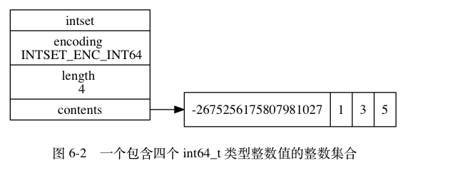

# 整数集合

整数集合（intset）是**集合键**的底层实现之一： **当一个集合只包含整数值元素， 并且这个集合的元素数量不多时， Redis 就会使用整数集合作为集合键的底层实现**。

## 实现

整数集合（intset）是 Redis 用于保存整数值的集合抽象数据结构， 它可以保存类型为 int16_t 、 int32_t 或者 int64_t 的整数值， 并且**保证集合中不会出现重复元素**。

```bash
typedef struct intset {

    // 编码方式
    uint32_t encoding;

    // 集合包含的元素数量
    uint32_t length;

    // 保存元素的数组
    int8_t contents[];

} intset;
```

contents 数组是整数集合的底层实现： 整数集合的每个元素都是 contents 数组的一个数组项（item）， 各个项在数组中**按值的大小从小到大有序地排列， 并且数组中不包含任何重复项**。

length 属性**记录了整数集合包含的元素数量**， 也即是 contents 数组的长度。

虽然 intset 结构将 contents 属性声明为 int8_t 类型的数组， 但实际上 contents 数组并不保存任何 int8_t 类型的值 —— **contents 数组的真正类型取决于 encoding 属性的值**

整数集合示例:
- encoding 属性的值为 INTSET_ENC_INT64 ， 表示整数集合的底层实现为 int64_t 类型的数组， 而数组中保存的都是 int64_t 类型的整数值。
- length 属性的值为 4 ， 表示整数集合包含四个元素。
- contents 数组按从小到大的顺序保存着集合中的四个元素。
- 因为每个集合元素都是 int64_t 类型的整数值， 所以 contents 数组的大小为 sizeof(int64_t) * 4 = 64 * 4 = 256 位。



当向一个底层为 int16_t 数组的整数集合添加一个 int64_t 类型的整数值时， **整数集合已有的所有元素都会被转换成 int64_t 类型**， 所以 contents 数组保存的四个整数值都是 int64_t 类型的

## 升级

每当我们要将**一个新元素添加到整数集合里面， 并且新元素的类型比整数集合现有所有元素的类型都要长时**， 整数集合需要**先进行升级**（upgrade）， 然后**才能将新元素添加**到整数集合里面。
> 先升级才能进行添加

**升级整数集合并添加新元素**共分为**三步**进行：

- 根据新元素的类型， **扩展**整数集合底层数组的空间大小， 并为新元素分配空间。
- 将底层数组现有的所有元素都**转换**成与新元素相同的类型， 并将类型转换后的元素放置到正确的位上， 而且在放置元素的过程中， 需要继续维持底层数组的**有序性质**不变。
- 将新元素**添加**到底层数组里面。

因为每次向整数集合添加新元素都**可能会引起升级**， 而每次升级都需要对底层数组中已有的所有元素进行类型转换， 所以向整数集合**添加新元素的时间复杂度为 O(N)** 。

> 向整数集合**添加新元素的时间复杂度为 O(N)**

### 升级之后新元素的摆放位置

因为引发升级的新元素的长度**总是**比整数集合现有所有元素的长度都大， 所以这个新元素的值要么就**大于**所有现有元素， 要么就**小于**所有现有元素：

- 在新元素小于所有现有元素的情况下， 新元素会被放置在底层数组的最开头（索引 0 ）；
- 在新元素大于所有现有元素的情况下， 新元素会被放置在底层数组的最末尾（索引 length-1 ）。

> Q：升级代表总是比新元素长度都大，那为什么会小于现有的元素？ A：负值

## 升级的好处

整数集合的升级策略有两个好处， **一个是提升整数集合的灵活性， 另一个是尽可能地节约内存**。

### 提升灵活性

因为 C 语言是静态类型语言， 为了避免类型错误， 我们通常不会将两种不同类型的值放在同一个数据结构里面。

但是， 因为整数集合可以通过自动升级底层数组来适应新元素， 所以我们可以**随意地**将 int16_t 、 int32_t 或者 int64_t 类型的整数添加到集合中， 而**不必担心出现类型错误**， 这种做法非常灵活。
> 灵活： 支持不同的整数类型

### 节约内存

当然， 要让一个数组可以同时保存 int16_t 、 int32_t 、 int64_t 三种类型的值， 最简单的做法就是**直接使**用 int64_t 类型的数组作为整数集合的底层实现。 不过这样一来， 即使添加到整数集合里面的都是 int16_t 类型或者 int32_t 类型的值， 数组都需要使用 int64_t 类型的空间去保存它们， 从而出现**浪费内存**的情况。

而整数集合现在的做法**既可以让集合能同时保存三种不同类型的值， 又可以确保升级操作只会在有需要的时候进行， 这可以尽量节省内存**。
> 既支持灵活的数据类型，也能在有需要的时候才进行升级，尽可能节省内存

比如说， 如果我们一直只向整数集合添加 int16_t 类型的值， 那么整数集合的底层实现就会一直是 int16_t 类型的数组， 只有在我们要将 int32_t 类型或者 int64_t 类型的值添加到集合时， 程序才会对数组进行升级。

### 降级

整数集合**不支持降级操作， 一旦对数组进行了升级， 编码就会一直保持升级后的状态**。

## 总结

- 整数集合是集合键的底层实现之一。
- 整数集合的底层实现为数组， 这个数组以**有序、无重复**的方式保存集合元素， 在有需要时， 程序会根据新添加元素的类型， 改变这个数组的类型。
- 升级操作为整数集合带来了**操作上的灵活性**， 并且**尽可能地节约了内存**。
- 整数集合只支持升级操作， 不支持降级操作。

- [整数集合](http://redisbook.com/index.html)


---
# Redis中的集合类型是怎么实现的

- [Redis中的集合类型是怎么实现的？](https://mp.weixin.qq.com/s?__biz=MzA4NTg1MjM0Mg==&mid=2657261457&idx=1&sn=fe966f3825b81e9d50a2cf38dac9060c&chksm=84479e48b330175ea07905e791856cca5fc50694db9fd4c3485ba5dc097443e69f5ed28a34b5&scene=21#wechat_redirect): 有具体的查找与添加的逻辑过程。

## search
intsetSearch是对于二分查找算法的一个实现，它大致分为三个部分：

- 特殊处理intset为空的情况。

- 特殊处理两个边界情况：当要查找的value比最后一个元素还要大或者比第一个元素还要小的时候。实际上，这两部分的特殊处理，在二分查找中并不是必须的，但它们在这里提供了特殊情况下快速失败的可能。

- 真正执行二分查找过程。注意：如果最后没找到，插入位置在min指定的位置

> 这个查找算法的总的时间复杂度为O(log n)

## add
如果没查到，则调用intsetResize对intset**进行内存扩充，使得它能够容纳新添加的元素**。因为intset是一块连续空间，因此这个操作会引发内存的realloc（[参见](http://man.cx/realloc)）。这有可能带来一次数据拷贝。同时调用intsetMoveTail**将待插入位置后面的元素统一向后移动1个位置，这也涉及到一次数据拷贝**。值得注意的是，在intsetMoveTail中是调用memmove完成这次数据拷贝的。memmove保证了在拷贝过程中不会造成数据重叠或覆盖，具体参见: http://man.cx/memmove。

intsetUpgradeAndAdd的实现中也会调用intsetResize来完成内存扩充。在进行编码升级时，intsetUpgradeAndAdd的实现会把原来intset中的每个元素取出来，再用新的编码重新写入新的位置。

注意一下intsetAdd的返回值，它返回一个新的intset指针。它可能与传入的intset指针is相同，也可能不同。调用方必须用这里返回的新的intset，替换之前传进来的旧的intset变量。类似这种接口使用模式，在Redis的实现代码中是很常见的，比如我们之前在介绍sds和ziplist的时候都碰到过类似的情况。

> 显然，这个intsetAdd算法总的时间复杂度为O(n)。

## 命令
上面这些命令的含义：

- sadd用于分别向集合s1和s2中添加元素。添加的元素既有数字，也有非数字（"a"和"b"）。
- sismember用于判断指定的元素是否在集合内存在。
- sinter, sunion和sdiff分别用于计算集合的交集、并集和差集。

对于小集合使用intset来存储，主要的原因是**节省内存**。特别是当存储的元素个数较少的时候，dict所带来的**内存开销要大得多**（包含两个哈希表、链表指针以及大量的其它元数据）。所以，当存储大量的小集合而且集合元素都是数字的时候，用intset能**节省下一笔可观的内存空间**。

实际上，从时间复杂度上比较，intset的**平均情况是没有dict性能高**的。以查找为例，intset是O(log n)的，而dict可以认为是O(1)的。但是，由于使用intset的时候集合元素个数比较少，所以这个**影响不大**。

## 交集

计算交集的过程大概可以分为三部分：

- 检查各个集合，对于不存在的集合当做空集来处理。一旦出现空集，则不用继续计算了，最终的交集就是空集。
- 对各个集合按照元素个数由少到多进行排序。这个排序有利于后面计算的时候从最小的集合开始，需要处理的元素个数较少。
- 对排序后第一个集合（也就是最小集合）进行遍历，对于它的每一个元素，依次在后面的所有集合中进行查找。只有在所有集合中都能找到的元素，才加入到最后的结果集合中。

需要注意的是，上述第3步在集合中进行查找，对于intset和dict的存储来说时间复杂度分别是O(log n)和O(1)。但由于只有**小集合**才使用intset，所以可以粗略地认为intset的查找也是常数时间复杂度的。因此，如[Redis官方文档上](http://redis.io/commands/sinter)所说，sinter命令的时间复杂度为：

> O(N*M) worst case where N is the cardinality of the smallest set and M is the number of sets.

## 并集

计算并集最简单，只需要遍历所有集合，将每一个元素都添加到最后的结果集合中。向集合中添加元素会自动去重。

由于要遍历所有集合的每个元素，所以Redis官方文档给出的sunion命令的[时间复杂度](http://redis.io/commands/sunion)为：

> O(N) where N is the total number of elements in all given sets.

注意，这里同前面讨论交集计算一样，将元素插入到结果集合的过程，**忽略intset的情况**，认为时间复杂度为O(1)。

## 差集

计算差集有两种可能的算法，它们的时间复杂度有所区别。

第一种算法：

对第一个集合进行遍历，对于它的每一个元素，依次在后面的所有集合中进行查找。只有在所有集合中都找不到的元素，才加入到最后的结果集合中。

> 这种算法的时间复杂度为O(N*M)，其中N是第一个集合的元素个数，M是集合数目。

第二种算法：

将第一个集合的所有元素都加入到一个中间集合中。

遍历后面所有的集合，对于碰到的每一个元素，从中间集合中删掉它。

最后中间集合剩下的元素就构成了差集。

> 这种算法的时间复杂度为O(N)，其中N是所有集合的元素个数总和。

在计算差集的开始部分，会**先分别估算一下两种算法预期的时间复杂度，然后选择复杂度低的算法来进行运算**。还有两点需要注意：

- 在一定程度上优先选择第一种算法，因为它涉及到的操作比较少，只用添加，而第二种算法要先添加再删除。

- 如果选择了第一种算法，那么在执行该算法之前，Redis的实现中对于第二个集合之后的所有集合，按照元素个数由多到少进行了排序。这个排序有利于以更大的概率查找到元素，从而更快地结束查找。

对于sdiff的时间复杂度，[Redis官方文档](http://redis.io/commands/sdiff)只给出了第二种算法的结果，是不准确的。
