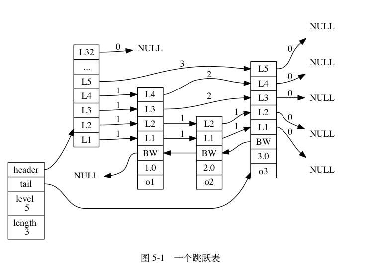
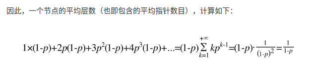
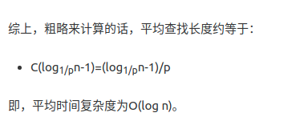
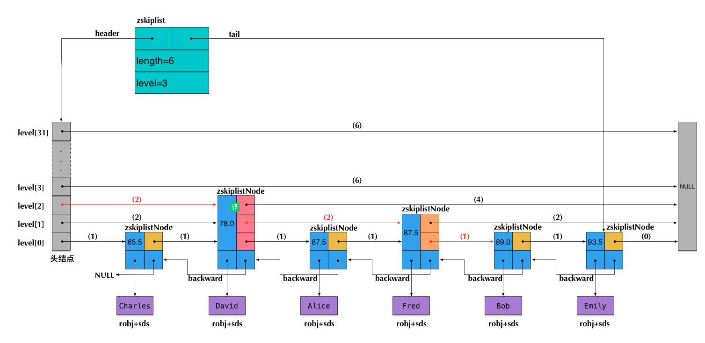

# 跳跃表

和链表、字典等数据结构被广泛地应用在 Redis 内部不同， Redis 只在两个地方用到了跳跃表， 一个是实现**有序集合键**， 另一个是在**集群节点**中用作**内部数据结构**， 除此之外， 跳跃表在 Redis 里面没有其他用途。

## 跳跃表的实现



图 5-1 展示了一个跳跃表示例， 位于图片最左边的是 zskiplist 结构， 该结构包含以下属性：

- header ：指向跳跃表的表头节点。
- tail ：指向跳跃表的表尾节点。
- level ：记录目前跳跃表内，**层数最大**的那个节点的层数（表头节点的层数不计算在内）。
- length ：记录跳跃表的长度，也即是，跳跃表目前包含节点的数量（表头节点不计算在内）。

位于 zskiplist 结构右方的是四个 zskiplistNode 结构， 该结构包含以下属性：

- 层（level）：节点中用 L1 、 L2 、 L3 等字样标记节点的各个层， L1 代表第一层， L2 代表第二层，以此类推。每个层都带有两个属性：**前进指针和跨度**。前进指针用于访问位于表尾方向的其他节点，而跨度则记录了前进指针所指向节点和当前节点的距离。在上面的图片中，连线上带有数字的箭头就代表前进指针，而那个数字就是跨度。当程序从表头向表尾进行遍历时，访问会沿着层的前进指针进行。
- 后退（backward）指针：节点中用 BW 字样标记节点的后退指针，它指向位于当前节点的前一个节点。后退指针在程序从**表尾向表头遍历**时使用。
- 分值（score）：各个节点中的 1.0 、 2.0 和 3.0 是节点所保存的分值。在跳跃表中，节点按各自所保存的分值从小到大排列。
- 成员对象（obj）：各个节点中的 o1 、 o2 和 o3 是节点所保存的成员对象。

注意表头节点和其他节点的构造是一样的： 表头节点也有后退指针、分值和成员对象， 不过表头节点的这些属性**都不会被用到**， 所以图中省略了这些部分， 只显示了表头节点的各个层。

## 跳跃表节点

```
typedef struct zskiplistNode {

    // 后退指针
    struct zskiplistNode *backward;

    // 分值
    double score;

    // 成员对象
    robj *obj;

    // 层
    struct zskiplistLevel {

        // 前进指针
        struct zskiplistNode *forward;

        // 跨度
        unsigned int span;

    } level[];

} zskiplistNode;

```

### 层
跳跃表节点的 level 数组可以包含多个元素， 每个元素都包含一个指向其他节点的指针， 程序可以通过这些层来加快访问其他节点的速度， 一般来说， **层的数量越多， 访问其他节点的速度就越快**。

每次创建一个新跳跃表节点的时候， 程序都根据**幂次定律** （power law，越大的数出现的概率越小） **随机生成一个介于 1 和 32 之间的值作为 level 数组的大小**， 这个大小就是层的“高度”。
### 前进指针
每个层都有一个指向表尾方向的前进指针（level[i].forward 属性）， 用于从表头向表尾方向访问节点。

### 跨度
层的跨度（level[i].span 属性）用于记录两个节点之间的距离：

- 两个节点之间的跨度越大， 它们相距得就越远。
- 指向 NULL 的所有前进指针的跨度都为 0 ， 因为它们没有连向任何节点。

初看上去， 很容易以为**跨度和遍历操作有关**， 但实际上并不是这样 —— 遍历操作只使用前进指针就可以完成了， 跨度实际上是用来**计算排位**（rank）的： 在查找某个节点的过程中， 将沿途访问过的所有层的跨度累计起来， 得到的结果就是目标节点在跳跃表中的排位。

> 跨度是用来计算排位的

### 后退指针
节点的后退指针（backward 属性）用于从表尾向表头方向访问节点： 跟可以**一次跳过多个节点的前进指针不同**， 因为每个节点**只有一个**后退指针， 所以每次**只能后退至前一个节点**。

> 只有第一层有后退指针

### 分值和成员
节点的分值（score 属性）是一个 double 类型的浮点数， 跳跃表中的所有节点都按分值**从小到大来排序**。

节点的成员对象（obj 属性）是一个指针， 它指向一个字符串对象， 而字符串对象则保存着一个 SDS 值。

## 跳跃表
header 和 tail 指针分别指向跳跃表的表头和表尾节点， 通过这两个指针， 程序**定位表头节点和表尾节点的复杂度为 O(1)** 。

通过使用 length 属性来记录节点的数量， 程序可以在 **O(1) 复杂度内**返回**跳跃表的长度**。

level 属性则用于在 O(1) 复杂度内获取跳跃表中层高最大的那个节点的层数量， 注意**表头节点的层高并不计算在内**。

## 总结

- 跳跃表是**有序集合的底层**实现**之一**， 除此之外它在 Redis 中没有其他应用。
- Redis 的跳跃表实现由 zskiplist 和 zskiplistNode 两个结构组成， 其中 zskiplist 用于保存跳跃表信息（比如表头节点、表尾节点、长度）， 而 zskiplistNode 则用于表示跳跃- 表节点。
- 每个跳跃表节点的层高都是 1 至 32 之间的**随机数**。
- 在同一个跳跃表中， 多个节点可以包含相同的分值， 但每个节点的成员**对象必须是唯一**的。
- 跳跃表中的节点按照分值大小进行排序， 当分值相同时， 节点按照成员**对象的大小**进行排序。

> 理解为每个节点就是一个数据，然后幂次定律随机生成一个level，作为该节点的level数组长度。然后插入。

## 参考链接
- [跳跃表](http://redisbook.com/index.html)

--------
# Redis 为什么用跳表而不用平衡树？

## skiplist数据结构简介

一般查找问题的解法分为两个大类：

- 一个是基于各种**平衡树**，
- 一个是基于**哈希表**。

但skiplist却比较特殊，它没法归属到这两大类里面。

skiplist正是受这种多层链表的想法的启发而设计出来的。实际上，按照上面生成链表的方式，上面每一层链表的节点个数，是下面一层的节点个数的一半，这样查找过程就非常类似于一个**二分查找**，使得查找的时间复杂度可以降低到O(log n)。但是，这种方法在插入数据的时候有很大的问题。新插入一个节点之后，就会**打乱上下相邻两层链表上节点个数严格的2:1的对应关系**。如果要维持这种对应关系，就必须把新插入的节点后面的所有节点（也包括新插入的节点）重新进行**调整**，这会让时间复杂度重新蜕化成O(n)。删除数据也有同样的问题。

skiplist为了避免这一问题，它**不要求上下相邻两层链表之间的节点个数有严格的对应关系**，而是为每个节点**随机出一个层数**(level)。_比如，一个节点随机出的层数是3，那么就把它链入到第1层到第3层这三层链表中_。

因此，插入操作**只需要修改插入节点前后的指针**，而不需要对很多节点都进行调整。这就**降低了插入操作的复杂度**。实际上，这是skiplist的一个很重要的特性，这让它在**插入性能上明显优于平衡树的方案**。

计算随机层数的伪码如下所示：
```
randomLevel()
    level := 1
    // random()返回一个[0...1)的随机数
    while random() < p and level < MaxLevel do
        level := level + 1
    return level
```

randomLevel()的伪码中包含两个参数，一个是p，一个是MaxLevel。在Redis的skiplist实现中，这两个参数的取值为：
```
p = 1/4
MaxLevel = 32
```

## skiplist的算法性能分析



现在很容易计算出：

- 当p=1/2时，每个节点所包含的平均指针数目为2；
- 当p=1/4时，每个节点所包含的平均指针数目为**1.33**。这也是Redis里的skiplist实现在空间上的开销。



平均查找的时间复杂度为O(log n)。


## Skiplist与平衡树、哈希表的比较
[](#bookmark)

- skiplist和各种平衡树（如AVL、红黑树等）的元素是**有序排列**的，而**哈希表不是有序的**。因此，在哈希表上只能做单个key的查找，**不适宜做范围查找**。所谓范围查找，指的是查找那些大小在指定的两个值之间的所有节点。
- 在做范围查找的时候，平衡树比skiplist操作要**复杂**。在平衡树上，我们找到指定范围的小值之后，还需要以**中序遍历的顺序**继续寻找其它不超过大值的节点。如果不对平衡树进行一定的**改造**，这里的中序遍历并**不容易实现**。而在skiplist上进行范围查找就**非常简单**，只需要在找到小值之后，对第1层链表进行若干步的遍历就可以实现。
- 平衡树的插入和删除操作可能引发**子树的调整**，**逻辑复杂**，而skiplist的插入和删除**只需要修改相邻节点的指针**，**操作简单又快速**。
- 从**内存占用**上来说，skiplist比平衡树更**灵活**一些。一般来说，平衡树每个节点包含**2个指针**（分别指向左右子树），而skiplist每个节点包含的指针数目平均为1/(1-p)，具体**取决于参数p的大小**。如果像Redis里的实现一样，取p=1/4，那么平均每个节点包含1.33个指针，比平衡树**更有优势**。
- **查找单个key**，skiplist和平衡树的时间复杂度都为O(log n)，大体相当；而哈希表在保持较低的哈希值冲突概率的前提下，查找时间复杂度**接近O(1)**，性能更高一些。所以我们平常使用的各种Map或dictionary结构，大都是基于哈希表实现的。
- 从**算法实现难度**上来比较，skiplist比平衡树要简单得多。

> 范围查询、插入和删除操作、内存占用（指针）

## Redis中skiplist实现的特殊性

实际上，Redis中sorted set的实现是这样的：

- 当数据**较少**时，sorted set是由一个**ziplist**来实现的。
- 当数据**多**的时候，sorted set是由一个**dict + 一个skiplist**来实现的。简单来讲，dict用来查询**数据到分数的对应关系**，而skiplist用来根据**分数查询数据**

相关命令：
- zrevrank命令查询Alice的排名
- zscore命令查询了Charles对应的分数。
- zrevrange命令查询了从大到小排名为0~3的4位同学。
- zrevrangebyscore命令查询了分数在80.0和90.0之间的所有同学，并按分数从大到小排列。


前述的查询过程，也暗示了各个操作的时间复杂度：

- zscore只用查询一个dict，所以**时间复杂度为O(1)**
- zrevrank, zrevrange, zrevrangebyscore由于要查询skiplist，所以zrevrank的时间复杂度为**O(log n)**，而zrevrange, zrevrangebyscore的时间复杂度为**O(log(n)+M)**，其中M是当前查询返回的元素个数。

Redis中的skiplist跟前面介绍的经典的skiplist相比，有如下不同：

- **分数(score)允许重复**，即skiplist的key允许重复。这在最开始介绍的经典skiplist中是不允许的。
- 在比较时，不仅比较分数（相当于skiplist的key），还**比较数据本身**。在Redis的skiplist实现中，数据本身的内容唯一标识这份数据，而不是由key来唯一标识。另外，当多个元素分数相同的时候，还需要根据**数据内容来进字典排序**。
- **第1层链表**不是一个单向链表，而是一个**双向链表**。这是为了方便以倒序方式获取一个范围内的元素。
- 在skiplist中可以**很方便地计算出每个元素的排名**(rank)。

> 参考链接有详细分析


可见，在查找skiplist的过程中，通过**累加span值**的方式，我们就能**很容易算出排名**。相反，如果指定排名来查找数据（类似zrange和zrevrange那样），也可以不断累加span并时刻保持累加值不超过指定的排名，通过这种方式就能得到一条O(log n)的查找路径。


## Redis中的sorted set

在这里我们先来讨论一下前一种情况——基于ziplist实现的sorted set。在本系列前面关于ziplist的文章里，我们介绍过，ziplist就是由很多**数据项组成的一大块连续内存**。由于sorted set的每一项元素都由数据和score组成，因此，当使用zadd命令插入一个(数据, score)对的时候，底层在相应的ziplist上就**插入两个数据项**：数据在前，score在后。

ziplist的主要优点是**节省内存**，但它上面的查找操作只能按**顺序查找**（可以正序也可以倒序）。因此，sorted set的各个查询操作，就是在ziplist上从前向后（或从后向前）一步步查找，每一步前进两个数据项，跨域一个(数据, score)对。

```
zset-max-ziplist-entries 128
zset-max-ziplist-value 64
```

这个配置的意思是说，在如下两个条件之一满足的时候，ziplist会转成zset（具体的触发条件参见t_zset.c中的zaddGenericCommand相关代码）：

- 当sorted set中的**元素个数**，即(数据, score)对的数目超过128的时候，也就是ziplist数据项超过256的时候。
- 当sorted set中插入的任意一个**数据的长度**超过了64的时候。


```bash
typedef struct zset {
    dict *dict;
    zskiplist *zsl;
} zset;
```

## Redis为什么用skiplist而不用平衡树？

There are a few reasons:
1. They are not very memory intensive. It's up to you basically. Changing parameters about the probability of a node to have a given number of levels will make then less memory intensive than btrees.
2. A sorted set is often target of many ZRANGE or ZREVRANGE operations, that is, traversing the skip list as a linked list. With this operation the cache locality of skip lists is at least as good as with other kind of balanced trees.
3. They are simpler to implement, debug, and so forth. For instance thanks to the skip list simplicity I received a patch (already in Redis master) with augmented skip lists implementing ZRANK in O(log(N)). It required little changes to the code.

- [出处](https://news.ycombinator.com/item?id=1171423)

这里从内存占用、对范围查找的支持和实现难易程度这三方面总结的原因，我们在前面其实也都涉及到了。

## 参考链接
- [Redis 为什么用跳表而不用平衡树？](https://zhuanlan.zhihu.com/p/23370124)
- [跳跃表确定不了解下](https://juejin.im/post/5ed5eec16fb9a047995842f2): 比较详细的源码例子，插入单个节点的层级遍历

---
# 思考

## 为什么MySQL的索引结构，采用了B+树，没有使用跳跃表呢？

> - [为什么MySQL的索引结构，采用了B+树，没有使用跳跃表呢？](https://segmentfault.com/q/1010000018633282)


个人感觉： 首先，跳跃表不适用于数据量大的磁盘读取的场景(B+树非叶子节点没有保存值，可以让索引更加紧凑放更多的数据。一次性读入内存中的需要查找的关键字也就越多。因此访问叶子节点上关联的数据也具有更好的缓存命中率。相对来说 IO 读写次数也就降低了。)，其二，跳跃表的查找效率不如B+树效率高，也不如B+树稳定（level查找不确定）。


其他观点：db数据量比较大如果,db索引使用了跳跃表,那么

1. 跳跃表的level太高,数据存储不紧凑,产生大量的空间浪费
2. 插入的数据不会如b+树那么紧凑,数据的压缩,dump也会存在问题
2. 查询会产生大量跨页IO
3. 查询时候磁盘磁头无法对链表进行预读,会产生大量的随机IO,对磁盘的缓存不友好
4. 无法实现聚集索引和覆盖索引,

---
## why-are-skip-lists-not-preferred-over-b-trees-for-databases
> - [why-are-skip-lists-not-preferred-over-b-trees-for-databases](https://stackoverflow.com/questions/21828834/why-are-skip-lists-not-preferred-over-b-trees-for-databases)

数据库通常非常庞大，必须存储在外部存储器中，比如一个巨大的磁盘驱动器。因此，大多数数据库应用程序中的瓶颈是必须**将内存从磁盘驱动器传输到主内存的次数**。

B-树及其变体是**专门设计来最小化执行其每个操作所需的块读写次数的**。从数学上讲，每个B树操作所需的内存传输数是O（logn/logB），其中B是块大小。

将其与skiplist比较，后者需要按预期进行O（logn）内存传输。由于B通常以兆字节为单位，因此logb可以在15-25的附近，因此B树可以明显地更快

即使数据库在主存中，内存层次结构（L1和L2缓存等）的影响也非常明显，以至于B树变体在实践中仍然比许多其他数据结构更快。

尽管B-树上的每个操作通常比其他数据结构中的相应操作需要更多的CPU工作，但是它们需要的内存传输很少的事实往往使它们在实践中比其他数据结构快得多。因此，不建议在数据库中使用跳过列表。

> B树所需块来进行设计的，加快磁盘到内存的传输效率。尽管B树的各种消耗更多的CPU。

还有另一个原因B-树是好的：他们是**最坏情况下的效率**。尽管确实存在确定性跳过列表，但大多数skiplist实现是随机的，并对其行为提供预期的保证。在数据库中，这可能是不可接受的，因为数据库上的许多用例需要最坏情况下的高效行为。
> 查询稳定性
