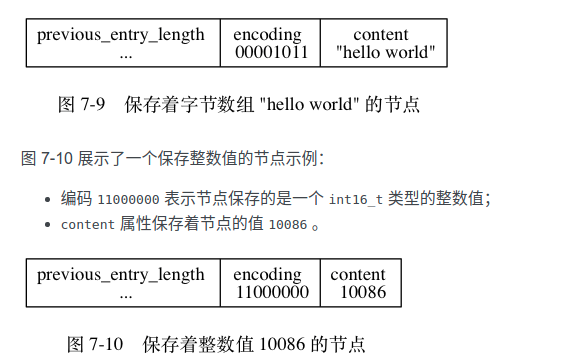

# 压缩列表

压缩列表（ziplist）是**列表键**和**哈希键**的底层实现之一。

当一个列表键只包含**少量列表项**， 并且每个列表项要么就是**小整数值**， 要么就是长度**比较短的字符串**， 那么 Redis 就会使用压缩列表来做列表键的底层实现。

`RPUSH lst 1 3 5 10086 "hello" "world"`

另外， 当一个哈希键只包含**少量键值对**， 并且每个键值对的键和值要么就是**小整数值**， 要么就是长度**比较短的字符串**， 那么 Redis 就会使用压缩列表来做哈希键的底层实现。

`HMSET profile "name" "Jack" "age" 28 "job" "Programmer"`

因为哈希键里面包含的所有键和值都是小整数值或者短字符串。

> ziplist的使用场景

## 压缩列表的构成


- zlbytes	uint32_t	4 字节	记录**整个压缩列表占用的内存字节数**：在对压缩列表进行内存重分配， 或者计算 zlend 的位置时使用。
- zltail	uint32_t	4 字节	记录压缩列表**表尾节点距离压缩列表的起始地址**有多少字节： 通过这个偏移量，程序无须遍历整个压缩列表就可以确定表尾节点的地址。
- zllen	uint16_t	2 字节	记录了压缩列表包含的**节点数量**： 当这个属性的值小于 UINT16_MAX （65535）时， 这个属性的值就是压缩列表包含节点的数量； 当这个值等于 UINT16_MAX 时， 节点的真实数量需要遍历整个压缩列表才能计算得出。
- entryX	列表节点	**不定**	压缩列表包含的各个节点，节点的长度由节点保存的内容决定。
- zlend	uint8_t	1 字节	特殊值 0xFF （十进制 255 ），用于标记**压缩列表的末端**。


图 7-3 展示了另一个压缩列表示例：

- 列表 zlbytes 属性的值为 0xd2 （十进制 210）， 表示压缩列表的总长为 210 字节。
- 列表 zltail 属性的值为 0xb3 （十进制 179）， 这表示如果我们有一个指向压缩列表起始地址的指针 p ， 那么只要用指针 p 加上偏移量 179 ， 就可以计算出表尾节点 entry5 的地址。
- 列表 zllen 属性的值为 0x5 （十进制 5）， 表示压缩列表包含五个节点。


## 压缩列表节点的构成

每个压缩列表节点都由 previous_entry_length 、 encoding 、 content 三个部分组成。

> **previous_entry_length方便回溯，encoding记录节点的content类型和长度，content节点的值。以此来表示一个双向链表**

### previous_entry_length

节点的 previous_entry_length 属性以字节为单位， 记录了**压缩列表中前一个节点的长度**。

previous_entry_length 属性的长度可以是 1 字节或者 5 字节：

- 如果前一节点的长度小于 254 字节， 那么 previous_entry_length 属性的长度为 1 字节： 前一节点的长度就保存在这一个字节里面。
- 如果前一节点的长度大于等于 254 字节， 那么 previous_entry_length 属性的长度为 5 字节： 其中属性的第一字节会被设置为 0xFE （十进制值 254）， 而之后的四个字节则用于保存前一节点的长度。

压缩列表的从表尾向表头遍历操作就是使用这一原理实现的： 只要我们拥有了一个指向某个节点起始地址的指针， 那么通过这个指针以及这个节点的 previous_entry_length 属性， 程序就可以一直向前一个节点回溯， 最终到达压缩列表的表头节点。

### encoding

节点的 encoding 属性记录了**节点的 content 属性**所保存数据的**类型以及长度**：

- 一字节、两字节或者五字节长， 值的最高位为 00 、 01 或者 10 的是字节数组编码： 这种编码表示节点的 content 属性保存着字节数组， 数组的长度由编码除去最高两位之后的其他位记录；
- 一字节长， 值的最高位以 11 开头的是整数编码： 这种编码表示节点的 content 属性保存着整数值， 整数值的类型和长度由编码除去最高两位之后的其他位记录；

> 长度：确定内容的范围。字节数组编码（字符）与整数编码详细看看具体的例子

### content

节点的 content 属性负责保存节点的值， 节点值可以是**一个字节数组或者整数**， **值的类型和长度**由节点的**encoding属性决定**。

图 7-9 展示了一个保存字节数组的节点示例：

- 编码的最高两位 00 表示节点保存的是一个字节数组；
- 编码的后六位 001011 记录了字节数组的长度 11 ；
- content 属性保存着节点的值 "hello world" 。




## 连锁更新

如果我们将一个长度大于等于 254 字节的新节点 new 设置为压缩列表的表头节点， 那么 new 将成为 e1 的前置节点。因为 e1 的 previous_entry_length 属性仅长 1 字节， 它没办法保存新节点 new 的长度， 所以程序将对压缩列表执行空间重分配操作， 并将 e1 节点的 previous_entry_length 属性从原来的 1 字节长扩展为 5 字节长。

现在， 麻烦的事情来了 —— e1 原本的长度介于 250 字节至 253 字节之间， 在为 previous_entry_length 属性新增四个字节的空间之后， e1 的长度就变成了介于 254 字节至 257 字节之间， 而这种长度使用 1 字节长的 previous_entry_length 属性是没办法保存的。

因此， 为了让 e2 的 previous_entry_length 属性可以记录下 e1 的长度， 程序需要再次对压缩列表执行空间重分配操作， 并将 e2 节点的 previous_entry_length 属性从原来的 1 字节长扩展为 5 字节长。

正如扩展 e1 引发了对 e2 的扩展一样， 扩展 e2 也会引发对 e3 的扩展， 而扩展 e3 又会引发对 e4 的扩展……**为了让每个节点的 previous_entry_length 属性都符合压缩列表对节点的要求， 程序需要不断地对压缩列表执行空间重分配操作， 直到 eN 为止**。


***Redis 将这种在特殊情况下产生的连续多次空间扩展操作称之为“连锁更新”（cascade update）***


因为连锁更新在最坏情况下需要对压缩列表执行 N 次空间重分配操作， 而每次空间重分配的最坏复杂度为 O(N) ， 所以**连锁更新的最坏复杂度为 O(N^2)**。

要注意的是， 尽管连锁更新的复杂度较高， 但它真正造成性能问题的**几率是很低**的：

- 首先， 压缩列表里要**恰好有多个连续**的、长度介于 250 字节至 253 字节之间的节点， 连锁更新才有可能被引发， 在实际中， 这种情况并不多见；
- 其次， 即使出现连锁更新， 但只要被更新的节点**数量不多**， 就不会对性能造成任何影响： 比如说， 对三五个节点进行连锁更新是绝对不会影响性能的；

因为以上原因， ziplistPush 等命令的平均复杂度仅为 O(N) ， 在实际中， 我们可以**放心地使用**这些函数， 而不必担心连锁更新会影响压缩列表的性能。

因为 ziplistPush 、 ziplistInsert 、 ziplistDelete 和 ziplistDeleteRange 四个函数都有可能会引发连锁更新， 所以它们的最坏复杂度都是 O(N^2) 。

## 总结

- 压缩列表是一种为节约内存而开发的顺序型数据结构。
- 压缩列表被用作列表键和哈希键的底层实现之一。
- 压缩列表可以包含多个节点，**每个节点可以保存一个字节数组或者整数值**。
- 添加新节点到压缩列表， 或者从压缩列表中删除节点， **可能会引发连锁更新操作，** 但这种操作出现的几率并不高。

## 参考链接
- [压缩列表](http://redisbook.com/index.html)

> 思考：为什么节省空间？


---
# ziplist

## 是什么

ziplist是一个经过**特殊编码**的**双向链表**，它的设计目标就是为了**提高存储效率**。ziplist可以用于存储**字符串或整数**，其中整数是按**真正的二进制**表示进行编码的，而不是编码成**字符串序列**。它能以**O(1)**的时间复杂度在表的两端**提供push和pop操作**。

## 优势

实际上，ziplist充分体现了Redis对于**存储效率的追求**。

- 一个普通的双向链表，链表中**每一项**都占用**独立的一块内存**，各项之间用**地址指针（或引用）连接**起来。这种方式会带来**大量的内存碎片**，而且地址指针也会**占用额外的内存**。
> 内存碎片：因为不是连续的。回收时候导致内存碎片？

- 而ziplist却是将表中**每一项**存放在**前后连续的地址空间内**，一个ziplist整体**占用一大块内存**。它是一个**表（list）**，但其实**不是一个链表**（linked list）。

- 另外，ziplist为了在细节上节省内存，对于**值的存储**采用了**变长的编码方式**，大概意思是说，对于大的整数，就多用一些字节来存储，而对于小的整数，就少用一些字节来存储。我们接下来很快就会讨论到这些实现细节。

> 双向链表的缺点[](#bookmark) [quicklist 空间与时间的折中](./quicklist.md)

## ziplist的接口

- ziplistPush: 在ziplist的头部或尾端插入一段数据（产生一个新的数据项）。注意一下这个接口的返回值，是一个**新的ziplist**。调用方必须用这里返回的新的ziplist，替换之前传进来的旧的ziplist变量，而经过这个函数处理之后，原来旧的ziplist变量就失效了。**为什么一个简单的插入操作会导致产生一个新的ziplist呢**？这是因为ziplist是**一块连续空间**，对它的**追加操作**，会引发**内存的realloc**，因此ziplist的内存位置可能会发生变化。实际上，我们在之前介绍sds的文章中提到过类似这种接口使用模式（参见sdscatlen函数的说明）。

> 这是因为ziplist是**一块连续空间**，对它的**追加操作**，会引发**内存的realloc**，因此ziplist的内存位置可能会发生变化。

- ziplistInsert: 在ziplist的任意数据项前面插入一个新的数据项。

- ziplistFind: 查找给定的数据（由vstr和vlen指定）。注意它有一个skip参数，表示查找的时候每次比较之间要跳过几个数据项。为什么会有这么一个参数呢？其实这个参数的**主要用途是当用ziplist表示hash结构的时候**，是按照一个field，一个value来依次存入ziplist的。也就是说，**偶数索引的数据项存field，奇数索引的数据项存value**。当按照field的值进行查找的时候，就需要把**奇数项跳过去**。
> 查找跳过奇数项（存value）


## hash与ziplist

实际上，hash随着数据的增大，其底层数据结构的实现是会发生变化的，当然存储效率也就不同。
- 在field比较少，各个value值也比较小的时候，hash采用ziplist来实现；
- 而随着field增多和value值增大，hash可能会变成dict来实现。当hash底层变成dict来实现的时候，它的存储效率就没法跟那些序列化方式相比了。

```
hset user:100 name tielei
hset user:100 age 20
```

每执行一次hset命令，插入的field和value分别作为一个新的数据项插入到ziplist中（即每次hset产生两个数据项）。

当随着数据的插入，hash底层的这个ziplist就可能会转成dict。

```
hash-max-ziplist-entries 512
hash-max-ziplist-value 64
```

这个配置的意思是说，在如下两个条件之一满足的时候，**ziplist会转成dict**：

- 当hash中的数据项（即field-value对）的数目超过512的时候，也就是ziplist数据项超过1024的时候（请参考t_hash.c中的hashTypeSet函数）。

- 当hash中插入的任意一个value的长度超过了64的时候（请参考t_hash.c中的hashTypeTryConversion函数）。

Redis的hash之所以这样设计，是因为当ziplist变得很大的时候，它有如下几个缺点：

- 每次插入或修改引发的realloc操作会有更大的概率**造成内存拷贝**，从而降低性能。

- 一旦发生内存拷贝，内存拷贝的成本也相应增加，因为要拷贝更大的一块数据。

- 当ziplist数据项过多的时候，在它上面查找指定的数据项就会性能变得很低，因为ziplist上的**查找需要进行遍历**。

总之，ziplist本来就设计为**各个数据项挨在一起组成连续的内存空间**，这种结构并**不擅长做修改操作**。一旦数据发生**改动**，就会引发**内存realloc**，可能导致**内存拷贝**。

## 参考链接
- [Redis内部数据结构详解(4)——ziplist](https://mp.weixin.qq.com/s?__biz=MzA4NTg1MjM0Mg==&mid=2657261265&idx=1&sn=e105c4b86a5640c5fc8212cd824f750b&scene=21#wechat_redirect)

