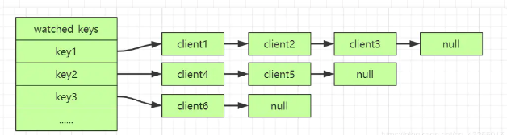
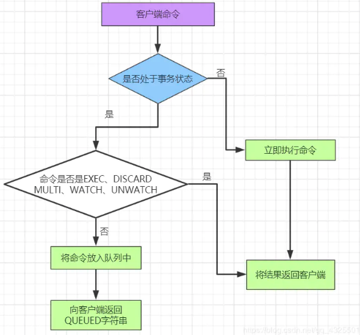

Redis事务是一组命令的集合，将多个命令进行打包，然后这些命令会被顺序的添加到队列中，并且按顺序的执行这些命令。

> 「Redis事务中没有像Mysql关系型数据库事务隔离级别的概念，不能保证原子性操作，也没有像Mysql那样执行事务失败会进行回滚操作」。

这个与Redis的特点：「快速、高效」有着密切的关联，「因为一些列回滚操作、像事务隔离级别那这样加锁、解锁，是非常消耗性能的」。所以，Redis中执行事务的流程只需要简单的下面三个步骤：

- 开始事务（MULTI）
- 命令入队
- 执行事务（EXEC）、撤销事务（DISCARD ）

## MULTI
「事务开始的命令」，执行该命令后，后面执行的对Redis数据类型的「操作命令都会顺序的放进队列中」，等待执行EXEC命令后队列中的命令才会被执行

## DISCARD
「放弃执行队列中的命令」，你可以理解为Mysql的回滚操作，「并且将当前的状态从事务状态改为非事务状态」。

DISCARD命令取消一个事务的时候，就会将命令队列清空，并且将客户端的状态从事务状态修改为非事务的状态。

## EXEC
执行该命令后「表示顺序执行队列中的命令」，执行完后并将结果显示在客户端，「将当前状态从事务状态改为非事务状态」。若是**执行该命令之前**有**key被执行WATCH命令并且又被其它客户端修改，那么就会放弃执行队列中的所有命令，在客户端显示报错信息**，若是没有修改就会执行队列中的所有命令。

## WATCH key
表示指定监视某个key，「该命令只能在MULTI命令之前执行」，如果监视的key被其他客户端修改，「EXEC将会放弃执行队列中的所有命令」

WATCH命令的底层实现中保存了watched_keys 字典，「字典的键保存的是监视的key，值是一个链表，链表中的每个节点值保存的是监视该key的客户端」。

## UNWATCH
「取消监视之前通过WATCH 命令监视的key」，通过执行EXEC 、DISCARD 两个命令之前监视的key也会被取消监视

# 错误处理

那么在Redis中的错误处理主要分为两类：「语法错误」、「运行错误」。下面主要来讲解一下这两类错误的区别。

「（1）语法错误」

比如执行命令的时候，命令的不存在或者错误的敲错命令、参数的个数不对等都会导致语法错误。

语法错误是在Redis语法检测的时候就能发现的，所以当你执行错误命令的时候，也会即使的返回错误的提示。

最后，即使命令进入队列，只要存在语法错误，该队列中的命令**都不会被执行**，会直接向客户端返回事务执行失败的提示。

「（2）运行错误」

执行时使用不同类型的操作命令操作不同数据类型就会出现运行时错误，这种错误时Redis在不执行命令的情况下，是无法发现的。

这样就会导致，正确的命令被执行，而错误的命令不会不执行，这也显示出Redis的事务并**不能保证数据的一致性**，**因为中间出现了错误，有些语句还是被执行了。**

这样的结果只能程序员自己根据之前执行的命令，自己一步一步正确的回退，所谓自己的烂摊子，自己收拾。

> 与其说是事务，不如说是：具有命令打包功能。

> 用MULTI/EXEC 来把多个命令组装成一次发送，达到原子性

> 用WATCH提供的乐观锁功能，在你EXEC的那一刻，如果被WATCH的键发生过改动，则MULTI到EXEC之间的指令全部不执行，不需要rollback

# 参考链接
- [Redis事务](https://juejin.im/post/5f0054346fb9a07e9d60362c)

---
# 事务的使用场景
- 需要原子地执行多个命令
- 不需要事务中间命令的执行结果来编排后面的命令
