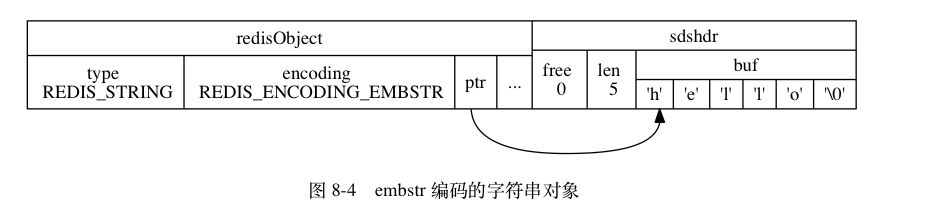

# 对象

Redis 用到的所有主要数据结构， 比如**简单动态字符串（SDS）、双端链表、字典、压缩列表、整数集合**

Redis 并没有直接使用这些数据结构来实现键值对数据库， 而是基于这些数据结构创建了一个**对象系统**， 这个系统包含**字符串对象、列表对象、哈希对象、集合对象和有序集合对象**这五种类型的对象， 每种对象都用到了**至少一种**我们前面所介绍的**数据结构**。

通过这五种不同类型的对象， Redis 可以在执行命令之前， 根据对象的**类型**来**判断**一个对象是否可以执行给定的命令。 使用对象的另一个好处是， 我们可以针对**不同的使用场景**， 为对象设置**多种不同的数据结构**实现， 从而优化对象在不同场景下的**使用效率**。

除此之外， Redis 的对象系统还实现了基于**引用计数技术的内存回收机制**： 当程序不再使用某个对象的时候， 这个对象所占用的内存就会被**自动释放**； 另外， Redis 还通过引用计数技术实现了**对象共享机制**， 这一机制可以在适当的条件下， 通过让**多个数据库键共享同一个对象来节约内存**。

最后， Redis 的对象带有**访问时间记录信息**， 该信息可以用于计算数据库键的**空转时长**， 在服务器启用了 **maxmemory** 功能的情况下， 空转时长较大的那些键可能会**优先**被服务器**删除**。

## 对象的类型与编码
Redis 使用对象来表示数据库中的键和值， 每次当我们在 Redis 的数据库中新创建一个键值对时， 我们至少会创建两个对象， **一个对象用作键值对的键（键对象）， 另一个对象用作键值对的值（值对象）**。

```bash
typedef struct redisObject {

    // 类型
    unsigned type:4;

    // 编码
    unsigned encoding:4;

    // 指向底层实现数据结构的指针
    void *ptr;

    // ...

} robj;
```

对象 |	对象 type 属性的值	|TYPE 命令的输出
 ----------------- | ---------------------------- |----------------------------
字符串对象 |	REDIS_STRING|	"string"
列表对象 |	REDIS_LIST|	"list"
哈希对象 |	REDIS_HASH|	"hash"
集合对象 |	REDIS_SET|	"set"
有序集合对象 |	REDIS_ZSET|	"zset"

对于 Redis 数据库保存的键值对来说， **键总是一个字符串对象**， 而值则可以是**字符串对象、列表对象、哈希对象、集合对象或者有序集合对象**的其中一种， 因此：

- 当我们称呼一个数据库键为“字符串键”时， 我们指的是“这个数据库键所对应的值为字符串对象”；
- 当我们称呼一个键为“列表键”时， 我们指的是“这个数据库键所对应的值为列表对象”，

> 键总是一个字符串对象，所以列表键指的是值为列表对象。对象底层可以有不一样的编码类型(数据结构)。

### 编码和底层实现

类型	|编码	|对象
 ----------------- | ---------------------------- |----------------------------
REDIS_STRING |	REDIS_ENCODING_INT |	使用整数值实现的字符串对象。
REDIS_STRING |	REDIS_ENCODING_EMBSTR |	使用 embstr 编码的简单动态字符串实现的字符串对象。
REDIS_STRING |	REDIS_ENCODING_RAW |	使用简单动态字符串实现的字符串对象。
REDIS_LIST |	REDIS_ENCODING_ZIPLIST |	使用压缩列表实现的列表对象。
REDIS_LIST |	REDIS_ENCODING_LINKEDLIST |	使用双端链表实现的列表对象。
REDIS_HASH |	REDIS_ENCODING_ZIPLIST |	使用压缩列表实现的哈希对象。
REDIS_HASH |	REDIS_ENCODING_HT |	使用字典实现的哈希对象。
REDIS_SET |	REDIS_ENCODING_INTSET |	使用整数集合实现的集合对象。
REDIS_SET |	REDIS_ENCODING_HT |	使用字典实现的集合对象。
REDIS_ZSET |	REDIS_ENCODING_ZIPLIST |	使用压缩列表实现的有序集合对象。
REDIS_ZSET |	REDIS_ENCODING_SKIPLIST |	使用跳跃表和字典实现的有序集合对象。

通过 encoding 属性来设定对象所使用的编码， 而不是为特定类型的对象关联一种固定的编码， 极大地提升了 Redis 的**灵活性和效率**， 因为 Redis 可以根据**不同的使用场景**来为一个对象**设置不同的编码**， 从而优化对象在某一场景下的效率。

举个例子， 在列表对象包含的元素比较少时， Redis 使用压缩列表作为列表对象的底层实现：

- 因为压缩列表比双端链表更**节约内存**， 并且在元素数量较少时， 在内存中以**连续块方式**保存的压缩列表比起双端链表可以**更快被载入到缓存中**；
- 随着列表对象包含的元素越来越多， 使用压缩列表来保存元素的优势逐渐消失时， 对象就会将底层实现从压缩列表转向功能更强、也更适合保存大量元素的**双端链表**上面；

## 字符串对象
字符串对象的编码可以是 **int 、 raw 或者 embstr** 。

如果一个字符串对象保存的是整数值， 并且这个整数值可以**用 long 类型来表示**， 那么字符串对象会将整数值保存在字符串对象结构的 ptr 属性里面（将 void* 转换成 long ）， 并将字符串对象的编码设置为 int 。

如果字符串对象保存的是一个字符串值， 并且这个字符串值的长度**大于 39 字节**， 那么字符串对象将使用一个简单动态字符串（SDS）来保存这个字符串值， 并将对象的编码设置为 raw 。

如果字符串对象保存的是一个字符串值， 并且这个字符串值的长度**小于等于 39 字节**， 那么字符串对象将使用 embstr 编码的方式来保存这个字符串值。

embstr 编码是**专门用于保存短字符串的一种优化编码方式**， 这种编码和 raw 编码一样， 都使用 redisObject 结构和 sdshdr 结构来表示字符串对象， **但 raw 编码会调用两次内存分配函数来分别创建** redisObject 结构和 sdshdr 结构， 而 embstr 编码**则通过调用一次内存分配函数来分配一块连续的空间， 空间中依次包含 redisObject 和 sdshdr 两个结构**

> embstr对比raw的区别。一次内存分配

embstr 编码的字符串对象在执行命令时， 产生的效果和 raw 编码的字符串对象执行命令时产生的效果是相同的， 但使用 embstr 编码的字符串对象来保存短字符串值有以下**好处**：

- embstr 编码将创建字符串对象所需的内存分配次数从 raw 编码的两次降低为一次。
- 释放 embstr 编码的字符串对象只需要调用一次内存释放函数， 而释放 raw 编码的字符串对象需要调用两次内存释放函数。
- 因为 embstr 编码的字符串对象的所有数据都保存在一块连续的内存里面， 所以这种编码的字符串对象比起 raw 编码的字符串对象**能够更好地利用缓存带来的优势**。



最后要说的是， 可以用 long double 类型表示的浮点数在 Redis 中**也是作为字符串值来保存**的： 如果我们要保存一个浮点数到字符串对象里面， 那么程序会先将这个浮点数转换成字符串值， 然后再保存起转换所得的字符串值。

因为 Redis 没有为 embstr 编码的字符串对象编写任何相应的修改程序 （只有 int 编码的字符串对象和 raw 编码的字符串对象有这些程序）， 所以 **embstr 编码的字符串对象实际上是只读的**： 当我们对 embstr 编码的字符串对象执行任何修改命令时， 程序会先将对象的编码从 embstr 转换成 raw ， 然后再执行修改命令； 因为这个原因， embstr 编码的字符串对象**在执行修改命令之后， 总会变成一个 raw 编码的字符串对象**。

## 列表对象

列表对象的编码可以是 **ziplist 或者 linkedlist** 。
> 新版应该是quicklist

ziplist 编码的列表对象使用压缩列表作为底层实现， 每个压缩列表节点（entry）保存了一个列表元素。

注意， linkedlist 编码的列表对象在底层的双端链表结构中包含了多个字符串对象， 这种嵌套字符串对象的行为在稍后介绍的哈希对象、集合对象和有序集合对象中都会出现， 字符串对象是 Redis 五种类型的对象中唯一一种会被其他四种类型对象嵌套的对象。

当列表对象可以**同时满足以下两个条件**时， 列表对象使用 ziplist 编码：

- 列表对象保存的所有字符串元素的长度都小于 64 字节；
- 列表对象保存的元素数量小于 512 个；

不能满足这两个条件的列表对象需要使用 linkedlist 编码。 list-max-ziplist-value 选项和 list-max-ziplist-entries 选项。

## 哈希对象

哈希对象的编码可以是 **ziplist 或者 hashtable** 。

ziplist 编码的哈希对象使用压缩列表作为底层实现， 每当有新的键值对要加入到哈希对象时， 程序会先将保存了键的压缩列表节点推入到压缩列表表尾， 然后再将保存了值的压缩列表节点推入到压缩列表表尾， 因此：

- **保存了同一键值对的两个节点总是紧挨在一起**， 保存键的节点在前， 保存值的节点在后；
- 先添加到哈希对象中的键值对会被放在压缩列表的表头方向， 而后来添加到哈希对象中的键值对会被放在压缩列表的表尾方向。

另一方面， hashtable 编码的哈希对象使用字典作为底层实现， 哈希对象中的每个键值对都使用一个字典键值对来保存：

- 字典的每个键都是一个字符串对象， 对象中保存了键值对的键；
- 字典的每个值都是一个字符串对象， 对象中保存了键值对的值。

> hashtable指的是一种编码REDIS_ENCODING_HT，是一个通称。

### 编码转换
当哈希对象可以同**时满足以下两个条件时**， 哈希对象使用 ziplist 编码：

- 哈希对象保存的所有键值对的键和值的字符串长度都小于 64 字节；
- 哈希对象保存的键值对数量小于 512 个；

不能满足这两个条件的哈希对象需要使用 hashtable 编码。 hash-max-ziplist-value 选项和 hash-max-ziplist-entries 选项

## 集合对象

集合对象的编码可以是 **intset 或者 hashtable** 。

intset 编码的集合对象**使用整数集合**作为底层实现， 集合对象包含的所有元素都被保存在整数集合里面。

另一方面， **hashtable 编码的集合对象使用字典作为底层实现**， 字典的每个键都是一个字符串对象， 每个字符串对象包含了一个集合元素， 而**字典的值则全部被设置为 NULL** 。

> 键值为NULL

### 编码的转换
当集合对象可以**同时满足以下两个条件**时， 对象使用 intset 编码：

- 集合对象保存的所有元素都是整数值；
- 集合对象保存的元素数量不超过 512 个；

不能满足这两个条件的集合对象需要使用 hashtable 编码。 set-max-intset-entries选项

## **有序集合对象**

[](#bookmark)

有序集合的编码可以是 **ziplist 或者 skiplist** 。

ziplist 编码的有序集合对象使用压缩列表作为底层实现， **每个集合元素使用两个紧挨在一起的压缩列表节点来保存**， 第一个节点保存元素的成员（member）， 而第二个元素则保存元素的分值（score）。

压缩列表内的集合元素按**分值从小到大进行排序**， 分值较小的元素被放置在靠近表头的方向， 而分值较大的元素则被放置在靠近表尾的方向。

skiplist 编码的有序集合对象使用 **zset** 结构作为底层实现， 一个 zset 结构同时**包含一个字典和一个跳跃表**

zset 结构中的 zsl 跳跃表按分值从小到大保存了所有集合元素， 每个跳跃表节点都保存了一个集合元素： 跳跃表节点的 object 属性保存了元素的成员， 而跳跃表节点的 score 属性则保存了元素的分值。 通过这个跳跃表， 程序可以对**有序集合进行范围型操作**， 比如 ZRANK 、 ZRANGE 等命令就是基于跳跃表 API 来实现的。

除此之外， zset 结构中的 dict 字典为有序集合创建了一个从**成员到分值的映射**， 字典中的每个键值对都保存了一个集合元素： 字典的键保存了元素的成员， 而字典的值则保存了元素的分值。 通过这个字典， 程序可以用 **O(1) 复杂度查找给定成员的分值**， ZSCORE 命令就是根据这一特性实现的， 而很多其他有序集合命令都在实现的内部用到了这一特性。

有序集合每个元素的成员都是一个字符串对象， 而每个元素的分值都是一个 double 类型的浮点数。 值得一提的是， 虽然 zset 结构同时使用跳跃表和字典来保存有序集合元素， 但这两种数据结构都会**通过指针来共享相同元素的成员和分值**， 所以同时使用跳跃表和字典来保存集合元素不会产生任何重复成员或者分值， 也**不会因此而浪费额外的内存**。

> 优化手段：共享相同元素达到节省内存的目的。

### 编码的转换

当有序集合对象可以**同时满足以下两个条件时**， 对象使用 ziplist 编码：

- 有序集合保存的元素数量小于 128 个；
- 有序集合保存的所有元素成员的长度都小于 64 字节；

不能满足以上两个条件的有序集合对象将使用 skiplist 编码。zset-max-ziplist-entries 选项和 zset-max-ziplist-value 选项

## 类型检查与命令多态

Redis 中用于操作键的命令基本上可以分为两种类型。

其中一种命令可以对任何类型的键执行， 比如说 DEL 命令、 EXPIRE 命令、 RENAME 命令、 TYPE 命令、 OBJECT 命令， 等等。

而**另一种命令只能对特定类型的键执行**， 比如说：

- SET 、 GET 、 APPEND 、 STRLEN 等命令只能对字符串键执行；
- HDEL 、 HSET 、 HGET 、 HLEN 等命令只能对哈希键执行；
- RPUSH 、 LPOP 、 LINSERT 、 LLEN 等命令只能对列表键执行；
- SADD 、 SPOP 、 SINTER 、 SCARD 等命令只能对集合键执行；
- ZADD 、 ZCARD 、 ZRANK 、 ZSCORE 等命令只能对有序集合键执行；

### 类型检查的实现
类型特定命令所进行的类型检查是通过 redisObject 结构的 type 属性来实现的：

- 在执行一个类型特定命令之前， 服务器会先检查输入数据库键的值对象是否为执行命令所需的类型， 如果是的话， 服务器就对键执行指定的命令；
- 否则， 服务器将拒绝执行命令， 并向客户端返回一个类型错误。

### 多态命令的实现

Redis 除了会根据值对象的类型来判断键是否能够执行指定命令之外， 还会**根据值对象的编码方式， 选择正确的命令实现代码来执行命令**。

借用面向对象方面的术语来说， 我们可以认为 LLEN 命令是多态（polymorphism）的： 只要执行 LLEN 命令的是列表键， 那么无论值对象使用的是 ziplist 编码还是 linkedlist 编码， 命令都可以正常执行。

实际上， 我们可以将 DEL 、 EXPIRE 、 TYPE 等命令也称为多态命令， 因为无论输入的键是什么类型， 这些命令都可以正确地执行。

DEL 、 EXPIRE 等命令和 LLEN 等命令的区别在于， 前者是基于类型的多态 —— 一个命令可以同时用于处理多种不同类型的键， 而后者是基于编码的多态 —— **一个命令可以同时用于处理多种不同编码**。

## 内存回收

因为 **C 语言并不具备自动的内存回收功能**， 所以 Redis 在自己的对象系统中**构建了一个引用计数（reference counting）技术实现的内存回收机制**， 通过这一机制， 程序可以通过跟踪对象的引用计数信息， 在适当的时候自动释放对象并进行内存回收。

每个对象的引用计数信息由 **redisObject 结构的 refcount 属性记录**：

对象的引用计数信息会随着对象的使用状态而不断变化：

- 在创建一个新对象时， 引用计数的值会被初始化为 1 ；
- 当对象被一个新程序使用时， 它的引用计数值会被增一；
- 当对象不再被一个程序使用时， 它的引用计数值会被减一；
- 当对象的引用计数值变为 0 时， 对象所占用的内存会被释放。

对象的整个生命周期可以划分为**创建对象、操作对象、释放对象**三个阶段。

## 对象共享

[](#bookmark)

除了用于实现引用计数内存回收机制之外， 对象的引用计数属性还带有对象共享的作用。

共享对象机制对于节约内存非常有帮助， 数据库中**保存的相同值对象越多， 对象共享机制就能节约越多的内存**。

比如说， 假设数据库中保存了整数值 100 的键不只有键 A 和键 B 两个， 而是有一百个， 那么服务器只需要用一个字符串对象的内存就可以保存原本需要使用一百个字符串对象的内存才能保存的数据。

目前来说， Redis 会在初始化服务器时， **创建一万个字符串对象**， 这些对象包含了**从 0 到 9999 的所有整数值**， 当服务器需要用到值为 0 到 9999 的字符串对象时， 服务器就**会使用这些共享对象， 而不是新创建对象**。

> 字符串对象，但是整数值

另外， 这些共享对象不单单只有字符串键可以使用， 那些**在数据结构中嵌套了字符串对象的对象**（linkedlist 编码的列表对象、 hashtable 编码的哈希对象、 hashtable 编码的集合对象、以及 zset 编码的有序集合对象）都可以使用这些共享对象。

### 为什么 Redis 不共享包含字符串的对象？

当服务器考虑将一个共享对象设置为键的值对象时， 程序**需要先检查**给定的共享对象和键想创建的目标对象是否完全相同， 只有在共享对象和目标对象完全相同的情况下， 程序才会将共享对象用作键的值对象， 而一个共享对象保存的**值越复杂**， 验证共享对象和目标对象**是否相同所需的复杂度就会越高， 消耗的 CPU 时间也会越多**：

- 如果共享对象是**保存整数值的字符串对象**， 那么验证操作的复杂度为 O(1) ；
- 如果共享对象是保存字符串值的字符串对象， 那么验证操作的复杂度为 O(N) ；
- 如果共享对象是包含了多个值（或者对象的）对象， 比如列表对象或者哈希对象， 那么验证操作的复杂度将会是 O(N^2) 。

因此， **尽管共享更复杂的对象可以节约更多的内存， 但受到 CPU 时间的限制， Redis 只对包含整数值的字符串对象进行共享**。

> 字符串的对比消耗CPU时间更高

> 优化手段：对象共享与预初始化。TODO：初始化共享对象跟python也很像。可以对比一下[](#bookmark)


## 对象的空转时长

除了前面介绍过的 type 、 encoding 、 ptr 和 refcount 四个属性之外， redisObject 结构包含的最后一个属性为 lru 属性， **该属性记录了对象最后一次被命令程序访问的时间**：

OBJECT IDLETIME 命令可以打印出给定键的空转时长， 这一空转时长就是**通过将当前时间减去键的值对象的 lru 时间计算得出**的：

注意： OBJECT IDLETIME 命令的实现**是特殊的， 这个命令在访问键的值对象时， 不会修改值对象的 lru 属性**。

除了可以被 OBJECT IDLETIME 命令打印出来之外， 键的空转时长还有另外一项作用： 如果服务器打开了 maxmemory 选项， 并且服务器用于回收内存的算法为 volatile-lru 或者 allkeys-lru ， 那么当服务器占用的内存数超过了 maxmemory 选项所设置的上限值时， **空转时长较高的那部分键会优先被服务器释放， 从而回收内存**。

> 键值回收的原理
