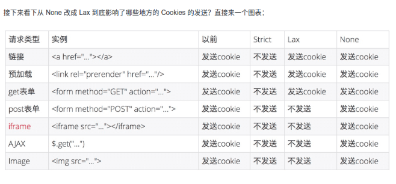

# Cookie

## 介绍

`Domain=<domain-value> 可选`

指定 cookie 可以送达的主机名。假如没有指定，那么默认值为当前文档访问地址中的主机部分（但是不包含子域名）。与之前的规范不同的是，**域名之前的点号会被忽略** 。假如指定了域名，那么相当于各个子域名也包含在内了。

注意： 不指定域名的时候，是**不包含子域名的**。删除也需要不指定域名才能删除。只要是指定域名的，**有没有点号都会被忽略**，相当于包含子域名. If Domain is specified, then subdomains are **always** included.

> 注意： django的删除域名只能删除同名设置多个的一个，可以通过改key值来进行修改

### 相关参数

- secure: (cookie只通过https协议传输)
- HttpOnly: 为避免**跨域脚本** (XSS) 攻击，通过**JavaScript的 Document.cookie API无法访问带有 HttpOnly 标记的Cookie**，它们只应该发送给服务端。如果包含服务端 Session 信息的 Cookie **不想被客户端 JavaScript 脚本调用**，那么就应该为其设置 HttpOnly 标记。
- SameSite： SameSite Cookie**允许服务器要求某个cookie在跨站请求时不会被发送**，从而可以**阻止跨站请求伪造攻击（CSRF）**。
    - Strict最为严格，完全禁止第三方 Cookie，跨站点时，任何情况下都不会发送 Cookie。换言之，**只有当前网页的 URL 与请求目标一致**，才会带上 Cookie。
    - Lax规则稍稍放宽，大多数情况也是不发送第三方 Cookie，但是**导航到目标网址的 Get 请求除外**。
    - Chrome 计划将Lax变为默认设置。这时，网站可以选择显式关闭SameSite属性，将其设为None。不过，前提是必须同时设置Secure属性（Cookie 只能通过 HTTPS 协议发送），否则无效。




参考链接：

- [Cookies](https://developer.mozilla.org/en-US/docs/Web/HTTP/Cookies)
- [Cookie 的 SameSite 属性](https://www.ruanyifeng.com/blog/2019/09/cookie-samesite.html)
- [浏览器系列之 Cookie 和 SameSite 属性 ](https://github.com/mqyqingfeng/Blog/issues/157): 阿里对SameSite的影响分析和研究。

---
## 跨域请求带上cookie

cookie无法设置除当前域名或者其父域名之外的其他domain.

cookie的作用域是domain本身以及domain下的所有子域名

基于安全方面的考虑，在浏览器中**无法获取跨域的 Cookie 这一点时永远不变的**。但是我们处理跨域请求时有可能会遇到这样的情况：一个网页与域为bbb.cn的服务器正常发送请求和接收响应，同时这个网页也需要跨域访问aaa.cn服务器。

众所周知，浏览器会在准备发送的请求中附上所有符合要求的Cookie，故在上面的情况中浏览器会自动处理网页与域为bbb.cn的服务器之间的 Cookie；但是在 CORS 跨域中，浏览器**并不会自动发送 Cookie**，也就是说，浏览器不会处理网页与aaa.cn服务器之间的 Cookie。

### 配置说明

要想浏览器处理 CORS 跨域中的 Cookie 只需要分别在网页以及服务端作出一点点改变：

网页端中，对于跨域的 XMLHttpRequest 请求，**需要设置withCredentials 属性为 true**。
```
var xhr = new XMLHttpRequest();
xhr.open("GET", "http://aaa.cn/localserver/api/corsTest");
xhr.withCredentials = true; // 设置跨域 Cookie
xhr.send();
```

同时**服务端的响应中必须携带 Access-Control-Allow-Credentials: true 首部**。如果服务端的响应中未携带Access-Control-Allow-Credentials: true 首部，浏览器将不会把响应的内容返回给发送者。

要想设置和获取跨域 Cookie，上面提到的**两点缺一不可**。另外有一点需要注意的是：规范中提到，如果 XMLHttpRequest 请求设置了withCredentials 属性，那么服务器**不得设置** Access-Control-Allow-Origin的值为* ，否则浏览器将会抛出The value of the 'Access-Control-Allow-Origin' header in the response must not be the wildcard '*' 错误。

- [参考链接](https://www.jianshu.com/p/13d53acc124f)

1. 1.ag.cn 请求auth.ag.cn token接口，后端把cookie set 到 ag.cn
2. 新开页面 2.ag.cn ，可以通过document.cookie拿到 ag.cn的 cookie信息；

如果set cookie的时候，set到auth.ag.cn , 那么在 2.ag.cn 就拿不到了；

> 可以拿到父级域名的cookie，拿不到兄弟域名的cookie

---
# restful

### patch
patch方法用来**更新局部资源**，这句话我们该如何理解？

假设我们有一个UserInfo，里面有userId， userName， userGender等10个字段。可你的编辑功能因为需求，在某个特别的页面里只能修改userName，这时候的更新怎么做？

人们通常(为徒省事)把一个包含了修改后userName的完整userInfo对象传给后端，**做完整更新**。但仔细想想，这种做法感觉有点二，而且真心浪费带宽(纯技术上讲，你不关心带宽那是你土豪)。

于是patch诞生，只传一个userName到指定资源去，表示该请求是一个局部更新，后端仅更新接收到的字段。

### put
而put虽然也是更新资源，但要求前端提供的**一定是一个完整的资源对象**，理论上说，如果你用了put，但却没有提供完整的UserInfo，那么缺了的那些字段应该被清空

> 最后再补充一句，restful只是标准，标准的意思是如果在大家都依此行事的话，沟通成本会很低，开发效率就高。但并非强制(也没人强制得了)，所以你说在你的程序里把方法名从put改成patch没有任何影响，那是自然，因为你的后端程序并没有按照标准对两个方法做不同处理，她的表现自然是一样的

### 以"/"结尾

以/结尾就是资源的集合，不加就是单个对象

- [Trailing slash in RESTful API](https://softwareengineering.stackexchange.com/a/187006)


---
# 网络请求

### 背景
将通用版的请求接口，服务化后，因为请求变多了，每次请求通用版数据的接口都需要请求auth进行用户校验，而且走的是nginx层的https、uwsgi的sock解析，并且也要经过反爬虫的计算。

### 解决办法
uwsgi的sock需要nginx才能解析，uwsgi直接启动监听端口。减少nginx和反爬虫的解析后观察情况

> 思考：按理来说uwsgi直接启动监听端口, 性能不及nginx监听端口，后反向代理给uwsgi。忘了之前的场景是什么了，指标监控也没有补充上。主要还是内网还是https请求和反爬虫导致的高CPU吧。

---
# 其他

auth请求各个企业管理。改为企业管理对外，然后请求相应的auth

之前没有讨论好架构就去做了，结果需要重构！！

服务状态，例如购买： 钱到了，应该改订单的状态.

至于用户的组别的权限更改，是不同服务的，可以通过订单系统发送一个信号进行异步更改，或者业务相关服务监控某个信号进行更改。对于一些非强一致性的，可以有延迟。

对于强一致性的接口（具体？）需要分布式锁去进行控制。
