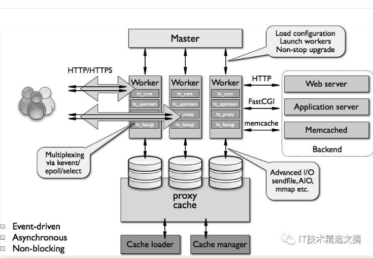

# 问题
## Nginx 是如何实现高并发的?

异步，非阻塞，使用了epoll 和大量的底层代码优化。

如果一个server采用一个进程负责一个request的方式，那么进程数就是并发数。正常情况下，会有很多进程一直在等待中。

而nginx采用一个master进程，多个woker进程的模式。

- master进程主要负责收集、分发请求。每当一个请求过来时，master就拉起一个worker进程负责处理这个请求。
- 同时master进程也负责监控woker的状态，保证高可靠性
- woker进程一般设置为跟cpu核心数一致。nginx的woker进程在同一时间可以处理的请求数只受内存限制，可以处理多个请求。

Nginx 的异步非阻塞工作方式正把当中的等待时间利用起来了。在需要等待的时候，这些进程就空闲出来待命了，因此表现为少数几个进程就解决了大量的并发问题。

每进来一个request，会有一个worker进程去处理。但不是全程的处理，处理到什么程度呢?**处理到可能发生阻塞的地方**，比如向上游(后端)服务器转发request，并等待请求返回。那么，这个处理的worker很聪明，他会在发送完请求后，注册一个事件：“如果upstream返回了，告诉我一声，我再接着干”。于是他就休息去了。此时，如果再有request 进来，他就可以很快再按这种方式处理。而一旦上游服务器返回了，就会触发这个事件，worker才会来接手，这个request才会接着往下走。

> 也就是nginx把很多事件拆得很细了，所以进行各种异步事件的注册，其真正的处理任务worker能快速处理。

---

## 为什么 Nginx 不使用多线程?

- Apache: 创建多个进程或线程，而每个进程或线程都会为其分配 cpu 和内存(线程要比进程小的多，所以worker支持比perfork高的并发)，并发过大会耗光服务器资源。

- Nginx: 采用单线程来异步非阻塞处理请求(管理员可以配置Nginx主进程的工作进程的数量)(epoll)，不会为每个请求分配cpu和内存资源，节省了大量资源，同时也减少了大量的CPU的上下文切换。所以才使得Nginx支持更高的并发。

- [参考链接](https://juejin.im/post/5cf790985188254c5726a981)

---

## Nginx服务器上的Master和Worker进程分别是什么?

主程序 Master process 启动后，通过一个 **for 循环来 接收 和 处理外部信号** ；

主进程通过 fork() 函数产生 worker 子进程 ，每个子进程执行一个 **for循环来实现Nginx服务器对事件的接收和处理** 。

一般推荐 worker 进程数与CPU内核数一致，这样一来不存在大量的子进程生成和管理任务，**避免了进程之间竞争CPU 资源和进程切换的开销**。而且 Nginx 为了更好的利用 多核特性 ，提供了 CPU 亲缘性的绑定选项，我们可以将**某一个进程绑定在某一个核上**，这样就不会因为进程的切换带来 Cache 的失效。

对于每个请求，有且只有一个工作进程 对其处理。首先，每个 worker 进程都是从 master进程 fork 过来。在 master 进程里面，**先建立好需要 listen 的 socket（listenfd）** (?)之后，然后再 fork 出多个 worker 进程。

所有 worker 进程的 listenfd 会在**新连接到来时变得可读** ，为保证只有一个进程处理该连接，所有 worker 进程在注册 listenfd 读事件前**抢占 accept_mutex** ，抢到互斥锁的那个进程注册 listenfd 读事件 ，在读事件里调用 **accept 接受该连接**。

当一个 worker 进程在 accept 这个连接之后，就开始**读取请求、解析请求、处理请求，产生数据后，再返回给客户端** ，最后才断开连接。这样一个完整的请求就是这样的了。我们可以看到，一个请求，完全由 worker 进程来处理，而且只在一个 worker 进程中处理。

在 Nginx 服务器的运行过程中， 主进程和工作进程 需要进程交互。**交互依赖于 Socket 实现的管道来实现**。

- [参考链接](https://zhuanlan.zhihu.com/p/114764771)

> 工作线程**抢占 accept_mutex** ，抢到互斥锁的那个进程注册 listenfd 读事件 ，在读事件里调用 **accept 接受该连接**。主进程和工作进程 需要进程交互。**交互依赖于 Socket 实现的管道来实现**。

### master的工作职责是什么

- [浅析Nginx的工作模式及原理](https://cloud.tencent.com/developer/article/1031821)

- 读取并验证配置信息。

- 创建，绑定，关闭套接字。？

- 启动，终止，维护worker进程的个数。

- 配置热更新

> 所以不会跟客户端打交道

### nginx master-worker进程工作原理

- [nginx master-worker进程工作原理](https://zhuanlan.zhihu.com/p/96757160) 源码分析

这里在创建子进程的过程中，首先主要是创建了一对用于master进程和worker进程之间进行通信的管道，也即这里的channel数组，该数组的长度为2，其中，第0号位用于master进程向worker进程发送信息，而worker进程则会监听该管道数组的第1号位的管道，从而获取master进程发送过来的消息，前面已经讲到，master进程向worker进程广播消息都是使用ngx_channel_t结构体进行封装的。在创建了这一对管道之后，就会为其设置TCP相关的参数。接着就会调用fork()方法创建一个子进程，创建之后，子进程会调用proc()方法，这里的proc()方法就是ngx_spawn_process()方法传入的第二个参数，也就是说nginx在创建子进程之后，子进程就会进入ngx_worker_process_cycle()方法以实现worker进程的处理逻辑。在创建完子进程之后，master进程就会根据当前创建子进程的类型，来设置ngx_processes数组中标记当前新创建进程位置的结构体对象中的相关属性。

> 管道实现进程间的通信[多进程通信](./../../js/node进程.md)

ngx_process_events_and_timers()方法主要完成了如下几部分的工作：

- 首先会**尝试获取共享锁**，并且检查当前进程**是否已经超负荷**，所谓的超负荷，就是当前**正在处理的连接数**超过了指定的最大连接数的7/8，如果超负荷了，则当前进程放弃当前请求的处理工作；
- 需要注意的是，如果客户端发送过来的是请求连接事件，那么**该事件就会被放到ngx_posted_accept_events**队列中，而如果客户端发送过来的是读写事件，那么该事件就会被放到ngx_posted_events队列中；
- 接着处理ngx_posted_accept_events队列中的**连接建立请求**；
- 释放共享锁；
- 处理ngx_posted_events队列中的读写事件。

> 连接请求才需要互斥锁，当worker接受请求，**建立连接**，后进行释放。然后自行处理读写事件。

---

## C10K

即「在同时连接到服务器的客户端数量超过 10000 个的环境中，即便硬件性能足够， 依然无法正常提供服务」，简而言之，就是单机1万个并发连接问题。

进程和线程的创建都需要消耗一定的内存，每创建一个栈空间，都会产生内存开销，当内存使用超过物理内存的时候，一部分数据就会持久化到磁盘上，随之而来的就是性能的大幅度下降。

当然，现在我们早已经突破了 C10K 这个瓶颈，具体的思路就是通过单个进程或线程服务于多个客户端请求，通过异步编程和事件触发机制替换轮训，IO 采用非阻塞的方式，减少不必要的性能损耗，等等。

底层的相关技术包括 epoll、kqueue、libevent 等

- [程序员怎么会不知道 C10K 问题呢？](https://medium.com/@chijianqiang/%E7%A8%8B%E5%BA%8F%E5%91%98%E6%80%8E%E4%B9%88%E4%BC%9A%E4%B8%8D%E7%9F%A5%E9%81%93-c10k-%E9%97%AE%E9%A2%98%E5%91%A2-d024cb7880f3)

## 惊群问题

惊群简单来说就是多个进程或者线程**在等待同一个事件，当事件发生时，所有线程和进程都会被内核唤醒**。唤醒后通常只有一个进程获得了该事件并进行处理，其他进程发现获取事件失败后又继续进入了等待状态，在一定程度上降低了系统性能。

具体来说惊群通常发生在服务器的监听等待调用上，服务器创建监听socket，后fork多个进程，在每个进程中调用accept或者epoll_wait等待终端的连接。

**epoll_wait通过添加EPOLLEXCLUSIVE标志标识在唤醒时，只唤醒一个等待进程**，这个时间比较近没有找对应的内核进行验证（待后续验证）。相比而言，内核在解决accept的惊群时是作为一个问题进行了修复，即无需设置标志，而对epoll_wait则作为添加一个功能选项，这主要是因为accept等待的是一个socket，并且这个socket的连接只**能被一个进程处理，内核可以很明确的进行这个预设**，因此**accept只唤醒一个进程才是更优的选择**。而对于epoll_wait，等待的是多个socket上的事件，有连接事件，读写事件等等，这些事件可以同时被一个进程处理，也可以同时被多个进程分别处理，内核不能进行唯一进程处理的假定，因此**提供一个设置标志让用户决定**。

> accept只唤醒一个进程才是更优的选择。epoll_wait通过添加EPOLLEXCLUSIVE标志标识在唤醒时，只唤醒一个等待进程

### nginx如何处理惊群

前面提到内核解决epoll的惊群效应是比较晚的，因此nginx自身解决了该问题（更准确的说是避免了）。其具体思路是：不让多个进程在同一时间监听接受连接的socket，而是让每个进程轮流监听，这样当有连接过来的时候，就只有一个进程在监听那肯定就没有惊群的问题。具体做法是：**利用一把进程间锁，每个进程中都尝试获得这把锁，如果获取成功将监听socket加入wait集合中，并设置超时等待连接到来，没有获得所的进程则将监听socket从wait集合去除**。这里只是简单讨论nginx在处理惊群问题基本做法，实际其代码还处理了很多细节问题，例如简单的连接的负载均衡、定时事件处理等等。

### 解决惊群问题

Nginx中使用**mutex互斥锁解决这个问题**，具体措施有使用全局互斥锁，每个子进程在**epoll_wait()之前先去申请锁**，申请到则继续处理，获取不到则等待，并设置了一个**负载均衡**的算法（当某一个子进程的任务量达到**总设置量的7/8时**，则不会再尝试去申请锁）来均衡各个进程的任务量。后面深入学习一下Nginx的惊群处理过程。

- [Linux网络编程“惊群”问题总结](https://www.cnblogs.com/Anker/p/7071849.html)

### accept_mutex

在Nginx服务器的多进程下，就可能出现这个问题，为了解决这个问题，Nginx配置了包含这样一条指令accept_mutex，当其设置为开启的时候，将会对多个Nginx进程接受连接进行序列化，防止多个进程对连接的争抢。当服务器连接数不多时，开启这个参数会让负载有一定程度的降低。但是**当服务器的吞吐量很大时，为了效率，请关闭这个参数**；并且关闭这个参数的时候也可以让请求在多个worker间的分配更均衡。所以我们设置accept_mutex off;

### 总结
1. accept 不会有惊群，epoll_wait 才会。
2. Nginx 的 accept_mutex,并不是解决 accept 惊群问题，而是解决 epoll_wait 惊群问题。
3. 说Nginx 解决了 epoll_wait 惊群问题，也是不对的，它只是控制是否将监听套接字加入到子进程的epoll 中。**监听套接字只在一个子进程的 epoll 中，当新的连接来到时，其他子进程当然不会惊醒了**。

> 也不影响其他进程的已建立连接的读写事件！？

- [nginx如何解决惊群效应](https://www.jianshu.com/p/21c3e5b99f4a)
- [Nginx高并发下的优化](https://segmentfault.com/a/1190000011405320)
- [关于linux中select和epoll是否存在惊群效应的争执](https://www.jianshu.com/p/362b56b573f4)

---
## 事件驱动模型
事件驱动模型有select、poll、poll等。

- select先创建事件的描述符集合，对于一个描述符，可以关注其上面的Read事件、Write事件以及Exception事件，所以要创建三类事件描述符集合，分别用来处理Read事件的描述符、Write事件的描述符、Exception事件的描述符，然后调用底层的select()函数，等待事件发生，轮询所有事件描述符集合的每一个事件描述符，检查是否有事件发生，有的话就处理。select效率低，主要是轮询效率低，而且还要分别轮询三个事件描述符的集合。
- poll方法与select类似，都是先创建一个关注事件的描述符集合，再去等待这些事件发生，然后再轮询描述符集合，检查有无事件发生，如果有，就去处理。不同点是poll为Read事件、Write事件以及Exception事件只创建一个集合，在每个描述符对应的结构上分别设置Read事件、Write事件以及Exception事件。最后轮询的时候，可以同时检察权这三个事件是否发生。可以说，poll库是select库的优化实现。
- epoll是Nginx支持的高性能事件驱动库之一。是公认的非常优秀的事件驱动模型。和poll库跟select库有很大的不同，最大区别在于效率。我们知道poll库跟select库都是创建一个待处理的事件列表，然后把这个列表发给内核，返回的时候，再去轮询检查这个列表，以判断事件是否发生。这样在描述符多的应用中，效率就显得比较低下了。一种比较好的方式是把列表的管理交由内核负责，一旦某种事件发生，内核就把发生事件的描述符列表通知给进程，这样就避免了轮询整个描述符列表。首先，epoll库通过相关调用同志内核创建一个有N个描述符的事件列表，然后给这些描述符设置所关注的事件，并把它添加到内核的事件列表中去。完成设置以后，epoll库就开始等待内核通知事件发生了，某一事件发生后，内核将发生事件的描述符列表上报给epoll库，得到事件列表的epoll库，就可以进行事件处理了。epoll库在linux平台是高效的，它支持一个进程打开大数目的事件描述符，上限是系统可以打开文件的最大数目；同时，epoll库的IO效率不随描述符数量的增加而线性下降，因为它只会对内核上报的活跃的描述符进行操作。

- [Nginx高并发下的优化](https://segmentfault.com/a/1190000011405320)

---
## nginx如何实现高可用？

> - 

Nginx既然作为入口网关，很重要，如果出现单点问题，显然是不可接受的。

答案是：**Keepalived+Nginx实现高可用**。

Keepalived是一个高可用解决方案，主要是用来防止服务器单点发生故障，可以通过和Nginx配合来实现Web服务的高可用。（其实，Keepalived不仅仅可以和Nginx配合，还可以和很多其他服务配合）

Keepalived+Nginx实现高可用的思路：

第一：请求不要直接打到Nginx上，应该先通过Keepalived（这就是所谓**虚拟IP，VIP**）

第二：Keepalived应该**能监控Nginx的生命状态**（提供一个用户自定义的脚本，定期检查Nginx进程状态，进行权重变化,，从而实现Nginx故障切换）
