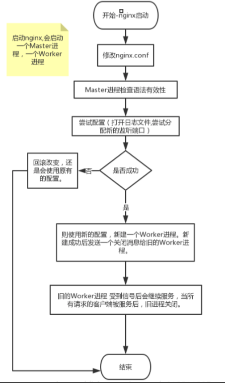

## 配置热更新

当修改了 nginx 的配置文件时，执行 nginx -s reload 命令就可以使新的配置生效（业务不会中断），而不需要关闭当前的进程再重新启动。这就是所谓的配置热更新。这一节让我们看看 nginx 是如何实现配置热更新的。

nginx启动时，会启动两个进程： 一个是Master进程和worker进程。

改变配置后nginx做的事
- 1）改变了nginx配置之后，HUP signal的信号需要发送给主进程。
- 2）主进程首先会检测新配置的语法有效性。
- 3）尝试应用新的配置

1. 打开日志文件，并且新分配一个socket来监听。
2. 如果1失败，则回滚改变，还是会使用原有的配置。
3. 如果1成功，则使用新的配置，新建一个线程。新建成功后发送一个关闭消息给旧的进程。要求旧线程优雅的关闭。
4. 旧的线程 受到信号后会继续服务，当所有请求的客户端被服务后，旧线程关闭



- [reload的原理](https://www.cnblogs.com/gcixx/p/11145466.html)
- [nginx 源码分析：配置热更新流程](https://blog.csdn.net/woay2008/article/details/102770759)

---
## nginx热升级流程

步骤1、升级nginx二进制文件，需要先将新的nginx可执行文件替换原有旧的nginx文件，然后给nginx master进程发送**USR2**信号，告知其开始升级可执行文件；nginx **master进程会将老的pid文件增加.oldbin后缀，然后拉起新的master和worker进程，并写入新的master进程的pid**。

步骤2、在此之后，所有工作进程(包括旧进程和新进程)将会继续接受请求。这时候，需要发送**WINCH**信号给nginx master进程，master进程将会向worker进程发送消息，告知其需要进行graceful shutdown，worker进程会在连接处理完之后进行退出。

步骤3、经过一段时间之后，将会只会有新的worker进程处理新的连接。

> 注意，旧master进程并不会关闭它的listen socket；因为如果出问题后，需要回滚，master进程需要法重新启动它的worker进程。

步骤4、如果升级成功，则可以向旧master进程发送**QUIT**信号，停止老的master进程；如果新的master进程（意外）退出，那么旧master进程将会去掉自己的pid文件的.oldbin后缀。

master进程相关信号
```
USR2    升级可执行文件
WINCH   优雅停止worker进程
QUIT    优雅停止master进程
```
worker进程相关信号
```
TERM, INT   快速退出进程
QUIT    优雅停止进程
```

- [nginx热更新](https://zhuanlan.zhihu.com/p/59193526)
