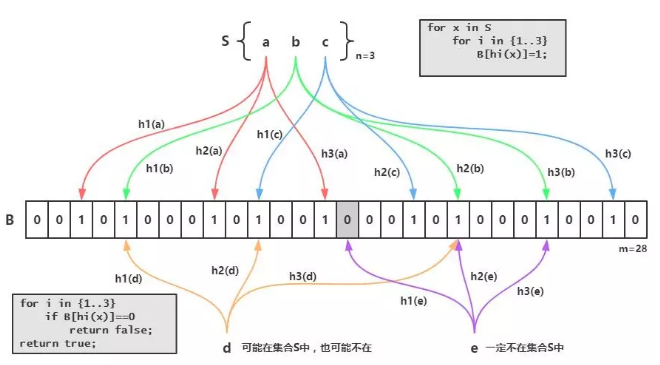
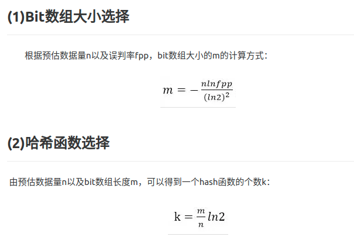

# 概念

布隆过滤器可以用于**检索一个元素是否在一个集合中**。它的优点是**空间效率和查询时间都远远超过一般的算法**，缺点是**有一定的误识别率和删除困难**。

# 原理

布隆过滤器的原理是，当一个元素被加入集合时，通过K个散列函数将这个元素映射成一个位数组中的K个点，把它们置为1。检索时，我们只要看看这些点是不是都是1就（大约）知道集合中有没有它了：如果这些点有任何一个0，则被检元素一定不在；如果都是1，则被检元素很可能在。这就是布隆过滤器的基本思想。

Bloom Filter跟单哈希函数Bit-Map不同之处在于：Bloom Filter使用了**k个哈希函数**，每个字符串跟k个bit对应。从而降低了**冲突的概率**。

# 场景

先查询缓存，缓存不命中再查询数据库。然后将查询结果放在缓存中即使数据不存在，也需要创建一个缓存，用来防止穿库。当用户量太大时，我们会缓存大量数据空数据。

k-v，存在的键值缓存布隆过滤器里面。当一个k过来，判断是否存在，不存在的话，肯定是没有缓存到的，就直接返回一个空。即使误判存在了，但是再次查询数据库，也是返回空。

问题： 要预先把所有的K存在布隆过滤器？是的。需要提前将真实正确的商品Id，在添加完成之后便加入到过滤器当中

# Bloom Filter的缺点
bloom filter之所以能做到在时间和空间上的效率比较高，是因为牺牲了判断的准确率、删除的便利性

- 存在误判，可能要查到的元素并没有在容器中，但是hash之后得到的k个位置上值都是1。如果bloom filter中存储的是黑名单，那么可以通过建立一个白名单来存储可能会误判的元素。
> 也就是把误判的k缓存到一个白名单上。

- 删除困难。一个放入容器的元素映射到bit数组的k个位置上是1，删除的时候不能简单的直接置为0，可能会影响其他元素的判断。

- [Redis-避免缓存穿透的利器之BloomFilter](https://juejin.im/post/5db69365518825645656c0de)

> 不存在的肯定不存在，存在的不一定存在。思路要倒转一下。

# 实现

在使用bloom filter时，绕不过的两点是预估数据量n以及期望的误判率fpp，

在实现bloom filter时，绕不过的两点就是hash函数的选取以及bit数组的大小。

对于一个确定的场景，我们预估要存的数据量为n，期望的误判率为fpp，然后需要计算我们需要的Bit数组的大小m，以及hash函数的个数k，并选择hash函数

错误率0.03，上面的numBits，表示存一百万个int类型数字，需要的位数为7298440，700多万位。理论上存一百万个数，一个int是4字节32位，需要481000000=3200万位。如果使用HashMap去存，按HashMap50%的存储效率，需要6400万位。可以看出BloomFilter的存储空间很小，只有HashMap的**1/10左右**

0.0003时，所需要的位数为16883499，1600万位，需要12个函数

和上面对比可以看出，错误率越大，所需空间和时间越小，错误率越小，所需空间和时间约大

----
# 布谷鸟过滤器

最简单的布谷鸟哈希结构是**一维数组结构**，会有两个 hash 算法将新来的元素映射到数组的两个位置。如果两个位置中有一个位置为空，那么就可以将元素直接放进去。但是如果这两个位置都满了，它就不得不「鸠占鹊巢」，随机踢走一个，然后自己霸占了这个位置。

删除算法和查找算法差不多，也很简单，在两个桶里把自己的指纹抹去就 ok 了。

这句话明确告诉我们如果想要让**布谷鸟过滤器支持删除操作，那么就必须不能允许插入操作多次插入同一个元素**，确保每一个元素不会被插入多次（kb+1）。这里的 k 是指 hash 函数的个数 2，b 是指单个位置上的座位数，这里我们是 4。

在现实世界的应用中，**确保一个元素不被插入指定的次数那几乎是不可能做到的**。如果你觉得可以做到，请思考一下要如何做！你是不是还得维护一个外部的字典来记录每个元素的插入次数呢？这个外部字典的存储空间怎么办？

- [老錢:布谷鸟过滤器](https://juejin.im/post/5cfb9c74e51d455d6d5357db)
