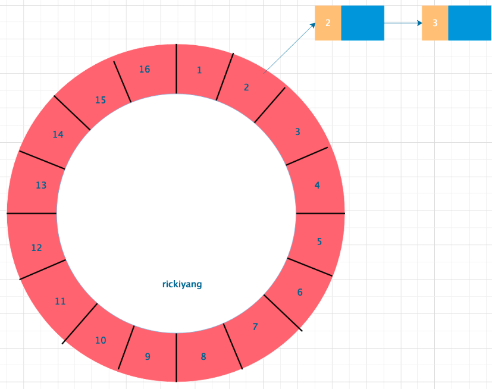

## redis

使用sortedset，拿时间戳作为score，消息内容作为key调用zadd来生产消息，消费者用zrangebyscore指令获取N秒之前的数据轮询进行处理。

这个方案比较常用，简单有效。利用 Redis 的 sorted set 结构，使用 timeStamp 作为 score，比如你的任务是要延迟5分钟，那么就在当前时间上加5分钟作为 score ，**轮询任务每秒只轮询 score 大于当前时间的 key即可**，如果任务支持有误差，那么当没有扫描到有效数据的时候可以休眠对应时间再继续轮询。

方案优劣：

### 优点：

简单实用，一针见血。

### 缺点：

- 单个 zset 肯定支持不了太大的数据量，如果你有几百万的延迟任务需求，大哥我还是劝你换一个方案；
- 定时器轮询方案可能会有**异常终止的情况需要自己处理，同时消息处理失败的回滚方案**，您也要自己处理。

所以，sorted set 的方案并不是一个成熟的方案，他只是一个快速可供落地的方案。

---

## RabbitMQ

RabbitMQ本身是不支持延迟队列的，只是他的特性弄出了这么一套可用的方案。

可用的方案就是：

1. 如果有事件需要延迟那么将该事件发送到MQ 队列中，为需要延迟的消息设置一个TTL；
2. TTL到期后就会**自动进入设置好的DLX，然后由DLX转发到配置好的实际消费队列**；
3. 消费该队列的延迟消息，处理事件。

### 优点：

大品牌组件，用的放心。如果面临**大数据量需求可以很容易的横向扩展，同时消息支持持久化，有问题可回滚**。

### 缺点：

1. 配置麻烦，额外增加一个死信交换机和一个死信队列的配置；
2. RabbitMQ 是一个消息中间件，TTL 和 DLX 只是他的一个特性，将延迟队列绑定在一个功能软件的某一个特性上，可能会有风险。不要杠，当你们组不用 **RabbitMQ 的时候迁移很痛苦**；
3. 消息队列具**有先进先出的特点**，如果第一个进入队列的消息 A 的延迟是10分钟，第二个进入队列的消息B 的延迟是5分钟，期望的是谁先到 TTL谁先出，但是事实是B已经到期了，而还要等到 A 的延迟10分钟结束A先出之后，B 才能出。所以在设计的时候需要考虑**不同延迟的消息**要放到**不同的队列**。另外该问题官方已经给出了**插件来支持**

---

## 基于 Netty#HashedWheelTimer类方法的实现

HashedWheelTimer 是 Netty 中 的一个基础工具类，主要用来高效处理大量定时任务，且**任务对时间精度要求相对不高**， 在Netty 中的应用场景就是**连接超时或者任务处理超时**，一般都是**操作比较快速的任务**，缺点是**内存占用相对较高**。

HashedWheelTimer 主要还是一个 **DelayQueue 和一个时间轮算法**组合。

Hash Wheel Timer是一个环形结构，可以想象成时钟，分为很多格子，**一个格子代表一段时间**（越短Timer精度越高），并用一个**List保存在该格子上到期的所有任务**。同时一个指针随着时间流逝一格一格转动，并执行对应List中所有到期的任务。

以上图为例，假设一个格子是1s，则整个时间轮能表示的时间段16s。当前任务指向格子2，表明在第2s的时候有任务需要执行。任务列表中有两个任务，**每个任务前面的数字表示圈数**。2表示当走到第2圈的时候才会执行，那么整个任务的真正执行时间其实是在12s之后执行，即第二圈走到2的时候。每推进一格，对应的每一个 slot 中的round数都要减一。整体算法就是这么个逻辑。

需要注意的是，这种方式任务是**串行执行的**。意味着你如果在时间轮中执行任务且任务耗时较长，将会出现调度超时或者任务堆积的情况。所以要将任务的执行**异步化**。

### 算法的要点：

- 任务并不是直接放在格子中的，而是维护了一个双向链表，这种数据结构非常便于插入和移除；
- 新添加的任务并不直接放入格子，而是先放入一个队列中，这是为了**避免多线程插入任务的冲突**。在每个tick运行任务之前由worker线程自动对任务进行归集和分类，插入到对应的槽位里面。

Netty 使用**数组 + 双向链表的方式来组织时间轮**，对于添加/取消操作仅做了**记录**，真正的操作实际发生在下一个tick。

时间的推进是独立的线程在做，该线程同时也负责过期任务的执行等操作，可简单认为此步骤操作为O(n)，因为推进线程需要完全遍历timeouts、cancelledTimeouts与bucket链表，在遍历timeouts时，Netty为了避免任务过多，所以限制每次最多遍历10万个，也就是说，一个tick只能规划10万个任务，当任务量过大时，会存在超时任务执行时间延迟的现象。

### 优点：

实现比较优雅。效率高。

### 缺点：

- **无法实现HA和横向扩展，要么就使用多个时间轮**。
- 最重要的是，**实现也比较复杂**，开发者需要考虑所有可能的情况

- [如何实现延迟队列](https://www.cnblogs.com/rickiyang/p/12237612.html)