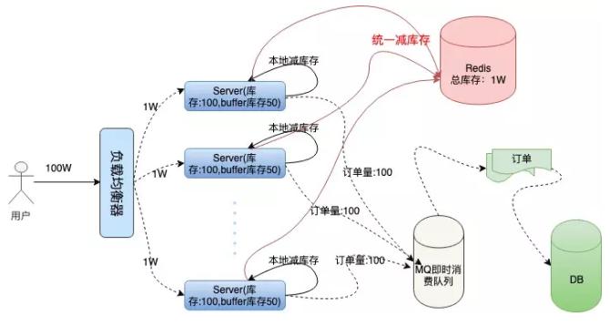

要解决这个问题，我们就要想明白一件事：通常订票系统要处理生成订单、减扣库存、用户支付这三个基本的阶段。

这种顺序是我们一般人首先会想到的解决方案，这种情况下也能保证订单不会超卖，因为**创建订单之后就会减库存，这是一个原子操作**。

但是这样也会产生一些问题：
- 在极限并发情况下，任何一个内存操作的细节都至关影响性能，尤其像创建订单这种逻辑，**一般都需要存储到磁盘数据库的，对数据库的压力是可想而知的**。

- 如果用户存在恶意下单的情况，**只下单不支付这样库存就会变少**，会少卖很多订单，虽然服务端可以限制 IP 和用户的购买订单数量，这也不算是一个好方法。

为了**保证扣库存和生成订单的原子性**，需要**采用事务处理**，然后**取库存判断、减库存，最后提交事务**，整个流程有很多 IO，对数据库的操作又是阻塞的。

我们把一定的库存量分配到本地机器，直接在内存中减库存，然后按照之前的逻辑异步创建订单。

这样就避免了对数据库频繁的 IO 操作，只在内存中做运算，极大的提高了单机抗并发的能力。

但是百万的用户请求量单机是无论如何也抗不住的，虽然 Nginx 处理网络请求使用 Epoll 模型，c10k 的问题在业界早已得到了解决。

但是 Linux 系统下，一切资源皆文件，网络请求也是这样，大量的文件描述符会使操作系统瞬间失去响应。

上面我们提到了 Nginx 的**加权均衡策略**，我们不妨假设将 100W 的用户请求量平均均衡到 100 台服务器上，这样单机所承受的并发量就小了很多。

然后我们每台机器本地库存 100 张火车票，100 台服务器上的总库存还是 1 万，这样保证了库存订单不超卖。

---

问题接踵而至，在高并发情况下，现在我们还无法保证系统的高可用，假如这 100 台服务器上有两三台机器因为扛不住并发的流量或者其他的原因**宕机**了。那么这些服务器上的订单就卖不出去了，这就造成了订单的少卖。

服务器不仅要在本地减库存，另外要远程统一减库存。

有了远程统一减库存的操作，我们就可以根据机器负载情况，为每台机器分配一些多余的“Buffer 库存”**用来防止机器中有机器宕机的情况**。

统一扣库存操作 Redis，因为 Redis 是单线程的，而我们要实现从中取数据，写数据并计算一些列步骤，我们**要配合 Lua 脚本打包命令，保证操作的原子性**：

---
- [秒杀系统的艺术](https://juejin.im/post/5d84e21f6fb9a06ac8248149)

思路： 通过go的chan实现全局的读写锁，对单击里面的库存进行操作。进行本地扣取库存和远程扣取库存的操作。而且远程扣取的操作进行了lua的封装，报错操作的原子性。本地减库存如果不满足，就不去请求远程redis。

问题： 本地扣取库存和远程扣取库存并没有原子性的操作，导致少买。

A: 内存扣减成功，以redis扣减为最终的结果。总库存还在，某台机器上库存无了，还会有其他机器上的buffer库存做补充，不会存在少卖情况。

问题： 远程扣取库存是原子性操作，那不也就是所有的请求到去到远程redis的负载，不就是单机redis的操作是一样的？远程redis的高可用？

A：之所以使用远程减库存，是为了更好的保护redis，虽然redis性能很好，但是如果大量redis的请求也会将redis压垮。所以本地减库存如果不满足，就不去请求redis能非常大的限制流量冲击到redis。（也就是分担本地库存卖完后的远程redis的压力？）

问题：本地buffer库存的作用。

A: 上面说的补充其他机器的buffer。那这样子是不是永远都会去到远程的redis，去确认是否还有库存。

Go 语言的哲学：不要通过共享内存来通信，而要通过通信来共享内存。

> 感觉还是太简陋和不成熟了

---

秒杀的关键在于动静分离、提前校验。
1. 根据 db 规格做好进程内限流，预留一倍升级空间。

2. 静态数据（商品属性）提前预热至缓存，缓存过期时间为秒杀结束时间。

3. 各种校验提前做，特别是库存校验。

4. 库存怎么扣减
    - 提前预热库存数据至 redis，原子 DECR 扣减库存，扣减成功 mq 同步 db 库存。

5. 如何下单？
    - 校验成功通过 mq 抛出下单事件，做好耗时监控，前端页面 hold 一下。

6. 超时未支付怎么办？
    - 下单成功时抛出抛出延时消息，比如 30 分钟。到期检测订单状态，失败 INCR 把库存还回去。

7. 如何防刷？
    - uid 固定时间限流

8. 如何反止链接提前泄露？
    - 产品 id 哈希

9. 如何反止暴力遍历？
    - 产品 id 经过布隆过滤器校验一下

---
# 参考链接

- [《我们一起进大厂》系列-秒杀系统设计](https://juejin.im/post/5dd09f5af265da0be72aacbd)
- [由微视春节集卡瓜分活动，看高可用秒杀系统的架构设计](https://www.infoq.cn/article/7HG7DR5ZVbtBlT4VaadJ)
- [穗康小程序口罩预约前后端架构及产品设计](https://cloud.tencent.com/developer/salon/live-1217?channel=gzhxyh): TODO
- [一个秒杀系统的设计思考](https://segmentfault.com/a/1190000020970562)

- [云+社区沙龙](https://cloud.tencent.com/developer/salon/lives?channel=gzhxyh)
