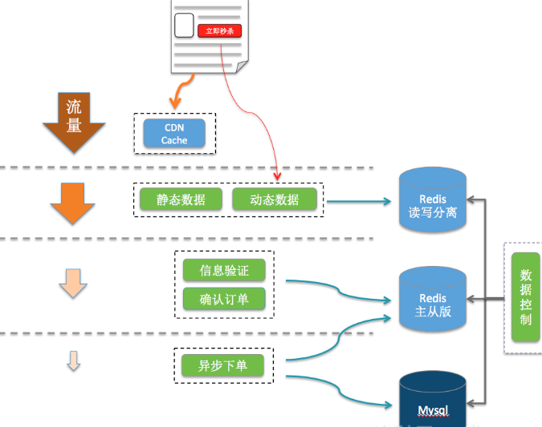

## 服务单一职责

单一职责的好处就是就算秒杀没抗住，秒杀库崩了，服务挂了，也不会影响到其他的服务。

## Redis集群

之前不是说单机的Redis顶不住嘛，那简单多找几个兄弟啊，秒杀本来就是读多写少，那你们是不是瞬间想起来我之前跟你们提到过的，Redis集群，主从同步、读写分离，我们还搞点哨兵，开启持久化直接无敌高可用！

## Nginx

负载均衡嘛，一台服务几百，那就多搞点，在秒杀的时候多租点流量机。

## 资源静态化

提前放入cdn服务器的东西都放进去，反正把所有能提升效率的步骤都做一下，减少真正秒杀时候服务器的压力。

## 按钮控制

这是因为怕大家在时间快到的最后几秒秒疯狂请求服务器，然后还没到秒杀的时候基本上服务器就挂了。

## 限流

- **前端限流**：这个很简单，一般秒杀不会让你一直点的，一般都是点击一下或者两下然后几秒之后才可以继续点击，这也是保护服务器的一种手段。

- **后端限流**：秒杀的时候肯定是涉及到后续的订单生成和支付等操作，但是都只是成功的幸运儿才会走到那一步，那一旦100个产品卖光了，return了一个false，前端直接秒杀结束，然后你后端也关闭后续无效请求的介入了。

## 库存预热

提前把商品的库存加载到Redis中去，让整个流程都在Redis里面去做，然后等秒杀结束了，再异步的去修改库存就好了。

> Lua 脚本功能是 Reids在 2.6 版本的最大亮点， 通过内嵌对 Lua 环境的支持， Redis 解决了长久以来不能高效地处理 CAS （check-and-set）命令的缺点， 并且可以通过组合使用多个命令， 轻松实现以前很难实现或者不能高效实现的模式。

Lua脚本是类似Redis事务，有一定的原子性，不会被其他命令插队，可以完成一些Redis事务性的操作。

## 限流&降级&熔断&隔离

限流，顶不住就挡一部分出去但是不能说不行，降级，降级了还是被打挂了，熔断，至少不要影响别的系统，隔离，你本身就独立的，但是你会调用其他的系统嘛，你快不行了你别拖累兄弟们啊。

## 削峰填谷

把它放消息队列，然后一点点消费去改库存就好了嘛，不过单个商品其实一次修改就够了，我这里说的是某个点多个商品一起秒杀的场景，像极了双十一零点。

- [《我们一起进大厂》系列-秒杀系统设计](https://juejin.im/post/5dd09f5af265da0be72aacbd)

----
- [由微视春节集卡瓜分活动，看高可用秒杀系统的架构设计](https://www.infoq.cn/article/7HG7DR5ZVbtBlT4VaadJ)

# 高可用秒杀系统的架构设计

## 漏斗型架构设计

漏斗型架构设计，指的是，用户的请求，从客户端到DB层，层层递减，递减的程度视业务而定。例如当10万人去抢1个物品时，DB层的请求在个位数量级，对于秒杀系统来讲，漏斗型架构设计就是比较理想的模型，如下图所示。

## 产品策略
- 轻重逻辑分离，以秒杀为例，将抢到和到账分开；
    - 抢到，是比较轻的操作，库存扣成功后，就可以成功了。
    - 到账，是比较重的操作，需要涉及到到事务操作。

- 用户分流，以整点秒杀活动为例，在 1 分钟内，陆续对用户放开入口，将所有用户请求打散在 60s 内，请求就可以降一个数量级。?
- 页面简化，在秒杀开始的时候，需要简化页面展示，该时刻只保留和秒杀相关的功能。例如，秒杀开始的时候，页面可以不展示推荐的商品

## 客户端
- 重试策略非常关键，如果用户秒杀失败了，**频繁重试**，会加剧后端的**雪崩**。如何重试呢？根据后端返回码的约定，有两种方法：
    - 不允许重试错误，此时 UI 和文案都需要有一个**提示**。同时不允许重试；
    - 可重试错误，需要**策略重试**，例如二进制退避法。同时文案和 UI 需要提示。

- UI 和文案，秒杀开始前后，用户的所有异常都需要有精心设计的 UI 和文案提示。例如：【当前活动太火爆，请稍后再重试】【你的货物堵在路上，请稍后查看】等。
- 前端**随机丢弃**请求可以作为降级方案，当用户流量远远大于系统容量时，人工下发随机丢弃标记，用户本地客户端开始随机丢弃请求。

## 接入层

- 所有请求需要**鉴权**，校验合法身份。
> 如果是长链接的服务，鉴权粒度可以在 session 级别；如果是短链接业务，需要应对这种高并发流量，例如 cache 等。

- 根据后端系统容量，需要一个**全局的限流功能**，通常有两种做法：
    - 设置好 N 后，动态获取机器部署情况 M，然后下发单机限流值 N/M。要求请求均匀访问，部署机器统一。
    - 维护全局 key，以时间戳建 key。有热 key 问题，可以通过增加更细粒度的 key 或者定时更新 key 的方法。

- 对于单用户 / 单 IP 需要**频控**，主要是**防黑产和恶意用户**。如果秒杀是有条件的，例如需要完成 xxx 任务(答题)，解锁资格，对于获得资格的步骤，可以进行安全扫描，识别出黑产和恶意用户。

## 逻辑层

- 逻辑层首先应该进入**校验逻辑**，例如参数的合法性，是否有资格，如果失败的用户，快速返回，避免请求**洞穿**到 DB。

- **异步**补单，对于已经扣除秒杀资格的用户，如果发货失败后，通常的两种做法是：
    - 事务回滚，回滚本次行为，提示用户重试。这个代价特别大，而且用户重试和前面的重试策略结合的话，用户体验也不大流畅。
    - 异步重做，记录本次用户的 log，提示用户【稍后查看，正在发货中】，后台在峰值过后，启动异步补单。需要服务支持幂等。

- 对于发货的库存，需要处理热 key。通常的做法是，维护多个 key，每个用户**固定**去某个查询库存。对于大量人抢红包的场景，可以**提前分配**。

## 存储层
对于业务模型而言，对于 DB 的要求需要保证几个原则：

- 可靠性

1. 主备：主备能互相切换，一般要求在同城跨机房。
2. 异地容灾：当一地异常，数据能恢复，异地能选主。
3. 数据需要持久化到磁盘，或者更冷的设备。

- 一致性
对于秒杀而言，需要严格的一致性，一般要求主备严格的一致。

> 总结：漏斗形设计。过滤无用请求。避免直接的DB操作和事务。采用redis的内存操作和消息队列kafka的流量削峰、排队异步处理。

---
参考链接：

- [云+社区沙龙](https://cloud.tencent.com/developer/salon/lives?channel=gzhxyh)
- TODO[穗康小程序口罩预约前后端架构及产品设计](https://cloud.tencent.com/developer/salon/live-1217?channel=gzhxyh)

---
# 使用Redis搭建电商秒杀系统
- [使用Redis搭建电商秒杀系统](https://tech.antfin.com/docs/2/63920)

## 特征
秒杀活动可以分为3个阶段：

- 秒杀前：用户不断刷新商品详情页，页面请求达到瞬时峰值。
- 秒杀开始：用户点击秒杀按钮，下单请求达到瞬时峰值。
- 秒杀后：一部分成功下单的用户不断刷新订单或者产生退单操作，大部分用户继续刷新商品详情页等待退单机会。

## 设计

秒杀系统的流量虽然很高，但是实际有效流量是十分有限的。利用系统的层次结构，在每个阶段提前校验，拦截无效流量，可以减少大量无效的流量涌入数据库。

### 利用浏览器缓存和CDN抗压静态页面流量

秒杀前，用户不断刷新商品详情页，造成大量的页面请求。所以，我们需要把秒杀商品详情页与普通的商品详情页分开。对于秒杀商品详情页尽量将能静态化的元素静态化处理，除了秒杀按钮需要服务端进行动态判断，其他的静态数据可以缓存在浏览器和CDN上。这样，秒杀前刷新页面导致的流量进入服务端的流量只有很小的一部分。

### 利用读写分离Redis缓存拦截流量

CDN是第一级流量拦截，第二级流量拦截我们使用支持读写分离的Redis。在这一阶段我们主要读取数据，读写分离Redis能支持高达60万以上qps，完全可以支持需求。

### 利用主从版Redis缓存加速库存扣量
成功参与下单后，进入下层服务，开始进行订单信息校验，库存扣量。为了避免直接访问数据库，我们使用主从版Redis来进行库存扣量，主从版Redis提供10万级别的QPS。使用Redis来优化库存查询，提前拦截秒杀失败的请求，将大大提高系统的整体吞吐量。

先使用SCRIPT LOAD将lua脚本提前缓存在Redis，然后调用EVALSHA调用脚本，比直接调用EVAL节省网络带宽。

秒杀服务通过判断Redis是否返回抢购个数n，即可知道此次请求是否扣量成功。

### 使用主从版Redis实现简单的消息队列异步下单入库

扣量完成后，需要进行订单入库。如果商品数量较少的时候，直接操作数据库即可。如果秒杀的商品是1万，甚至10万级别，那数据库锁冲突将带来很大的性能瓶颈。因此，利用消息队列组件，当秒杀服务将订单信息写入消息队列后，即可认为下单完成，避免直接操作数据库。

### 数据控制模块管理秒杀数据同步

最开始，利用读写分离Redis进行流量限制，只让部分流量进入下单。对于下单检验失败和退单等情况，需要让更多的流量进来。因此，数据控制模块需要定时将数据库中的数据进行一定的计算，同步到主从版Redis，同时再同步到读写分离的Redis，让更多的流量进来。
