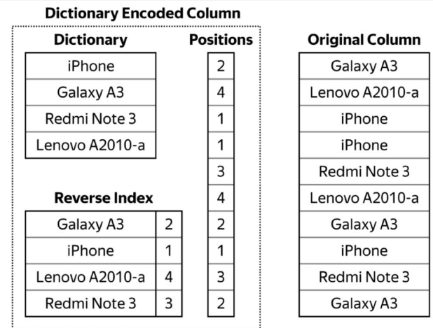

## LowCardinality Data Type

- [lowcardinality](https://clickhouse.tech/docs/en/sql-reference/data-types/lowcardinality/)

Changes the internal representation of other data types to be dictionary-encoded.

> 将其他数据类型的内部表示更改为[字典编码](https://baike.baidu.com/item/%E8%AF%8D%E5%85%B8%E7%BC%96%E7%A0%81/4097538)

### 语法

`LowCardinality(data_type)`

### 例子

```sql

CREATE TABLE test2
(
    `id` UInt32,
    `v1` String,
    `v2` StringWithDictionary
)
ENGINE = MergeTree()
ORDER BY id;

INSERT INTO test2 WITH
    (
        SELECT ['A', 'B', 'C', 'D']
    ) AS dict
SELECT
    number,
    dict[(number % 4) + 1] AS v1,
    v1
FROM system.numbers
LIMIT 300000000


SELECT
    column,
    any(type) AS type,
    sum(column_data_compressed_bytes) AS compressed,
    formatReadableSize(sum(column_data_compressed_bytes)) AS compressed_f,
    sum(column_data_uncompressed_bytes) AS uncompressed,
    formatReadableSize(sum(column_data_uncompressed_bytes)) AS uncompressed_f,
    sum(rows) AS rows
FROM system.parts_columns
WHERE (table = 'test2') AND (column LIKE 'v%') AND active
GROUP BY column
ORDER BY column ASC
```


|column| typ| compressed| compressed_f| uncompressed| uncompressed_f| rows|
| ------ | ------ |------ |------ |------ |------ |------ |
| v1 | String  |    9894228 | 9.44 MiB|   2168623320 | 2.02 GiB  | 1084311660 |
| v2 | LowCardinality(String) |    5305899 | 5.06 MiB |   1087695754 | 1.01 GiB  | 1084311660 |

> 2 rows in set. Elapsed: 0.006 sec. Processed 1.05 thousand rows, 394.61 KB (186.18 thousand rows/s., 69.97 MB/s.)

```sql
SELECT
    v1,
    count()
FROM test2
GROUP BY v1
ORDER BY v1 ASC
```

> 4 rows in set. Elapsed: 2.456 sec. Processed 300.00 million rows, 3.00 GB (122.16 million rows/s., 1.22 GB/s.)

```sql
SELECT
    v2,
    count()
FROM test2
GROUP BY v2
ORDER BY v2 ASC
```

> 4 rows in set. Elapsed: 0.842 sec. Processed 300.00 million rows, 300.30 MB (356.50 million rows/s., 356.85 MB/s.)

### 原理

低基数是改变数据存储方法和数据处理规则的上层结构。ClickHouse将字典编码应用于低基数列。使用字典编码的数据可以显著提高许多应用程序的SELECT查询的性能。



使用低基数数据类型的效率取决于数据的多样性。如果一个字典包含的不同值少于10000个，那么ClickHouse通常显示出更高的数据读取和存储效率。如果一个字典包含超过100000个不同的值，那么与使用普通数据类型相比，ClickHouse的性能会更差。

LowCardinality 支持 String、Number、Date、DateTime、Nullable数据类型。

在内部，ClickHouse 创建一个或多个文件以存储 LowCardinality 字典数据。如果所有 LowCardinality 列都符合 8192 个不同的值，那么每个表可以是一个单独的文件，如果去重值的数量更多，则每个 LowCardinality 列就使用一个文件。

ClickHouse LowCardinality 优化不仅限于存储，它还使用字典 position 进行过滤、分组和加速某些查询功能（例如 length()）等。

---
### 对比测试

SELECT ['A', 'B', 'C', 'D', 'E', 'F', 'G', 'H']

|column| typ| compressed| compressed_f| uncompressed| uncompressed_f| rows|
| ------ | ------ |------ |------ |------ |------ |------ |
| v1     | String                 |    9787969 | 9.33 MiB     |   2082642630 | 1.94 GiB       | 1041321315 |
| v2     | LowCardinality(String) |    5158745 | 4.92 MiB     |   1044511601 | 996.12 MiB     | 1041321315 |

SELECT ['a', 'b', 'c', 'd', 'e', 'f', 'g', 'h', 'i', 'j', 'k', 'l', 'm', 'n', 'o', 'p', 'q', 'r', 's', 't', 'u', 'v', 'w', 'x', 'y', 'z']

|column| typ| compressed| compressed_f| uncompressed| uncompressed_f| rows|
| ------ | ------ |------ |------ |------ |------ |------ |
| v1     | String                 |   20403033 | 19.46 MiB    |   4081169400 | 3.80 GiB       | 2040584700 |
| v2     | LowCardinality(String) |   12390096 | 11.82 MiB    |   2046680041 | 1.91 GiB       | 2040584700 |

> 结论： 压缩率都是一半左右，基数变多但因为字符长度不大没有什么太大区别，对一些长字符的优化更明显。


### LowCardinality 与 Enum

值得一提的是，还有一种用字典编码字符串的可能性，那就是枚举类型：Enum。

ClickHouse 完全支持枚举。从存储的角度来看，它可能甚至更高效，因为枚举值存储在表定义上而不是存储在单独的数据文件中。枚举适用于静态字典。但是，如果插入了原始枚举之外的值，ClickHouse 将抛出异常。枚举值中的每个更改都需要 ALTER TABLE，这可能会带来很多麻烦。LowCardinality 在这方面要灵活得多。

在处理字符串时，请考虑使用LowCardinality而不是Enum。低基数在使用中提供了更大的灵活性，并且通常显示出相同或更高的效率

---
### 注意事项

allow_suspicious_low_cardinality_types: 允许或限制将LowCardinality用于固定大小为8个字节或更少的数据类型：数字数据类型和FixedString（8_bytes_or_less）。

对于较小的固定值，使用**低基数通常效率低下**，因为ClickHouse为每一行存储一个数字索引:
- 磁盘空间使用量可能会增加。
- RAM消耗可能更高，具体取决于字典大小。
- 由于额外的编码/编码操作，某些功能的运行速度可能较慢。

由于上述所有原因，MergeTree引擎表中的合并时间可能会增加。

Possible values:
- 1 — Usage of LowCardinality is not restricted.
- 0 — Usage of LowCardinality is restricted.

Default value: 0.

- [allow_suspicious_low_cardinality_types](https://clickhouse.tech/docs/en/operations/settings/settings/#allow_suspicious_low_cardinality_types)

### 小结

在默认的情况下，声明了LowCardinality的字段会基于数据生成一个全局字典，并利用倒排索引建立Key和位置的对应关系。如果数据的基数大于 8192，也就是说不同的值多于8192个，则会将一个全局字典拆分成多个局部字典(由 low_cardinality_max_dictionary_size 参数控制, 默认8192)。

**因为进一步使用了字典压缩，所以查询的IO压力变小了，这是一处优化; 其次在处理数据的某些场合，可以直接使用字典进行操作，不需要将数据全部展开。**

由于字典压缩和数据特征息息相关，所以这项特性的最终受益效果，需要在大家各自的环境中进行验证。通常来说，在**万级别基数的数据**下，使用LowCardinality的收益效果都是不错的。

---

## 参考链接

- [LowCardinality 数据类型的神秘之旅](https://blog.csdn.net/jiangshouzhuang/article/details/103268340)
- [ClickHouse中的低基数字段优化](https://mp.weixin.qq.com/s/XKQk4hsdj8VN8TnYdrOnuw)
- [lowcardinality](https://clickhouse.tech/docs/en/sql-reference/data-types/lowcardinality/)

---
# 案例

mt.ad_log的area字段：

|column| typ| compressed| compressed_f| uncompressed| uncompressed_f| rows|
| ------ | ------ |------ |------ |------ |------ |------ |
|area       |String                         |6,753,766,101    |6.29 GiB        |24,213,036,473     |22.55 GiB   | 5,401,999,696|


## 测试数据库


### 压缩字段与原始字段对比

```sql

alter table ad_log add column area_d StringWithDictionary  default  area;

optimize table ad_log final
```

|column| typ| compressed| compressed_f| uncompressed| uncompressed_f| rows|
| ------ | ------ |------ |------ |------ |------ |------ |
| area           | String                 |   68923414 | 65.73 MiB    |    225413587 | 214.97 MiB     | 49741537 |
| area_d         | LowCardinality(String) |   27720251 | 26.44 MiB    |     51969474 | 49.56 MiB      | 49741537 |

> 压缩率： 26/66 =40%

### 直接更改语句

````sql
alter table ad_log MODIFY column area StringWithDictionary;
````

|column| typ| compressed| compressed_f| uncompressed| uncompressed_f| rows|
| ------ | ------ |------ |------ |------ |------ |------ |
| area           | LowCardinality(String) |   27720589 | 26.44 MiB    |     51969636 | 49.56 MiB      | 49741547 |

````sql
alter table ad_log drop column area_d;
````

表的总的数据空间对比：

```
mt  ad_log  247.42 MiB  2.12%   100	0.10	100	2020-07-29	2020-12-13	2020-12-13 13:56:22
mt  ad_log  208.35 MiB  1.79%   100	0.09	100	2020-07-29	2020-12-13	2020-12-13 14:03:20
```

> 节省了 247-208=39M 也就是area字段的节省率： 65 - 26 = 39M。

### 数值字段
```sql
ALTER TABLE ad_log
    MODIFY COLUMN `format` UInt16
```

|column| typ| compressed| compressed_f| uncompressed| uncompressed_f| rows|
| ------ | ------ |------ |------ |------ |------ |------ |
| format         | Int32                  |   25517461 | 24.34 MiB    |    198966212 | 189.75 MiB     | 49741553 |
| format         | UInt16                 |   18528476 | 17.67 MiB    |     99483246 | 94.87 MiB      | 49741623 |


```sql
ALTER TABLE ad_log
    MODIFY COLUMN `channel` LowCardinality(UInt32)
```

|column| typ| compressed| compressed_f| uncompressed| uncompressed_f| rows|
| ------ | ------ |------ |------ |------ |------ |------ |
| channel        | UInt32                 |   13599106 | 12.97 MiB    |    198966492 | 189.75 MiB     | 49741623 |
| channel        | LowCardinality(UInt32) |    7708302 | 7.35 MiB     |     49901555 | 47.59 MiB      | 49741623 |

> 7.35/12.97 = 56.7%。 47.59/189.75 = 25.08%

> 结论： 字段类型选择还是要精打细算。没必要设较大的字段类型浪费多余空间。通过LowCardinality(UInt32)，还是有很大的节省空间的。

---
# ad_effect表

|column| typ| compressed| compressed_f| uncompressed| uncompressed_f| rows|
| ------ | ------ |------ |------ |------ |------ |------ |
| media_id    | UInt32   |  707128346 | 674.37 MiB   |   1228238476 | 1.14 GiB       | 307059619 |
| format      | UInt32   |  415450638 | 396.20 MiB   |   1228238476 | 1.14 GiB       | 307059619 |
| platform    | UInt32   |  378096802 | 360.58 MiB   |   1228238476 | 1.14 GiB       | 307059619 |

```sql
ALTER TABLE _ad_effect_shadow_app
    MODIFY COLUMN `app_id` LowCardinality(UInt32)
```

|column| typ| compressed| compressed_f| uncompressed| uncompressed_f| rows|
| ------ | ------ |------ |------ |------ |------ |------ |
| media_id    | LowCardinality(UInt32) |  271709799 | 259.12 MiB   |    308517775 | 294.23 MiB     | 307059619 |
| format      | LowCardinality(UInt32) |  147651301 | 140.81 MiB   |    307741211 | 293.48 MiB     | 307059619 |
| platform    | LowCardinality(UInt32) |  142358249 | 135.76 MiB   |    307699475 | 293.45 MiB     | 307059619 |

```
mt  _ad_effect_shadow_app   6.44 GiB    56.7%   732	0.39	1,100	2018-11-30	2020-11-30	2020-12-09 02:18:06
mt  _ad_effect_shadow_app   5.57 GiB    53.09%  732	0.40	1,099	2018-11-30	2020-11-30	2020-12-13 14:27:46
```

## 速度对比

```sql
alter table _ad_effect_shadow_app add column media_id_row UInt32  default  media_id;
optimize table _ad_effect_shadow_app final;
-- 0 rows in set. Elapsed: 126.632 sec.
```

```sql

SELECT count(1)
FROM _ad_effect_shadow_app
WHERE media_id IN (1, 2, 3)
```

┌─count(1)─┐
|   315096 |
└──────────┘

1 rows in set. Elapsed: 0.945 sec.
1 rows in set. Elapsed: 0.934 sec.
1 rows in set. Elapsed: 0.948 sec.
5629f20dd9f9 :)

```sql

SELECT count(1)
FROM _ad_effect_shadow_app
WHERE media_id_row IN (1, 2, 3)
```

1 rows in set. Elapsed: 1.462 sec.
1 rows in set. Elapsed: 1.462 sec.
1 rows in set. Elapsed: 1.499 sec.

> 0.945/1.499 = 64.63% 提升了36%


---
## 位图

### 使用场景
- 留存分析
- 新上榜数据（对比上一个维度的结果）
- 归档压缩

### 概念
- [bitmap-functions](https://clickhouse.tech/docs/en/sql-reference/functions/bitmap-functions/): 官方文档

位图对象的构造方法有2种:
- 一个将由带有-State的聚合函数groupBitmap构造
- 另一个将由Array Object构造。也可以将位图对象转换为数组对象。

## 基本使用

### Array Object构造
```sql
WITH bitmapBuild([32, 65, 127, 1026]) AS bm
SELECT bm,toTypeName(bm);
```

```
┌─bm─┬─toTypeName(bm)─────────────────────────┐
|  A | AggregateFunction(groupBitmap, UInt16) |
└────┴────────────────────────────────────────┘

```

### 将由带有-State的聚合函数groupBitmap构造

```sql

select groupBitmapState(id) as bm, toTypeName(bm)  from (
    select 1 as id, 100 as b
    union all
    select 2 as id, 100 as b
) group by b
```


```
┌─bm─┬─toTypeName(groupBitmapState(id))──────┐
|    | AggregateFunction(groupBitmap, UInt8) |
└────┴───────────────────────────────────────┘

1 rows in set. Elapsed: 0.002 sec.
```

位图在CH中的本质是AggregateFunction(groupBitmap, UInt*)类型的（*由位图中的最大值弹性决定），即groupBitmap这个聚合函数产生的中间结果。


---
# 生产案例

构造一个广告id位图字段，以此来表达mt.ad_log表

---
## 聚合天
```sql
create table ad_log_dt
(
    area           String,
    ad_id          UInt32,
    ad_creative_id UInt32,
    position       UInt32,
    platform       UInt32,
    format         Int32,
    media          UInt32,
    appid          UInt32,
    channel        UInt32,
    dt             Date
) engine = MergeTree() partition by (dt) order by (ad_id);

INSERT INTO ad_log_dt (dt, platform, format, media, appid, channel, position, area, ad_id) SELECT
distinct
    dte,
    platform,
    format,
    media,
    appid,
    channel,
    position,
    area,
    ad_id
FROM mt.test_ad_log;
```

```sql
CREATE TABLE test_bit_ad_log
(
    `area` String,
    `ad_id_bm` AggregateFunction(groupBitmap, UInt32),
    `position` UInt32,
    `platform` UInt32,
    `format` Int32,
    `media` UInt32,
    `appid` UInt32,
    `channel` UInt32,
    `dt` Date
)
ENGINE = AggregatingMergeTree()
PARTITION BY dt
ORDER BY (dt, platform, format, media, appid, channel, position, area)

INSERT INTO test_bit_ad_log (dt, platform, format, media, appid, channel, position, area, ad_id_bm) SELECT
    dte,
    platform,
    format,
    media,
    appid,
    channel,
    position,
    area,
    groupBitmapState(ad_id)
FROM mt.test_ad_log
GROUP BY
    dte,
    platform,
    format,
    media,
    appid,
    channel,
    position,
    area;
```

## groupBitmapAndState

```sql
--  bitmapToArray 展开bitmap
select dt, platform, format, media, appid, channel, position, area, bitmapToArray(ad_id_bm)  from test_bit_ad_log;

-- groupBitmapOrState、 groupBitmapAndState 通过 -state 获取聚合的中间状态
select length(bitmapToArray(groupBitmapOrState(ad_id_bm))) from mt.test_bit_ad_log where dt between '2020-10-13' and '2020-10-14' and platform = 1 group by dt

-- 等于上面
select count(distinct ad_id) from mt.ad_log where between '2020-10-13' and '2020-10-14' and platform = 1
```

## 压缩成果：

|database| table | size| ratio | partitions| compression_ratio| parts| min_date| max_date | ut | rows|
| ------ | ------ |------ |------ |------ |------ |------ |------ |------ |------ |------ |
|mt| ad_log| 199.22 MiB| 1.86%|  100| 0.10| 100| 2020-07-29| 2020-12-13| 2020-12-13 14:18:08|    49,741,623 |
|mt| ad_log_dt|  12.05 MiB|  0.11%|  100| 0.13| 105| 2020-07-29| 2020-12-13| 2020-12-13 19:10:35|  2,571,216|
|mt| test_bit_ad_log| 2.90 MiB| 0.03%|  100| 0.50| 100| 2020-07-29| 2020-12-13| 2020-12-13 18:49:30|  21,303|

> 压缩率： 3/12=25%。不能跟ad_log进行对比，因为废弃了很多字段，特别是精确到秒时间。应该是跟按天维度的数据进行对比。

|database| table | size| ratio | partitions| compression_ratio| parts| min_date| max_date | ut | rows|
| ------ | ------ |------ |------ |------ |------ |------ |------ |------ |------ |------ |
| mt|test_ad_log |285.93 MiB|2.44%| 1| 0.12| 5| 2020-12-01| 2020-12-01| 2020-12-20 20:56:38| 48,852,386|
| mt|ad_log_dt| 26.15 MiB| 0.22%| 1| 0.18| 4| 2020-12-01| 2020-12-01| 2020-12-20 20:58:29| 3,971,254|
| mt|test_bit_ad_log| 11.86 MiB| 0.1%|1| 0.67| 1| 2020-12-01| 2020-12-01| 2020-12-20 20:59:56| 53,667|

> 压缩率： 11.86/26.15=45.35%

|database| table | size| ratio | partitions| compression_ratio| parts| min_date| max_date | ut | rows|
| ------ | ------ |------ |------ |------ |------ |------ |------ |------ |------ |------ |
| mt|test_ad_log |830.90 MiB|6.73%| 3| 0.12| 21| 2020-12-01| 2020-12-03| 2020-12-20 21:12:25| 138,779,440|
| mt|ad_log_dt| 78.96 MiB| 0.64%| 3| 0.18| 11| 2020-12-01| 2020-12-03| 2020-12-20 21:13:26| 11,883,406|
| mt|test_bit_ad_log| 35.38 MiB| 0.29%| 3| 0.67| 3| 2020-12-01| 2020-12-03| 2020-12-20 21:13:58| 159,698|
> 压缩率： 35.38/78.96=44.80%


## 查询效率

```sql
-- 原始表获取
SELECT countDistinct(ad_id)
FROM mt.test_ad_log
WHERE (platform = 2) AND (format = 102) AND (media > 3)

┌─uniqExact(ad_id)─┐
|            83555 |
└──────────────────┘

1 rows in set. Elapsed: 0.597 sec. Processed 138.78 million rows, 685.49 MB (232.43 million rows/s., 1.15 GB/s.)
```

```sql
-- 按天统计维度
SELECT countDistinct(ad_id)
FROM mt.ad_log_dt
WHERE (platform = 2) AND (format = 102) AND (media > 3)

┌─uniqExact(ad_id)─┐
|            83555 |
└──────────────────┘

1 rows in set. Elapsed: 0.112 sec. Processed 11.88 million rows, 60.14 MB (106.37 million rows/s., 538.31 MB/s.)

```


```sql
-- 位图压缩表进行数据的获取。
SELECT groupBitmapOr(ad_id_bm)
FROM mt.test_bit_ad_log
WHERE (platform = 2) AND (format = 102) AND (media > 3)

┌─groupBitmapOr(ad_id_bm)─┐
|                   83555 |
└─────────────────────────┘

1 rows in set. Elapsed: 0.057 sec. Processed 24.58 thousand rows, 389.66 KB (430.72 thousand rows/s., 6.83 MB/s.)
```

> 优化速率还是挺大的: 0.057/0.112=50.89%

## 恢复，列拆行
```sql
-- 展开位图列，变成原始表
SELECT *
FROM
(
    SELECT
        dt,
        platform,
        format,
        media,
        appid,
        channel,
        position,
        area,
        bitmapToArray(groupBitmapOrState(ad_id_bm)) AS ad_ids
    FROM mt.test_bit_ad_log
    WHERE (platform = 2) AND (format = 102) AND (media > 3)
    GROUP BY
        dt,
        platform,
        format,
        media,
        appid,
        channel,
        position,
        area
)
ARRAY JOIN ad_ids
LIMIT 1

379724 rows in set. Elapsed: 0.147 sec. Processed 24.58 thousand rows, 707.68 KB (166.69 thousand rows/s., 4.80 MB/s.)

```

```sql
-- 获取原始表的数据
SELECT count(1)
FROM mt.ad_log_dt
WHERE (platform = 2) AND (format = 102) AND (media > 3)

Query id: 665def57-f208-49e6-839e-573764158d05

┌─count(1)─┐
|   379724 |
└──────────┘

1 rows in set. Elapsed: 0.077 sec. Processed 11.88 million rows, 55.94 MB (153.84 million rows/s., 724.19 MB/s.)
```

---
## 不足思考

问题： 多个表联查

可以通过类似这样的操作：
```sql
select bitmapCardinality(bitmapAnd(
    select ad_id_bm from ad_effect,
    select ad_id_bm from ad_log
))
```

只能获取基数或者列表。join相关的操作如何处理？ 场景：获取这些结果的其他属性的聚合值？

```sql
-- join相关查询或者
select * from ad_effect where (ad_id, channel, platform, format) in (
    select bitmapToArray(ad_id), channel, platform, format from ad_log
)
```

这样的类似操作，应该不能？

只能在ad_log获取到位图后，重新展开。这样的性能应该会下降一个量级。还不如直接做展开位图后的ad_id聚合表了。

> 还是得看使用场景。如果单纯拿列表，还是挺好的（单纯的新上榜过滤）。如果需要附带维度聚合，涉及到重新展开，效率应该不如。

---
## 小结

在实际存储位图对象时，RoaringBitmap被包装到一个数据结构中。当基数小于或等于32时，它使用Set objet。当基数大于32时，它使用RoaringBitmap对象。这就是为什么低基数集的存储速度更快。

总的来说，本方案的优点是：

- 存储小，极大地节约了存储；
- 查询快，利用bitmapCardinality、bitmapAnd、bitmapOr等位图函数快速计算和满足一些条件的查询；

---
## 参考链接：
- [ClickHouse留存分析工具十亿数据秒级查询方案](https://mp.weixin.qq.com/s/Bh5aEvpBgSEDkTozpfMFkw): 通过位图的，优化留存用户的分析。有具体代码与总结、参考文献。
- [ClickHouse遇见RoaringBitmap](https://blog.csdn.net/nazeniwaresakini/article/details/108166089)
- [bitmap-functions](https://clickhouse.tech/docs/en/sql-reference/functions/bitmap-functions/): 官方文档

---
# RoaringBitmap


## 位图法简述

显然，如果我们将这40亿个数原样存储下来，需要耗费高达14.9GB的内存，不可接受。所以我们可以用位图来存储，即第0个比特表示数字0，第1个比特表示数字1，以此类推。如果某个数位于原集合内，就将它对应的位图内的比特置为1，否则保持为0。这样就能很方便地查询得出结果了，仅仅需要占用512MB的内存，只有原来的不到3.4%。

由于位图的这个特性，它经常被作为索引用在数据库、查询引擎和搜索引擎中，并且位操作（如and求交集、or求并集）之间可以并行，效率更好。但是，位图也不是完美无缺的：不管业务中实际的元素基数有多少，它占用的内存空间都恒定不变。举个例子，如果上文题目中的集合只存储了0这一个元素，那么该位图只有最低位是1，其他位全为0，但仍然占用了512MB内存。数据越稀疏，空间浪费越严重。

为了解决位图不适应稀疏存储的问题，大佬们提出了多种算法对稀疏位图进行压缩，减少内存占用并提高效率。比较有代表性的有WAH、EWAH、Concise，以及RoaringBitmap。前三种算法都是基于行程长度编码（Run-length encoding, RLE）做压缩的，而RoaringBitmap算是它们的改进版，更加优秀，因此本文重点探讨它。

## RoaringBitmap的思路

为了不用打那么多字，下文将RoaringBitmap简称为RBM。

RBM的历史并不长，它于2016年由S. Chambi、D. Lemire、O. Kaser等人在论文[《Better bitmap performance with Roaring bitmaps》](https://arxiv.org/pdf/1402.6407.pdf) 与[《Consistently faster and smaller compressed bitmaps with Roaring》](https://arxiv.org/pdf/1603.06549.pdf) 中提出，官网在[这里](https://roaringbitmap.org/ )。

RBM的主要思路是：将32位无符号整数按照高16位分桶，即最多可能有2^16=65536个桶，论文内称为container。存储数据时，按照数据的高16位找到container（找不到就会新建一个），再将低16位放入container中。也就是说，一个RBM就是很多container的集合。

> 插入： roaring.go:569


图中示出了三个container：

- 高16位为0000H(16进制)的container，存储有前1000个62的倍数(图里面的数据规律)。
- 高16位为0001H的container，存储有[2^16, 2^16+100)区间内的100个数。
- 高16位为0002H的container，存储有[2×2^16, 3×2^16)区间内的所有偶数，共215个(位图表示)。


## Container原理
一共有3种。
> 容器接口： roaringarray.go:11

### ArrayContainer
当桶内数据的基数不大于4096时，会采用它来存储，其本质上是一个unsigned short类型的有序数组。数组初始长度为4，随着数据的增多会自动扩容（但最大长度就是4096）。另外还维护有一个计数器，用来实时记录基数。

上图中的前两个container基数都没超过4096，所以均为ArrayContainer。

### BitmapContainer
当桶内数据的基数大于4096时，会采用它来存储，其本质就是上一节讲过的普通位图，用长度固定为1024的unsigned long型数组表示，亦即位图的大小固定为2^16位（8KB）。它同样有一个计数器。

上图中的第三个container基数远远大于4096，所以要用BitmapContainer存储。

### RunContainer
RunContainer在图中并未示出，初始的RBM实现中也没有它，而是在本节开头的第二篇论文中新加入的。它使用可变长度的unsigned short数组存储用行程长度编码（RLE）压缩后的数据。举个例子，连续的整数序列11, 12, 13, 14, 15, 27, 28, 29会被RLE压缩为两个二元组11, 4, 27, 2，表示11后面紧跟着4个连续递增的值，27后面跟着2个连续递增的值。

由此可见，RunContainer的压缩效果可好可坏。考虑极端情况：如果所有数据都是连续的，那么最终只需要4字节；如果所有数据都不连续（比如全是奇数或全是偶数），那么不仅不会压缩，还会膨胀成原来的两倍大。所以，RBM引入RunContainer是作为其他两种container的折衷方案。

---

## Container性能总结


> array升级过程 arraycontainer.go:256

### RoaringBitmap针对Container的优化策略

#### 创建时：

- 创建包含单个值的Container时，选用ArrayContainer
- 创建包含一串连续值的Container时，比较ArrayContainer和RunContainer，选取空间占用较少的

#### 转换：

针对ArrayContainer：
- 如果插入值后容量超过4096，则自动转换为BitmapContainer。因此正常使用的情况下不会出现容量超过4096的ArrayContainer。
- 调用runOptimize()方法时，会比较和RunContainer的空间占用大小，选择是否转换为RunContainer。

> toEfficientContainer arraycontainer.go:975 bitmapcontainer.go:1082 runcontainer.go:2452

> 主要是通过比较各自的大小，bitmap大小固定8kb, 数组则根据数组的长度计算， 而runcontainer则需要调用numberOfRuns方法(bitmapcontainer.go:1058) 来算出转换后的大小

针对BitmapContainer：
- 如果删除某值后容量低至4096，则会自动转换为ArrayContainer。因此正常使用的情况下不会出现容量小于4096的BitmapContainer。
- 调用runOptimize()方法时，会比较和RunContainer的空间占用大小，选择是否转换为RunContainer。
针对RunContainer：

只有在调用runOptimize()方法才会发生转换，会分别和ArrayContainer、BitmapContainer比较空间占用大小，然后选择是否转换。

---

操作又会出现下面三种场景：

- Bitmap vs Bitmap
- Bitmap vs Array
- Array vs Array

RBM 提供了相应的算法来高效地实现这些操作，看论文或者源码。
> 比较过程 roaring.go:712 大概应该是两个for循环高位和低位依次判断。

- [roaring golang](https://github.com/RoaringBitmap/roaring)
- [clickhouse](https://github.com/ClickHouse/ClickHouse/blob/master/src/AggregateFunctions/AggregateFunctionGroupBitmapData.h)
- [不深入而浅出 Roaring Bitmaps 的基本原理](https://cloud.tencent.com/developer/article/1136054)
- [RoaringBitmap数据结构及原理](https://blog.csdn.net/yizishou/article/details/78342499): 有比较具体空间和过程的分析


