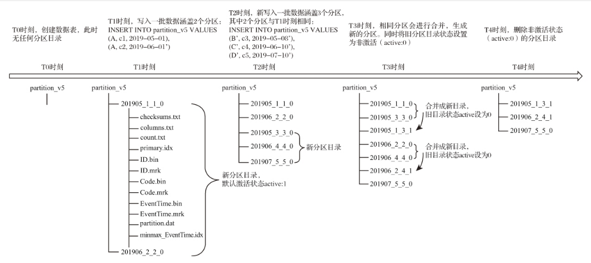

# 目录
```
2.1 ClickHouse的核心特性
2.1.1 完备的DBMS功能
2.1.2 列式存储与数据压缩
2.1.3 向量化执行引擎
2.1.4 关系模型与SQL查询
2.1.5 多样化的表引擎
2.1.6 多线程与分布式
2.1.7 多主架构
2.1.8 在线查询
2.1.9 数据分片与分布式查询

2.3 ClickHouse为何如此之快
2.3.1 着眼硬件，先想后做
2.3.2 算法在前，抽象在后
2.3.3 勇于尝鲜，不行就换
2.3.4 特定场景，特殊优化
2.3.5 持续测试，持续改进

第6章 MergeTree原理解析
6.1 MergeTree的创建方式与存储结构
6.1.1 MergeTree的创建方式
6.1.2 MergeTree的存储结构
6.2 数据分区
6.2.1 数据的分区规则
6.2.2 分区目录的命名规则
6.2.3 分区目录的合并过程
6.3 一级索引
6.3.1 稀疏索引
6.3.2 索引粒度
6.3.3 索引数据的生成规则
6.3.4 索引的查询过程
6.4 二级索引
6.4.1 granularity与index_granularity的关系
6.4.2 跳数索引的类型
6.5 数据存储
6.5.1 各列独立存储
6.5.2 压缩数据块
6.6 数据标记
6.6.1 数据标记的生成规则
6.6.2 数据标记的工作方式
6.7 对于分区、索引、标记和压缩数据的协同总结
6.7.1 写入过程
6.7.2 查询过程
6.7.3 数据标记与压缩数据块的对应关系
6.8 本章小结

第8章 其他常见类型表引擎
8.1 外部存储类型
8.1.1 HDFS
8.1.2 MySQL
8.1.3 JDBC
8.1.4 Kafka
8.1.5 File
8.2 内存类型
8.2.1 Memory
8.2.2 Set
8.2.3 Join
8.2.4 Buffer
8.3 日志类型
8.3.1 TinyLog
8.3.2 StripeLog
8.3.3 Log
8.4 接口类型
8.4.1 Merge
8.4.2 Dictionary
8.4.3 Distributed
8.5 其他类型
8.5.1 Live View
8.5.2 Null
8.5.3 URL
8.6 本章小结

第10章 副本与分片
10.1 概述
10.2 数据副本
10.2.1 副本的特点
10.2.2 ZooKeeper的配置方式
10.2.3 副本的定义形式
10.3 ReplicatedMergeTree原理解析
10.3.1 数据结构
10.3.2 副本协同的核心流程
10.4 数据分片
10.4.1 集群的配置方式
10.4.2 基于集群实现分布式DDL
10.5 Distributed原理解析
10.5.1 定义形式
10.5.2 查询的分类
10.5.3 分片规则
10.5.4 分布式写入的核心流程
10.5.5 分布式查询的核心流程
10.6 本章小结
```

# 读书笔记


## 第1章 ClickHouse的前世今生

分布式文件系统HDFS可以直接作为其他组件的底层存储（例如HBase、Hive等），生态内部的组件之间不用重复造轮子，只需相互借力、组合就能形成新的方案。

臃肿和复杂

### 1.1 传统BI系统之殇

即通过引入一个专门用于分析类场景的数据库，将分散的数据统一汇聚到一处。

### 1.3 OLAP常见架构分类

数据立方体可以进行如下操作。

下钻

上卷

切片

切块

旋转

顾名思义，它直接使用关系模型构建，数据模型常使用星型模型或者雪花模型。

为MOLAP（Multidimensional OLAP，多维型OLAP）

其核心思想是**借助预先聚合结果，使用空间换取时间的形式最终提升查询性能**。

维度预处理可能会导致数据的膨胀。

另外，由于使用了**预处理的形式，数据立方体会有一定的滞后性，不能实时进行数据分析**。而且，立方体只保留了聚合后的结果数据，导致无法查询明细数据。

HOLAP（Hybrid OLAP，混合架构的OLAP）

### 1.4 OLAP实现技术的演进

则借助物化视图的形式实现数据立方体

转为依托MapReduce或Spark这类新兴技术，将其作为立方体的计算引擎，**加速**立方体的构建过程

预聚合结果的**存储载体**也转向HBase这类高性能分布式数据库

> 维度爆炸、数据同步实时性不高

### 1.5 一匹横空出世的黑马

以Spark为代表的新一代ROLAP方案虽然可以一站式处理海量数据，但无法真正做到**实时应答和高并发**，它更适合作为一个后端的查询系统

大部分查询性能的瓶颈问题，能够做到实时应答，但**数据膨胀和预处理**等问题依然没有被很好解决

### 1.6 ClickHouse的发展历程

四个阶段
  > clickhouse发展的四个阶段，系统是如何演进的

### 1.6.1 顺理成章的MySQL时期

如果只考虑单线程的写入场景，并且在写入过程中不涉及数据删除或者更新操作，那么数据会依次按照写入的顺序被写入文件并落至磁盘。然而现实的场景不可能如此简单。这最终导致了数据在磁盘中是完全随机存储的，并且会产生大量的磁盘碎片。

  > 多进程，即使是顺序写，其实也是随机写？

### 1.6.2 另辟蹊径的Metrage时期

首先，在数据模型层面，它使用Key-Value模型（键值对）代替了关系模型；其次，在索引层面，它使用LSM树代替了B+树；最后，在数据处理层面，由实时查询的方式改为了预处理的方式。

写入动作只发生在内存中，不涉及磁盘操作，所以极大地提升了数据写入性能。其次，小树在构建的过程中会进行排序，这样就保证了数据的有序性。最后，当内存中小树的数量达到某个阈值时，就会借助后台线程将小树刷入磁盘并生成一个小的数据段。

首先对分析的具体场景实施立方体建模，框定所需的维度和度量以形成数据立方体；接着预先计算立方体内的所有维度组合；最后将聚合的结果数据按照Key-Value的形式存储。

然而，使用立方体这类预先聚合的思路会带来一个新的问题，那就是**维度组合爆炸**，因为需要预先对所有的维度组合进行计算。

### 1.6.3 自我突破的OLAPServer时期

在数据模型方面，它又换回了关系模型，因为相比Key-Value模型，关系模型拥有更好的描述能力。使用SQL作为查询语言，也将会拥有更好的“群众基础”。而在存储结构和索引方面，它结合了MyISAM和LSM树最精华的部分。在存储结构上，它与MyISAM表引擎类似，分为了索引文件和数据文件两个部分。在索引方面，它并没有完全沿用LSM树，而是使用了LSM树所使用到的稀疏索引。在数据文件的设计上，则沿用了LSM树中数据段的思想，即数据段内数据有序，借助稀疏索引定位数据段。

OLAPServer又进一步引入了列式存储的思想，将索引文件和数据文件按照列字段的粒度进行了拆分，每个列字段各自独立存储，以此进一步减少数据读取的范围。

缺失了一些基本的功能。例如，它只有一种数据类型，即固定长度的数值类型，且没有DBMS应有的基本管理功能（DDL查询等）。

### 1.6.4　水到渠成的ClickHouse时

现在，一个新的选择题摆在了Yandex.Metrica研发团队的面前，实时聚合还是预先聚合？预先聚合方案在查询性能方面带来了质的提升，成功地将之前的报告查询时间从26秒降低到了1秒以内，但同时它也带来了新的难题。

（1）由于预先聚合只能支持固定的分析场景，所以它无法满足自定义分析的需求。

（2）维度组合爆炸会导致数据膨胀，这样会造成不必要的计算和存储开销。因为用户并不一定会用到所有维度的组合，那些没有被用到的组合将会成为浪费的开销。

（3）流量数据是在线实时接收的，所以预聚合还需要考虑如何及时更新数据。

经过这么一分析，预先聚合的方案看起来似乎也没有那么完美。这是否表示实时聚合的方案更优呢？实时聚合方案意味着一切查询都是动态、实时的，从用户发起查询的那一刻起，整个过程需要在一秒内完成并返回，而在这个查询过程的背后，可能会涉及数亿行数据的处理。如果做不到这么快的响应速度，那么这套方案就不可行，因为用户都讨厌等待。很显然，如果查询性可以得到保障，实时聚合会是一个更为简洁的架构。由于OLAPServer的成功使用经验，选择倾向于实时聚合这一方。

OLAPServer在查询性能方面并不比Metrage差太多，在查询的灵活性方面反而更胜一筹。于是Yandex.Metrica研发团队以OLAPServer为基础进一步完善，以实现一个完备的数据库管理系统（DBMS）为目标，最终打造出了ClickHouse，并于2016年开源。纵览Yandex.Metrica背后技术的发展历程，ClickHouse的出现似乎是一个水到渠成的结果。


### 1.9 ClickHouse不适用的场景

- 不支持事务。
- 不擅长根据主键按行粒度进行查询（虽然支持），故不应该把ClickHouse当作Key-Value数据库使用。
- 不擅长按行删除数据（虽然支持）。

>  不擅长join

## 第2章 ClickHouse架构概述

### 2.1.1 完备的DBMS功能

DBMS，它具备了一些基本功能

### 2.1.2 列式存储与数据压缩

如果你想让查询变得更快，最简单且有效的方法是**减少数据扫描范围和数据传输时的大小**

数据中的重复项越多，则压缩率越高；压缩率越高，则数据体量越小；而数据体量越小，则数据在网络中的传输越快，对网络带宽和磁盘IO的压力也就越小。既然如此，那怎样的数据最可能具备重复的特性呢？答案是**属于同一个列字段的数据，因为它们拥有相同的数据类型和现实语义，重复项的可能性自然就更高。**

> 列式存储的原因

数据默认使用LZ4算法压缩

### 2.1.3 向量化执行引擎

**硬件层面的优化**确实是最直接、最高效的提升途径之一。**向量化执行就是这种方式的典型代表，这项寄存器硬件层面的特性，为上层应用程序的性能带来了指数级的提升。**

向量化执行，可以简单地看作**一项消除程序中循环的优化**。

为了实现向量化执行，需要利用CPU的SIMD指令。SIMD的全称是**Single Instruction Multiple Data，即用单条指令操作多条数据**。现代计算机系统概念中，它是通过数据并行以提高性能的一种实现方式（其他的还有指令级并行和线程级并行），它的原理是在**CPU寄存器层面实现数据的并行操作**。

存储媒介距离CPU越近，则访问数据的速度越快。

目前利用SSE4.2指令集实现向量化执行。

### 2.1.4 关系模型与SQL查询

已有的大量数据建模工作都是基于关系模型展开的（星型模型、雪花模型乃至宽表模型）

在**传统关系型数据库或数据仓库之上的系统迁移**到ClickHouse的**成本会变得更低**

### 2.1.5 多样化的表引擎

将表引擎独立设计的好处是显而易见的，通过特定的表引擎支撑特定的场景，十分灵活。对于简单的场景，可直接使用简单的引擎降低成本，而复杂的场景也有合适的选择。

### 2.1.6 多线程与分布式

如果说向量化执行是通过数据级并行的方式提升了性能，那么**多线程处理就是通过线程级并行的方式实现了性能的提升**。相比基于**底层硬件实现的向量化执行SIMD，线程级并行通常由更高层次的软件层面控制**。

由于**SIMD不适合用于带有较多分支判断的场景**，ClickHouse也**大量使用了多线程技术以实现提速**，以此和向量化执行形成**互补**。

同理，如果一台服务器性能吃紧，那么就利用多台服务的资源协同处理。为了实现这一目标，首先需要在数据层面实现数据的分布式。因为在分布式领域，存在一条金科玉律——**计算移动比数据移动更加划算**。

在各服务器之间，通过网络传输数据的成本是高昂的，所以相比移动数据，更为聪明的做法是预先将数据分布到各台服务器，将数据的计算查询直接下推到数据所在的服务器。ClickHouse在数据存取方面，既支持**分区（纵向扩展，利用多线程原理）**，也支持**分片（横向扩展，利用分布式原理）**，可以说是将多线程和分布式的技术应用到了极致。

> 分区与分片：横向与纵向扩展。

### 2.1.7 多主架构

HDFS、Spark、HBase和Elasticsearch这类分布式系统，都采用了**Master-Slave主从架构**，由一个管控节点作为Leader统筹全局。而ClickHouse则采用**Multi-Master多主架构**，**集群中的每个节点角色对等，客户端访问任意一个节点都能得到相同的效果**。

这种多主的架构有许多**优势**，例如:

- 对等的角色使系统架构变得更加简单，不用再区分主控节点
- 数据节点和计算节点，集群中的所有节点功能相同。

所以它天然规避了单点故障的问题，非常适合用于多数据中心、异地多活的场景。

### 2.1.8 在线查询

支撑海量数据的查询场景，都拥有分布式架构，都支持**列存、数据分片、计算下推**等特性。

Vertica这类商用软件价格高昂；SparkSQL与Hive这类系统无法保障90%的查询在1秒内返回，在大数据量下的复杂查询可能会需要分钟级的响应时间；而Elasticsearch这类搜索引擎在处理**亿级数据聚合查询时**则显得捉襟见肘。

> TODO: clickhouse与其他分析型数据库的对比

### 2.1.9 数据分片与分布式查询

ClickHouse支持分片，而分片则依赖集群。每个集群由**1到多个分片组成，而每个分片则对应了ClickHouse的1个服务节点**。分片的数量上限取决于节点数量（1个分片只能对应1个服务节点）。

ClickHouse并不像其他分布式系统那样，拥有高度自动化的分片功能。ClickHouse提供了本地表（Local Table）与分布式表（Distributed Table）的概念。**一张本地表等同于一份数据的分片。而分布式表本身不存储任何数据，它是本地表的访问代理，其作用类似分库中间件。借助分布式表，能够代理访问多个数据分片，从而实现分布式查询**。

数据量增大的时候，再通过新增数据分片的方式分流数据，并通过分布式表实现分布式查询

### 2.3 ClickHouse为何如此之快

### 2.3.1 着眼硬件，先想后做

ClickHouse会在**内存中进行GROUP BY**，并且使用HashTable装载数据。与此同时，他们**非常在意CPU L3级别的缓存**，因为一次L3的缓存失效会带来70～100ns的延迟。这意味着在单核CPU上，它会浪费4000万次/秒的运算；而在一个32线程的CPU上，则可能会浪费5亿次/秒的运算。

### 2.3.2 算法在前，抽象在后

字符串子串查询、数组排序、使用HashTable等

在字符串搜索方面，针对不同的场景，ClickHouse最终选择了这些算法：**对于常量，使用Volnitsky算法**；对于**非常量，使用CPU的向量化执行SIMD，暴力优化**；**正则匹配使用re2和hyperscan算法**。性能是算法选择的首要考量指标。

> clickhouse的算法与数据结构的简单介绍。TODO:算法了解

### 2.3.3 勇于尝鲜，不行就换

除了字符串之外，其余的场景也与它类似，ClickHouse会使用最合适、最快的算法。如果世面上出现了号称性能强大的新算法，ClickHouse团队会立即将其纳入并进行验证。如果效果不错，就保留使用；如果性能不尽人意，就将其抛弃

### 2.3.4 特定场景，特殊优化

针对同一个场景的不同状况，选择使用不同的实现方式，尽可能将性能最大化。

例如去重计数uniqCombined函数，会**根据数据量的不同选择不同的算法**：当数据量较小的时候，会选择**Array保存**；当数据量中等的时候，会选择**HashSet**；而当数据量很大的时候，则使用**HyperLogLog算法**。

向量化执行了。**SIMD被广泛地应用于文本转换、数据过滤、数据解压和JSON转换等场景**。相较于单纯地使用CPU，利用寄存器暴力优化也算是一种降维打击了。

> SIMD的使用场景和作用

## 第4章 数据定义

### 4.1.1 基础类型

FixedString类型和传统意义上的Char类型有些类似，对于一些字符有明确长度的场合，可以使用固定长度的字符串。定长字符串通过FixedString(N)声明，其中N表示字符串长度。但与Char不同的是，FixedString使用null字节填充末尾字符，而Char通常使用空格填充。

ClickHouse目前没有时间戳类型。时间类型最高的精度是秒，也就是说，如果需要处理毫秒、微秒等大于秒分辨率的时间，则只能借助UInt类型实现。

### 4.1.2 复合类型

嵌套类型，顾名思义是一种嵌套表结构。一张数据表，可以定义任意多个嵌套类型字段，但每个字段的嵌套层级只支持一级，即嵌套表内不能继续使用嵌套类型。对于简单场景的层级关系或关联关系，使用嵌套类型也是一种不错的选择。

嵌套类型本质是一种多维数组的结构。嵌套表中的每个字段都是一个数组，并且行与行之间数组的长度无须对齐。所以需要把刚才的INSERT语句调整成下面的形式

### 4.1.3 特殊类型

Nullable并不能算是一种独立的数据类型，它更像是一种辅助的修饰符，需要与基础数据类型一起搭配使用。Nullable类型与Java8的Optional对象有些相似，它表示某个基础数据类型可以是Null值。

在使用Nullable类型的时候还有两点值得注意：

- 首先，它只能和基础类型搭配使用，不能用于数组和元组这些复合类型，也不能作为索引字段；

- 其次，应该慎用Nullable类型，包括Nullable的数据表，不然会使查询和写入性能变慢。因为在正常情况下，每个列字段的数据会被存储在对应的[Column].bin文件中。如果一个列字段被Nullable类型修饰后，会额外生成一个[Column].null.bin文件专门保存它的Null值。这意味着在读取和写入数据时，需要一倍的额外文件操作。

 列数据存储在column.bin文件中，nullable独立存储。导致一倍的额外文件操作

### 4.2.1 数据库

默认数据库的实质是物理磁盘上的一个文件目录，所以在语句执行之后，ClickHouse便会在安装路径下创建DB_TEST数据库的文件目录

与此同时，在metadata路径下也会一同创建用于恢复数据库的DB_TEST.sql文件：

### 4.2.2 数据表

在这种方式下，不仅会根据SELECT子句建立相应的表结构，同时还会将SELECT子句查询的数据顺带写入

### 4.2.3 默认值表达式

表字段支持三种默认值表达式的定义方法，分别是DEFAULT、MATERIALIZED和ALIAS。无论使用哪种形式，表字段一旦被定义了默认值，它便不再强制要求定义数据类型，因为ClickHouse会根据默认值进行类型推断。如果同时对表字段定义了数据类型和默认值表达式，则以明确定义的数据类型为主

默认值表达式的三种定义方法之间也存在着不同之处，可以从如下三个方面进行比较。

- 数据写入：在数据写入时，只有DEFAULT类型的字段可以出现在INSERT语句中。而MATERIALIZED和ALIAS都不能被显式赋值，它们只能依靠计算取值。例如试图为MATERIALIZED类型的字段写入数据，将会得到如下的错误。DB::Exception: Cannot insert column URL, because it is MATERIALIZED column..
- 数据查询：在数据查询时，只有DEFAULT类型的字段可以通过SELECT *返回。而MATERIALIZED和ALIAS类型的字段不会出现在SELECT *查询的返回结果集中。
- 数据存储：在数据存储时，只有DEFAULT和MATERIALIZED类型的字段才支持持久化。如果使用的表引擎支持物理存储（例如TinyLog表引擎），那么这些列字段将会拥有物理存储。而ALIAS类型的字段不支持持久化，它的取值总是需要依靠计算产生，数据不会落到磁盘。

>  默认值的区别。物化与别名。写入、查询、存储。

### 4.2.4 临时表

它的生命周期是会话绑定的，所以它只支持Memory表引擎，如果会话结束，数据表就会被销毁；·临时表不属于任何数据库，所以在它的建表语句中，既没有数据库参数也没有表引擎参数。

通过返回结果可以得出结论：临时表的优先级是大于普通表的。当两张数据表名称相同的时候，会优先读取临时表的数据。在ClickHouse的日常使用中，通常不会刻意使用临时表。它更多被运用在ClickHouse的内部，是数据在集群间传播的载体。

### 4.2.5 分区表

借助数据分区，在后续的查询过程中能够跳过不必要的数据目录，从而提升查询的性能。合理地利用分区特性，还可以变相实现数据的更新操作，因为数据分区支持删除、替换和重置操作。假设数据表按照月份分区，那么数据就可以按月份的粒度被替换更新。

### 4.2.6 视图

ClickHouse拥有普通和物化两种视图，其中物化视图拥有独立的存储，而普通视图只是一层简单的查询代理。

物化视图创建好之后，如果源表被写入新数据，那么物化视图也会同步更新。

POPULATE修饰符决定了物化视图的初始化策略：如果使用了POPULATE修饰符，那么在创建视图的过程中，会连带将源表中已存在的数据一并导入，如同执行了SELECT INTO一般；反之，如果不使用POPULATE修饰符，那么物化视图在创建之后是没有数据的，它只会同步在此之后被写入源表的数据。

物化视图目前并不支持同步删除，如果在源表中删除了数据，物化视图的数据仍会保留。

> 物化视图独立的存储，但是不支持删除

### 4.5 分布式DDL执行

ClickHouse支持集群模式，一个集群拥有1到多个节点。CREATE、ALTER、DROP、RENMAE及TRUNCATE这些DDL语句，都支持分布式执行。这意味着，如果在集群中任意一个节点上执行DDL语句，那么集群中的每个节点都会以相同的顺序执行相同的语句。这项特性意义非凡，它就如同批处理命令一样，省去了需要依次去单个节点执行DDL的烦恼。将一条普通的DDL语句转换成分布式执行十分简单，只需加上ON CLUSTER cluster_name声明即可。

### 4.7 数据的删除与修改

ClickHouse提供了DELETE和UPDATE的能力，这类操作被称为**Mutation查询**，它可以看作ALTER语句的变种。虽然Mutation能最终实现修改和删除，但不能完全以通常意义上的UPDATE和DELETE来理解，我们必须清醒地认识到它的不同：

- 首先，**Mutation语句是一种“很重”的操作，更适用于批量数据的修改和删除**；
- 其次，它**不支持事务**，一旦语句被提交执行，就会立刻对现有数据产生影响，无法回滚；
- 最后，Mutation语句的执行是一个**异步的后台过程**，语句被提交之后就会立即返回。所以这并不代表具体逻辑已经执行完毕，它的具体执行进度需要通过system.mutations系统表查询。

可以发现，在执行了DELETE操作之后数据目录发生了一些变化。每一个原有的数据目录都额外增加了一个同名目录，并且在末尾处增加了_6的后缀。此外，目录下还多了一个名为mutation_6.txt的文件

至此，整个Mutation操作的逻辑就比较清晰了。每执行一条ALTER DELETE语句，都会**在mutations系统表中生成一条对应的执行计划**，当is_done等于1时表示执行完毕。与此同时，在数据表的根目录下，会以mutation_id为名生成与之对应的日志文件用于记录相关信息。而数据删除的过程是**以数据表的每个分区目录为单位，将所有目录重写为新的目录**，新目录的命名规则是在原有名称上加上system.mutations.block_numbers.number。**数据在重写的过程中会将需要删除的数据去掉**。**旧的数据目录并不会立即删除，而是会被标记成非激活状态（active为0）。等到MergeTree引擎的下一次合并动作触发时，这些非激活目录才会被真正从物理意义上删除**。

> 删除的流程：符合条件的分区为目标（也就是最坏是所有分区？）重写新的分区，去掉删除的数据。ES则是通过将需要删除的主键id记录到一个删除文件中，查询获取得到结果后进行删除数据的过滤。

UPDATE支持在一条语句中同时定义多个修改字段，分区键和主键不能作为修改字段

## 第5章 数据字典

由于**字典数据常驻内存的特性**，所以它非常适合保存**常量或经常使用的维度表数据，以避免不必要的JOIN查询**。

在正常情况下，字典中的数据只能通过字典函数访问（ClickHouse特别设置了一类字典函数，专门用于字典数据的取用）。但是也有一种例外，那就是使用特殊的字典表引擎。在字典表引擎的帮助下，可以将数据字典挂载到一张代理的数据表下，从而实现数据表与字典数据的JOIN查询。

### 5.2.6 扩展字典的数据更新策略

其中，min与max分别指定了更新间隔的上下限。ClickHouse会在这个时间区间内随机触发更新动作，这样能够有效错开更新时间，避免所有字典在同一时间内爆发性的更新。当min和max都是0的时候，将禁用字典更新。对于cache字典而言，lifetime还代表了它的缓存失效时间。


[](#bookmark)
## 第6章MergeTree原理解析

其中MergeTree作为家族中最基础的表引擎，提供了**主键索引、数据分区、数据副本和数据采样等基本能力**，而家族中其他的表引擎则在MergeTree的基础之上各有所长。例如ReplacingMergeTree表引擎具有**删除重复数据的特性**，而SummingMergeTree表引擎则会**按照排序键自动聚合数据**。如果给合并树系列的表引擎加上Replicated前缀，又会得到一组**支持数据副本的表引擎**

### 6.1 MergeTree的创建方式与存储结构

MergeTree在写入一批数据时，数据总会以**数据片段的形式写入磁盘，且数据片段不可修改。为了避免片段过多，ClickHouse会通过后台线程，定期合并这些数据片段，属于相同分区的数据片段会被合成一个新的片段**。这种数据片段往复合并的特点，也正是**合并树**名称的由来。

> 跟ES的合并段很像

### 6.1.2 MergeTree的存储结构

MergeTree在磁盘上的物理存储结构


列字段标记文件，使用二进制格式存储。标记文件中保存了**.bin文件中数据的偏移量信息**。标记文件与稀疏索引对齐，又与.bin文件一一对应，所以**MergeTree通过标记文件建立了primary.idx稀疏索引与.bin数据文件之间的映射关系**。

即**首先通过稀疏索引（primary.idx）找到对应数据的偏移量信息（.mrk），再通过偏移量直接从.bin文件中读取数据**。

由于.mrk标记文件与.bin文件一一对应，所以MergeTree中的**每个列字段都会拥有与其对应的.mrk标记文件**

如果使用了自适应大小的索引间隔，则标记文件会以.mrk2命名。它的工作原理和作用与.mrk标记文件相同。

> 标记文件与稀疏索引对齐，又与.bin文件一一对应：首先通过稀疏索引（primary.idx）找到对应数据的偏移量信息（.mrk），再通过偏移量直接从.bin文件中读取数据

### 6.2.2 分区目录的命名规则

对于MergeTree而言，它最核心的特点是其**分区目录的合并动作**。

MinBlockNum和MaxBlockNum：顾名思义，最小数据块编号与最大数据块编号。ClickHouse在这里的命名似乎有些歧义，很容易让人与稍后会介绍到的数据压缩块混淆。但是本质上它们毫无关系，这里的BlockNum是一个整型的自增长编号。如果将其设为n的话，那么计数n在单张MergeTree数据表内全局累加，n从1开始，每当新创建一个分区目录时，计数n就会累积加1。对于一个新的分区目录而言，MinBlockNum与MaxBlockNum取值一样，同等于n，例如201905_1_1_0、201906_2_2_0以此类推。但是也有例外，当分区目录发生合并时，对于新产生的合并目录MinBlockNum与MaxBlockNum有着另外的取值规则。对

Level：**合并的层级，可以理解为某个分区被合并过的次数，或者这个分区的年龄。数值越高表示年龄越大**。

Level计数与BlockNum有所不同，它并不是全局累加的。对于每一个新创建的分区目录而言，其初始值均为0。之后，以分区为单位，如果相同分区发生合并动作，则在相应分区内计数累积加1。

> level是分区内合并的次数，BlockNum则是全局自增的。

### 6.2.3分区目录的合并过程

首先，MergeTree的分区目录并不是在数据表被创建之后就存在的，而是**在数据写入过程中被创建的**。也就是说如果一张数据表没有任何数据，那么也不会有任何分区目录存在。其次，它的分区目录在建立之后也并不是一成不变的。在其他某些数据库的设计中，追加数据后目录自身不会发生变化，只是在相同分区目录中追加新的数据文件。而MergeTree完全不同，伴随着每一批数据的写入（一次INSERT语句），MergeTree都会生成一批新的分区目录。**即便不同批次写入的数据属于相同分区，也会生成不同的分区目录**。也就是说，对于同一个分区而言，也会存在多个分区目录的情况。

在之后的某个时刻（**写入后的10～15分钟，也可以手动执行optimize查询语句**），ClickHouse会通过后台任务再**将属于相同分区的多个目录合并成一个新的目录。已经存在的旧分区目录并不会立即被删除，而是在之后的某个时刻通过后台任务被删除（默认8分钟）**。属于同一个分区的多个目录，在合并之后会生成一个全新的目录，目录中的索引和数据文件也会相应地进行合并。新目录名称的合并方式遵循以下规则

对于每个新建的分区目录而言，它们的MinBlockNum与MaxBlockNum取值相同，均来源于**表内全局自增的BlockNum**。BlockNum初始为1，每次新建目录后累计加1。所以，3个分区目录的MinBlockNum与MaxBlockNum依次为0_0、1_1和2_2。最后是Level层级，每个新建的分区目录初始Level都是0

分区目录在发生合并之后，旧的分区目录**并没有被立即删除，而是会存留一段时间**。但是旧的分区目录已不再是激活状态（active=0），所以在数据查询时，它们会被自动过滤掉。



> 分区合并的过程。写入后的10～15分钟后台触发合并任务。合并后，并没有立刻删除，而会留存一段时间（8分钟），查询时自动过滤掉。

### 6.3 一级索引

在此种情形下，PRIMARY KEY与ORDER BY定义相同，所以索引（primary.idx）和数据（.bin）会按照完全相同的规则排序。

### 6.3.1稀疏索引

在**稠密索引**中每一行索引标记都会对应到一行具体的数据记录。而在**稀疏索引中，每一行索引标记对应的是一段数据，而不是一行**。

稀疏索引的优势是显而易见的，它仅需使用少量的索引标记就能够记录大量数据的区间位置信息，且数据量越大优势越为明显。

由于稀疏索引**占用空间小**，所以primary.idx内的**索引数据常驻内存**，取用速度自然极快。

### 6.3.2 索引粒度

数据以index_granularity的粒度（默认8192）被标记成多个小的区间，其中每个区间最多8192行数据。MergeTree使用MarkRange表示一个具体的区间，并通过start和end表示其具体的范围。index_granularity的命名虽然取了索引二字，但它**不单只作用于一级索引**（.idx），同时**也会影响数据标记（.mrk）和数据文件（.bin）**。因为仅有一级索引自身是无法完成查询工作的，它需要**借助数据标记才能定位数据**，所以一级索引和数据标记的间隔粒度相同（同为index_granularity行），**彼此对齐**。而数据文件也会依照index_granularity的**间隔粒度生成压缩数据块**。

### 6.3.3 索引数据的生成规则

MergeTree对于稀疏索引的存储是非常紧凑的，索引值前后相连，**按照主键字段顺序紧密地排列在一起**。不仅此处，ClickHouse中**很多数据结构都被设计得非常紧凑**，比如其使用**位读取替代专门的标志位或状态码**，可以不浪费哪怕一个字节的空间。以小见大，这也是ClickHouse为何性能如此出众的深层原因之一。


### 6.3.4 索引的查询过程

MarkRange在ClickHouse中是用于定义标记区间的对象。通过先前的介绍已知，MergeTree按照index_granularity的间隔粒度，将一段完整的数据划分成了多个小的间隔数据段，一个具体的数据段即是一个MarkRange。MarkRange与索引编号对应，使用start和end两个属性表示其区间范围。通过与start及end对应的索引编号的取值，即能够得到它所对应的数值区间。而数值区间表示了此MarkRange包含的数据范围。

在引出了数值区间的概念之后，对于索引的查询过程就很好解释了。索引查询其实就是两个数值区间的交集判断。其中，一个区间是由基于主键的查询条件转换而来的条件区间；而另一个区间是刚才所讲述的与MarkRange对应的数值区间。

（1）生成查询条件区间：首先，将查询条件转换为条件区间。即便是单个值的查询条件，也会被转换成区间的形式。

（2）递归交集判断：以递归的形式，依次对MarkRange的数值区间与条件区间做交集判断。从最大的区间[A000,+inf)开始：
- 如果不存在交集，则直接通过**剪枝算法优化**此整段MarkRange。
- 如果存在交集，且MarkRange**步长大于8**(end-start)，则将此区间进一步拆分成8个子区间（由merge_tree_coarse_index_granularity指定，默认值为8），并重复此规则，继续做递归交集判断。
- 如果存在交集，且MarkRange不可再分解（步长小于8），则记录MarkRange并返回。

（3）合并MarkRange区间：将最终匹配的MarkRange聚在一起，合并它们的范围。

> 通过查询条件，生成区间，进行与MarkRange的分区交集判断。


### 6.4二级索引

除了一级索引之外，MergeTree同样支持二级索引。二级索引又称**跳数索引**，由**数据的聚合信息**构建而成。根据索引类型的不同，其聚合信息的内容也不同。跳数索引的目的与一级索引一样，也是帮助查询时减少数据扫描的范围。

### 6.4.1 granularity与index_granularity的关系

对于跳数索引而言，index_granularity定义了数据的粒度，而**granularity定义了聚合信息汇总的粒度**。换言之，granularity定义了一行跳数索引能够跳过多少个index_granularity区间的数据。

要解释清楚granularity的作用，就要从跳数索引的数据生成规则说起，其规则大致是这样的：首先，按照index_granularity粒度间隔将数据划分成n段，总共有[0,n-1]个区间（n=total_rows/index_granularity，向上取整）。接着，根据索引定义时声明的表达式，从0区间开始，依次按index_granularity粒度从数据中获取聚合信息，每次向前移动1步(n+1)，聚合信息逐步累加。最后，当移动**granularity次区间时，则汇总并生成一行跳数索引数据**。

> 隔granularity区间定义了聚合信息汇总的粒度。减少聚合查询的扫描和统计量

### 6.4.2 跳数索引的类型

MergeTree共支持4种跳数索引，分别是minmax、set、ngrambf_v1和tokenbf_v1。一张数据表支持同时声明多个跳数索引

- minmax索引记录了一段数据内的最小和最大极值，其索引的作用类似分区目录的minmax索引，能够快速跳过无用的数据区间

- set索引直接记录了声明字段或表达式的取值（唯一值，无重复）

- ngrambf_v1索引记录的是数据短语的布隆表过滤器，只支持String和FixedString数据类型。ngrambf_v1只能够提升in、notIn、like、equals和notEquals查询的性能

- tokenbf_v1索引是ngrambf_v1的变种，同样也是一种布隆过滤器索引。tokenbf_v1除了短语token的处理方法外，其他与ngrambf_v1是完全一样的。tokenbf_v1会自动按照非字符的、数字的字符串分割token

> 这些索引看看能不能用在生产环境上，提高速度

## 6.5数据存储
### 6.5.1 各列独立存储

MergeTree也并不是一股脑地将数据直接写入.bin文件，而是经过了一番精心设计：

- 首先，数据是经过**压缩**的，目前支持LZ4、ZSTD、Multiple和Delta几种算法，默认使用LZ4算法；
- 其次，数据会事先依照ORDER BY的声明**排序**；
- 最后，数据是以**压缩数据块的形式被组织并写入**.bin文件中的。


### 6.5.2 压缩数据块

一个压缩数据块由头信息和压缩数据两部分组成。头信息固定使用9位字节表示，具体由1个UInt8（1字节）整型和2个UInt32（4字节）整型组成，分别代表使用的**压缩算法类型、压缩后的数据大小和压缩前的数据大小**


一个.bin文件是由1至多个压缩数据块组成的，每个压缩块大小在64KB～1MB之间。多个压缩数据块之间，按照写入顺序首尾相接，紧密地排列在一起


在.bin文件中引入压缩数据块的目的至少有以下两个：
- 其一，虽然数据被压缩后能够**有效减少数据大小，降低存储空间并加速数据传输效率**，但数据的**压缩和解压动作**，其本身也会带来额外的**性能损耗**。所以需要控制被**压缩数据的大小**，以求在性能损耗和压缩率之间寻求一种平衡。
- 其二，在具体读取某一列数据时（.bin文件），首先需要将**压缩数据加载到内存并解压**，这样才能进行后续的数据处理。通过**压缩数据块**，可以在不读取整个.bin文件的情况下将**读取粒度降低到压缩数据块级别**，从而进一步**缩小数据读取的范围**。

> 压缩（算法、解压，CPU性能平衡）、排序、数据块(减少数据读取范围、格式协议、缩小读取范围)

### 6.6 数据标记

如果把MergeTree比作一本书，primary.idx一级索引好比这本书的一级章节**目录**，.bin文件中的数据好比这本书中的文字，那么数据标记(.mrk)会为一级章节目录和具体的文字之间建立**关联**。对于数据标记而言，它记录了两点重要信息：

- 其一，是一级章节对应的页码信息；
- 其二，是一段文字在某一页中的起始位置信息。这样一来，通过数据标记就能够很快地从一本书中立即翻到关注内容所在的那一页，并知道从第几行开始阅读。

> 数据标记很重要

### 6.6.1 数据标记的生成规则

从图6-17中一眼就能发现数据标记的首个特征，即数据标记和索引区间是对齐的，均按照index_granularity的粒度间隔。如此一来，只需简单通过**索引区间的下标编号就可以直接找到对应的数据标记**。

为了能够与数据衔接，数据标记文件也与.bin文件一一对应。即每一个列字段[Column].bin文件**都有一个与之对应**的[Column].mrk数据标记文件，用于记录数据在.bin文件中的**偏移量信息**。

一行标记数据使用一个元组表示，元组内包含**两个整型数值的偏移量信息**。它们分别表示在此段数据区间内，在对应的.bin压缩文件中，压缩数据块的**起始偏移量**；以及将该数据压缩块解压后，其**未压缩数据的起始偏移量**。

每一行标记数据都表示了一个片段的数据（默认8192行）在.bin压缩文件中的读取位置信息。标记数据与一级索引数据不同，它**并不能常驻内存**，而是使用LRU（最近最少使用）缓存策略加快其取用速度。


### 6.6.2 数据标记的工作方式

MergeTree在读取数据时，必须通过标记数据的位置信息才能够找到所需要的数据。整个查找过程大致可以分为读取压缩数据块和读取数据两个步骤。

在查询某一列数据时，MergeTree**无须一次性加载整个**.bin文件，而是可以根据需要，只加载特定的压缩数据块。而这项特性需要借助**标记文件中所保存的压缩文件中的偏移量**。

12000只是数据压缩后的字节数，并没有包含头信息部分。而一个完整的压缩数据块是由头信息加上压缩数据组成的，它的头信息固定由9个字节组成，压缩后大小为8个字节。所以，12016=8+12000+8

在读取解压后的数据时，MergeTree并不需要一次性扫描**整段解压数据**，它可以根据需要，以index_granularity的粒度加载特定的一小段。为了实现这项特性，需要借助标记文件中保存的解压数据块中的偏移量。

## 6.7对于分区、索引、标记和压缩数据的协同总结

### 6.7.1 写入过程

数据写入的第一步是**生成分区目录，伴随着每一批数据的写入，都会生成一个新的分区目录**。在后续的某一时刻，属于**相同分区的目录会依照规则合并到一起**；接着，按照index_granularity索引粒度，会**分别生成**primary.idx一级索引（如果声明了二级索引，还会创建二级索引文件）、**每一个列字段的.mrk数据标记和.bin压缩数据文件**。

> 写入过程

### 6.7.2 查询过程

数据查询的本质，可以看作一个不断减小数据范围的过程。在最理想的情况下，MergeTree首先可以**依次借助分区索引、一级索引和二级索引，将数据扫描范围缩至最小。然后再借助数据标记，将需要解压与计算的数据范围缩至最小**。

如果一条查询语句没有指定任何WHERE条件，或是指定了WHERE条件，但条件没有匹配到任何索引（分区索引、一级索引和二级索引），那么MergeTree就不能预先减小数据范围。在后续进行数据查询时，它会扫描所有分区目录，以及目录内索引段的最大区间。虽然不能减少数据范围，但是MergeTree仍然能够借助**数据标记，以多线程的形式同时读取多个压缩数据块，以提升性能**。

> 多线程读取

### 6.7.3 数据标记与压缩数据块的对应关系

一个数据标记对应多个压缩数据块，当一个间隔（index_granularity）内的数据未压缩大小size直接大于1MB时，会出现这种对应关系。


> 索引确定数据标记文件，标记文件确定数据范围。数据标记文件有两个偏移值，一个是压缩文件的偏移值，来确定对应的数据压缩块的位置和压缩大小。是一直往后找到下一个标记文件的偏移值来确定单个数据标记文件的区间范围的。所以有可能一个标记文件会对应两个数据压缩块。因为单个数据压缩块的大小确定为1M。所以也有可能单个数据压缩块，是包含多个数据标记文件。另一个偏移值则是解压后的数据偏移量，也就是前面所述的，数据压缩块会包含多个数据标记文件。所以需要一个解压后的偏移量来确定当前标识文件的开头是在解压后文件的哪里。

> 压缩文件：头信息和压缩数据。头信息：压缩算法类型、压缩后的数据大小和压缩前的数据大小，9个字节。每个压缩块大小在64KB～1MB之间。不够累积，超出则生成多个压缩块。


### 6.8 本章小结

数据分区、一级索引、二级索引、数据存储和数据标记的重要特性；

## 第7章

### 7.1.1 数据TTL

在MergeTree中，可以为某个列字段或整张表设置TTL。当时间到达时，如果是列字段级别的TTL，则会删除这一列的数据；如果是表级别的TTL，则会删除整张表的数据；如果同时设置了列级别和表级别的TTL，则会以先到期的那个为主。

。如果一张MergeTree表被设置了TTL表达式，那么在写入数据时，会以数据分区为单位，在每个分区目录内生成一个名为ttl.txt的文件。

在知道了TTL信息的记录方式之后，现在看看它的大致处理逻辑。
  插入分区是，ttl记录最小与最大值，进行分区合并触发ttl过期数据的逻辑。贪婪算法找最早过期的分区
### 7.1.2 多路径存储策略

默认策略：MergeTree原本的存储策略，无须任何配置，所有分区会自动保存到config.xml配置中path指定的路径下。

JBOD策略：这种策略适合服务器挂载了多块磁盘，但没有做RAID的场景。JBOD的全称是Just a Bunch of Disks，它是一种轮询策略，每执行一次INSERT或者MERGE，所产生的新分区会轮询写入各个磁盘。这种策略的效果类似RAID 0，可以降低单块磁盘的负载，在一定条件下能够增加数据并行读写的性能。如果单块磁盘发生故障，则会丢掉应用JBOD策略写入的这部分数据。

·HOT/COLD策略：这种策略适合服务器挂载了不同类型磁盘的场景。将存储磁盘分为HOT与COLD两类区域。HOT区域使用SSD这类高性能存储媒介，注重存取性能；COLD区域则使用HDD这类高容量存储媒介，注重存取经济性。数据在写入MergeTree之初，首先会在HOT区域创建分区目录用于保存数据，当分区数据大小累积到阈值时，数据会自行移动到COLD区域。而在每个区域的内部，也支持定义多个磁盘，所以在单个区域的写入过程中，也能应用JBOD策略。

### 7.2 ReplacingMergeTree

注意这里的ORDER BY是去除重复数据的关键，排序键ORDER BY所声明的表达式是后续作为判断数据是否重复的依据。

从执行的结果来看，ReplacingMergeTree在去除重复数据时，确实是以ORDER BY排序键为基准的，而不是PRIMARY KEY。

再次观察返回的数据，可以看到A001:C1依然出现了重复。这是怎么回事呢？这是因为ReplacingMergeTree是以分区为单位删除重复数据的。只有在相同的数据分区内重复的数据才可以被删除，而不同数据分区之间的重复数据依然不能被剔除。这就是上面说ReplacingMergeTree只是在一定程度上解决了重复数据问题的原因。

如果没有设置ver版本号，则保留同一组重复数据中的最后一行。·如果设置了ver版本号，则保留同一组重复数据中ver字段取值最大的那一行。

### 7.3 SummingMergeTree

在MergeTree的每个数据分区内，数据会按照ORDER BY表达式排序。主键索引也会按照PRIMARY KEY表达式取值并排序。而ORDER BY可以指代主键，所以在一般情形下，只单独声明ORDER BY即可。此时，ORDER BY与PRIMARY KEY定义相同，数据排序与主键索引相同。

这是因为SummingMergeTree与AggregatingMergeTree的聚合都是根据ORDER BY进行的。由此可以引出两点原因：主键与聚合的条件定义分离，为修改聚合条件留下空间。

如果同时声明了ORDER BY与PRIMARY KEY，MergeTree会强制要求PRIMARY KEY列字段必须是ORDER BY的前缀。

这种强制约束保障了即便在两者定义不同的情况下，主键仍然是排序键的前缀，不会出现索引与数据顺序混乱的问题

其中，col1、col2为columns参数值，这是一个选填参数，用于设置除主键外的其他数值类型字段，以指定被SUM汇总的列字段。如若不填写此参数，则会将所有非主键的数值类型字段进行SUM汇总。

简单梳理一下它的处理逻辑。（1）用ORBER BY排序键作为聚合数据的条件Key。（2）只有在合并分区的时候才会触发汇总的逻辑。（3）以数据分区为单位来聚合数据。当分区合并时，同一数据分区内聚合Key相同的数据会被合并汇总，而不同分区之间的数据则不会被汇总。（4）如果在定义引擎时指定了columns汇总列（非主键的数值类型字段），则SUM汇总这些列字段；如果未指定，则聚合所有非主键的数值类型字段。（5）在进行数据汇总时，因为分区内的数据已经基于ORBER BY排序，所以能够找到相邻且拥有相同聚合Key的数据。（6）在汇总数据时，同一分区内，相同聚合Key的多行数据会合并成一行。其中，汇总字段会进行SUM计算；对于那些非汇总字段，则会使用第一行数据的取值。（7）支持嵌套结构，但列字段名称必须以Map后缀结尾。嵌套类型中，默认以第一个字段作为聚合Key。除第一个字段以外，任何名称以Key、Id或Type为后缀结尾的字段，都将和第一个字段一起组成复合Key。

### 7.4 AggregatingMergeTree

有过数据仓库建设经验的读者一定知道“数据立方体”的概念，这是一个在数据仓库领域十分常见的模型。它通过以空间换时间的方法提升查询性能，将需要聚合的数据预先计算出来，并将结果保存起来。在后续进行聚合查询的时候，直接使用结果数据。

AggregatingMergeTree就有些许数据立方体的意思，它能够在合并分区的时候，按照预先定义的条件聚合数据。同时，根据预先定义的聚合函数计算数据并通过二进制的格式存入表内。将同一分组下的多行数据聚合成一行，既减少了数据行，又降低了后续聚合查询的开销。可以说，AggregatingMergeTree是SummingMergeTree的升级版，它们的许多设计思路是一致的，例如同时定义ORDER BY与PRIMARY KEY的原因和目的。但是在使用方法上，两者存在明显差异，应该说AggregatingMergeTree的定义方式是MergeTree家族中最为特殊的一个。

AggregateFunction是ClickHouse提供的一种特殊的数据类型，它能够以二进制的形式存储中间状态结果。其使用方法也十分特殊，对于AggregateFunction类型的列字段，数据的写入和查询都与寻常不同。在写入数据时，需要调用*State函数；而在查询数据时，则需要调用相应的*Merge函数。其中，*表示定义时使用的聚合函数。

AggregatingMergeTree更为常见的应用方式是结合物化视图使用，将它作为物化视图的表引擎。而这里的物化视图是作为其他数据表上层的一种查询视图，

### 7.5 CollapsingMergeTree

一种最符合常理的思维可能是：首先找到保存数据的文件，接着修改这个文件，删除或者修改那些需要变化的数据行。然而在大数据领域，对于ClickHouse这类高性能分析型数据库而言，对数据源文件修改是一件非常奢侈且代价高昂的操作。相较于直接修改源文件，它们会将修改和删除操作转换成新增操作，即以增代删。

CollapsingMergeTree就是一种通过以增代删的思路，支持行级数据修改和删除的表引擎。它通过定义一个sign标记位字段，记录数据行的状态。如果sign标记为1，则表示这是一行有效的数据；如果sign标记为-1，则表示这行数据需要被删除。当CollapsingMergeTree分区合并时，同一数据分区内，sign标记为1和-1的一组数据会被抵消删除。这种1和-1相互抵消的操作，犹如将一张瓦楞纸折叠了一般。

镜像数据, ORDER BY字段与源数据相同(其他字段可以不同),sign取反为-1,它会和源数据折叠

折叠数据并不是实时触发的，和所有其他的MergeTree变种表引擎一样，这项特性也只有在分区合并的时候才会体现。所以在分区合并之前，用户还是会看到旧的数据。解决这个问题的方式有两种。

需要改变我们的查询方式。

最后这项限制可能是CollapsingMergeTree最大的命门所在。CollapsingMergeTree对于写入数据的顺序有着严格要求。现在用一个示例说明。如果按照正常顺序写入，先写入sign=1，再写入sign=-1，则能够正常折叠

这种现象是CollapsingMergeTree的处理机制引起的，因为它要求sign=1和sign=-1的数据相邻。而分区内的数据基于ORBER BY排序，要实现sign=1和sign=-1的数据相邻，则只能依靠严格按照顺序写入。如果数据的写入程序是单线程执行的，则能够较好地控制写入顺序；如果需要处理的数据量很大，数据的写入程序通常是多线程执行的，那么此时就不能保障数据的写入顺序了。在这种情况下，CollapsingMergeTree的工作机制就会出现问题。

### 7.6 VersionedCollapsingMergeTree

其实很简单，在定义ver字段之后，VersionedCollapsingMergeTree会自动将ver作为排序条件并增加到ORDER BY的末端。以上面的ver_collpase_table表为例，在每个数据分区内，数据会按照ORDER BY id，ver DESC排序。所以无论写入时数据的顺序如何，在折叠处理时，都能回到正确的顺序。

### 7.7.2 组合关系

ReplicatedMergeTree在MergeTree能力的基础之上增加了分布式协同的能力，其借助ZooKeeper的消息日志广播功能，实现了副本实例之间的数据同步功能。

## 第8章 其他常见类型表引擎

Everything is table（万物皆为表）是ClickHouse一个非常有意思的设计思路，正因为ClickHouse是一款数据库，所以自然而然的，数据表就是它的武器，是它与外部进行交互的接口层。在数据表背后无论连接的是本地文件、HDFS、Zookeeper还是其他服务，终端用户始终只需面对数据表，只需使用SQL查询语言。

其他常见类型的表引擎，它们以表作为接口，极大地丰富了ClickHouse的查询能力。这些表引擎各自特点突出，或是独立地应用于特定场景，或是能够与MergeTree一起搭配使用。例如，外部存储系列的表引擎，能够直接读取其他系统的数据，ClickHouse自身只负责元数据管理，类似使用外挂表的形式；内存系列的表引擎，能够充当数据分发的临时存储载体或消息通道；日志文件系列的表引擎，拥有简单易用的特点；接口系列表引擎，能够串联已有的数据表，起到黏合剂的作用。

### 8.1.1 HDFS

HDFS是一款分布式文件系统，堪称Hadoop生态的基石，HDFS表引擎则能够直接与它对接，读取HDFS内的文件。

HDFS表引擎通常有两种使用形式：·既负责读文件，又负责写文件。·只负责读文件，文件写入工作则由其他外部系统完成

第二种形式的使用方法，这种形式类似Hive的外挂表，由其他系统直接将文件写入HDFS。通过HDFS表引擎的hdfs_uri和format参数分别与HDFS的文件路径、文件格式建立映射

### 8.1.2 MySQL

当通过MySQL表引擎向远端MySQL数据库写入数据的同时，物化视图也会同步更新数据。不过比较遗憾的是，目前MySQL表引擎不支持任何UPDATE和DELETE操作，如果有数据更新方面的诉求，可以考虑使用CollapsingMergeTree作为视图的表引擎。

### 8.1.4 Kafka

虽然Kafka本身能够支持上述三层语义，但是目前ClickHouse还不支持恰好一次（Exactly once）的语义，因为这需要应用端与Kafka深度配合才能实现。Kafka使用offset标志位记录主题数据被消费的位置信息，当应用端接收到消息之后，通过自动或手动执行Kafka commit，提交当前的offset信息，以保障消息的语义，所以ClickHouse在这方面还有进步的空间。

表示执行Kafka commit的频率，默认值为0，即当一整个Block数据块完全写入数据表后才执行Kafka commit。如果将其设置为1，则每写完一个Batch批次的数据就会执行一次Kafka commit（一次Block写入操作，由多次Batch写入操作组成）。

在默认情况下，Kafka表引擎每间隔500毫秒会拉取一次数据，时间由stream_poll_timeout_ms参数控制（默认500毫秒）。数据首先会被放入缓存，在时机成熟的时候，缓存数据会被刷新到数据表。

触发Kafka表引擎刷新缓存的条件有两个，当满足其中的任意一个时，便会触发刷新动作：·当一个数据块完成写入的时候（一个数据块的大小由kafka_max_block_size参数控制，默认情况下kafka_max_block_size=max_block_size=65536）。·等待间隔超过7500毫秒，由stream_flush_interval_ms参数控制（默认7500 ms）。

### 8.1.5 File

File表引擎能够直接读取本地文件的数据，通常被作为一种扩充手段来使用。例如：它可以读取由其他系统生成的数据文件，如果外部系统直接修改了文件，则变相达到了数据更新的目的；它可以将ClickHouse数据导出为本地文件；它还可以用于数据格式转换等场景。除此以外，File表引擎也被应用于clickhouse-local工具（参见第3章相关内容）。

### 8.2 内存类型

接下来将要介绍的几款表引擎，都是面向内存查询的，数据会从内存中被直接访问，所以它们被归纳为内存类型。但这并不意味着内存类表引擎不支持物理存储，事实上，**除了Memory表引擎之外，其余的几款表引擎都会将数据写入磁盘，这是为了防止数据丢失，是一种故障恢复手段**。而在数据表被加载时，它们会将数据全部加载至内存，以供查询之用。将数据全量放在内存中，对于表引擎来说是一把双刃剑：一方面，这意味着拥有较好的查询性能；而另一方面，如果表内装载的数据量过大，可能会带来极大的内存消耗和负担。

### 8.2.2 Set

Set表引擎是拥有物理存储的，数据首先会被写至内存，然后被同步到磁盘文件中。所以当服务重启时，它的数据不会丢失，当数据表被重新装载时，文件数据会再次被全量加载至内存。众所周知，在Set数据结构中，所有元素都是唯一的。Set表引擎具有去重的能力，在数据写入的过程中，重复的数据会被自动忽略。然而Set表引擎的使用场景既特殊又有限，它虽然支持正常的INSERT写入，但并不能直接使用SELECT对其进行查询，Set表引擎只能间接作为IN查询的右侧条件被查询使用。

### 8.2.3 Join

Join表引擎可以说是为JOIN查询而生的，它等同于将JOIN查询进行了一层简单封装。在Join表引擎的底层实现中，它与Set表引擎共用了大部分的处理逻辑，所以Join和Set表引擎拥有许多相似之处。例如，Join表引擎的存储也由[num].bin数据文件和tmp临时目录两部分组成；数据首先会被写至内存，然后被同步到磁盘文件。但是相比Set表引擎，Join表引擎有着更加广泛的应用场景，它既能够作为JOIN查询的连接表，也能够被直接查询使用。

。当join_type被设置为ANY时，在数据写入时，join_key重复的数据会被自动忽略。

### 8.2.4 Buffer

Buffer表引擎完全使用内存装载数据，不支持文件的持久化存储，所以当服务重启之后，表内的数据会被清空。Buffer表引擎不是为了面向查询场景而设计的，它的作用是充当缓冲区的角色。假设有这样一种场景，我们需要将数据写入目标MergeTree表A，**由于写入的并发数很高，这可能会导致MergeTree表A的合并速度慢于写入速度**（因为每一次INSERT都会生成一个新的分区目录）。此时，可以引入Buffer表来缓解这类问题，将Buffer表作为数据写入的缓冲区。**数据首先被写入Buffer表，当满足预设条件时，Buffer表会自动将数据刷新到目标表**

> 写入并发数过高，导致分区数过多，分区合并速度过慢。buffer缓冲
> 目标表的名称，Buffer表内的数据会自动刷新到目标表。

Buffer表并不是实时刷新数据的，只有在**阈值条件满足时它才会刷新**。阈值条件由三组最小和最大值组成。接下来说明三组极值条件参数的具体含义：·min_time和max_time：时间条件的最小和最大值，单位为秒，从第一次向表内写入数据的时候开始计算；·min_rows和max_rows：数据行条件的最小和最大值；·min_bytes和max_bytes：数据体量条件的最小和最大值，单位为字节。

buffer_to_memory_1内有数据，而目标表memory_1是没有的，因为目前不论从时间、数据行还是数据大小来判断，没有一个达到了最大阈值。所以在大致100秒之后，数据才会从buffer_to_memory_1刷新到memory_1。

再次写入数据，这一次写入一百万零一行数据

查询目标表，可以看到数据不经等待即被直接写入目标表：

### 8.3 日志类型

与合并树家族表引擎类似，日志家族系列的表引擎也拥有一些共性特征。例如：它们均不支持索引、分区等高级特性；不支持并发读写，当针对一张日志表写入数据时，针对这张表的查询会被阻塞，直至写入动作结束；但它们也同时拥有切实的物理存储，数据会被保存到本地文件中。

### 8.3.1 TinyLog

TinyLog是日志家族系列中性能最低的表引擎，它的存储结构由数据文件和元数据两部分组成。其中，数据文件是按列独立存储的，也就是说每一个列字段都拥有一个与之对应的.bin文件。这种结构和MergeTree有些相似，但是TinyLog既不支持分区，也没有.mrk标记文件。由于没有标记文件，它自然无法支持.bin文件的并行读取操作，所以它只适合在非常简单的场景下使用。

### 8.3.2 StripeLog

相比TinyLog而言，StripeLog拥有更高的查询性能（拥有.mrk标记文件，支持并行查询），同时其使用了更少的文件描述符（所有数据使用同一个文件保存）。

### 8.3.3 Log

由于拥有数据标记且各列数据独立存储，所以Log既能够支持并行查询，又能够按列按需读取，而付出的代价仅仅是比StripeLog消耗更多的文件描述符（每个列字段都拥有自己的.bin文件）。

### 8.4.1 Merge

：在数据仓库的设计中，数据按年分表存储，例如test_table_2018、test_table_2019和test_table_2020。假如现在需要跨年度查询这些数据，应该如何实现呢？在这情形下，使用Merge表引擎是一种合适的选择了。

Merge表引擎就如同一层使用了门面模式的代理，它本身不存储任何数据，也不支持数据写入。它的作用就如其名，即负责合并多个查询的结果集。Merge表引擎可以代理查询任意数量的数据表，这些查询会异步且并行执行，并最终合成一个结果集返回。

其中，Merge表test_table_all直接复制了test_table_2018的表结构，它会合并当前数据库中所有以^test_table_开头的数据表。创建Merge之后，就可以查询这张Merge表了

值得一提的是，在上述示例中用到了虚拟字段_table，它表示某行数据的来源表。如果在查询语句中，将虚拟字段_table作为过滤条件：

### 8.4.2 Dictionary

Dictionary表引擎是数据字典的一层代理封装，它可以取代字典函数，让用户通过数据表查询字典。字典内的数据被加载后，会全部保存到内存中，所以使用Dictionary表对字典性能不会有任何影响。

### 8.4.3 Distributed

Distributed表引擎就等同于Sharding方案中的数据库中间件。Distributed表引擎自身不存储任何数据，它能够作为分布式表的一层透明代理，在集群内部自动开展数据的写入分发以及查询路由工作。

### 8.5.1 Live View

ive View是一种特殊的视图，虽然它并不属于表引擎，但是因为它与数据表息息相关，所以我还是把Live View归类到了这里。Live View的作用类似事件监听器，它能够将一条SQL查询结果作为监控目标，当目标数据增加时，Live View可以及时发出响应。

### 8.5.2 Null

Null表引擎的功能与作用，与Unix系统的空设备/dev/null很相似。如果用户向Null表写入数据，系统会正确返回，但是Null表会自动忽略数据，永远不会将它们保存。如果用户向Null表发起查询，那么它将返回一张空表。

在使用物化视图的时候，如果不希望保留源表的数据，那么将源表设置成Null引擎将会是极好的选择。

### 8.6 本章小结

外部存储类型的表引擎与Hive的外挂表很相似，它们只负责元数据管理和数据查询，自身并不负责数据的生成，数据文件直接由外部系统维护。它们可以直接读取HDFS、本地文件、常见关系型数据库和KafKa的数据。

内存类型的表引擎中的数据是常驻内存的，所以它们拥有堪比MergeTree的查询性能（1亿数据量以内）。其中Set和Join表引擎拥有物理存储，数据在写入内存的同时也会被刷新到磁盘；而Memory和Buffer表引擎在服务重启之后，数据便会被清空。内存类表引擎是一把双刃剑，在数据大于1亿的场景下不建议使用内存类表引擎。

日志类型表引擎适用于数据量在100万以下，并且是“一次”写入多次查询的场景。其中TinyLog、StripeLog和Log的性能依次升高的。

接口类型的表引擎自身并不存储任何数据，而是像黏合剂一样可以整合其他的数据表。其中Merge表引擎能够合并查询任意张表结构相同的数据表；Dictionary表引擎能够代理查询数据字典；而Distributed表引擎的作用类似分布式数据库的分表中间件，能够帮助用户简化数据的分发和路由工作。

其他类型的表引擎用途迥异。其中Live View是一种特殊的视图，能够对SQL查询进行准实时监听；Null表引擎类似于Unix系统的空设备/dev/null，通常与物化视图搭配使用；而URL表引擎类似于HTTP客户端，能够代理调用远端的REST服务。

## 第9章数据查询
### 9.1 WITH子句

在WITH中使用子查询时有一点需要特别注意，该查询语句只能返回一行数据，如果结果集的数据大于一行则会抛出异常。

### 9.2 FROM子句

在FROM子句后，可以使用Final修饰符。它可以配合CollapsingMergeTree和Versioned-CollapsingMergeTree等表引擎进行查询操作，以强制在查询过程中合并，但由于Final修饰符会降低查询性能，所以应该尽可能避免使用它。

### 9.3 SAMPLE子句

SAMPLE子句能够实现数据采样的功能，使查询仅返回采样数据而不是全部数据，从而有效减少查询负载。SAMPLE子句的采样机制是一种幂等设计，也就是说在数据不发生变化的情况下，使用相同的采样规则总是能够返回相同的数据，所以这项特性非常适合在那些可以接受近似查询结果的场合使用。例如在数据量十分巨大的情况下，对查询时效性的要求大于准确性时就可以尝试使用SAMPLE子句。

### 9.5.3 多表连接

在进行多张数据表的连接查询时，ClickHouse会将它们转为两两连接的形式

### 9.5.4 注意事项

为了能够优化JOIN查询性能:

- 首先应该遵循**左大右小**的原则，即将数据量小的表放在右侧。这是因为在执行JOIN查询时，无论使用的是哪种连接方式，**右表都会被全部加载到内存中与左表进行比较**。

- 其次，JOIN查询目前**没有缓存的支持**，这意味着每一次JOIN查询，即便是连续执行相同的SQL，也都会生成一次全新的执行计划。

- 如果应用程序会大量使用JOIN查询，则需要进一步考虑**借助上层应用侧的缓存服务或使用JOIN表引擎来改善性能**。

- 最后，如果是在大量维度属性补全的查询场景中，则建议使用**字典代替JOIN查询**。因为在进行多表的连接查询时，查询会转换成**两两连接的形式**，这种“滚雪球”式的查询很可能带来性能问题。

### 9.6 WHERE与PREWHERE子句

WHERE子句基于条件表达式来实现数据过滤。如果过滤条件恰好是主键字段，则能够进一步借助索引加速查询，所以WHERE子句是一条查询语句能否启用索引的判断依据

PREWHERE目前只能用于MergeTree系列的表引擎，它可以看作对WHERE的一种优化，其作用与WHERE相同，均是用来过滤数据。它们的不同之处在于，使用PREWHERE时，首先只会读取PREWHERE指定的列字段数据，用于数据过滤的条件判断。待数据过滤之后再读取SELECT声明的列字段以补全其余属性。所以在一些场合下，PREWHERE相比WHERE而言，处理的数据量更少，性能更高。

从PREWHERE语句的查询统计结果可以发现，虽然处理数据的总量没有发生变化，仍然是134万行数据，但是其数据大小从124.65 MB减少至91.61 MB，从而提高了每秒处理数据的吞吐量，这种现象充分印证了PREWHERE的优化效果。这是因为在执行PREWHERE查询时，只需获取JavaEnable字段进行数据过滤，减少了需要处理的数据量大小。

既然PREWHERE性能更优，那么是否需要将所有的WHERE子句都替换成PREWHERE呢？其实大可不必，因为ClickHouse实现了自动优化的功能，会在条件合适的情况下将WHERE替换为PREWHERE。如果想开启这项特性，需要将optimize_move_to_prewhere设置为1（默认值为1，即开启状态）

虽然在上述情形中ClickHouse不会自动将谓词移动到PREWHERE，但仍然可以主动使用PREWHERE。以主键字段为例，当使用PREWHERE进行主键查询时，首先会通过稀疏索引过滤数据区间（index_granularity粒度），接着会读取PREWHERE指定的条件列以进一步过滤，这样一来就有可能截掉数据区间的尾巴，从而返回低于index_granularity粒度的数据范围。即便如此，相比其他场合移动谓词所带来的性能提升，这类效果还是比较有限的，所以目前ClickHouse在这类场合下仍然保持不移动的处理方式。

### 9.7.1 WITH ROLLUP

，ROLLUP能够按照聚合键从右向左上卷数据，基于聚合函数依次生成分组小计和总计。如果设聚合键的个数为n，则最终会生成小计的个数为n+1。

### 9.7.2 WITH CUBE

顾名思义，CUBE会像立方体模型一样，基于聚合键之间所有的组合生成小计信息。如果设聚合键的个数为n，则最终小计组合的个数为2的n次方。

### 9.7.3 WITH TOTALS

使用TOTALS修饰符后，会基于聚合函数对所有数据进行总计

### 9.8 HAVING子句

分析上述查询的执行计划，相比使用HAVING，嵌套WHERE的执行计划效率更高。因为WHERE等同于使用了谓词下推，在聚合之前就进行了数据过滤，从而减少了后续聚合时需要处理的数据量。

### 9.10 LIMIT BY子句

LIMIT BY子句和大家常见的LIMIT所有不同，它运行于ORDER BY之后和LIMIT之前，能够按照指定分组，最多返回前n行数据（如果数据少于n行，则按实际数量返回），常用于TOP N的查询场景。

### 9.15 查看SQL执行计划

查看SQL执行计划
如何查询执行计划和执行计划的含义
ClickHouse目前并没有直接提供EXPLAIN查询，但是借助后台的服务日志，能变相实现该功能。

这条查询语句使用了2个线程执行，并最终通过Union合并了结果集。

## 第10章副本与分片
### 10.1 概述

集群是副本和分片的基础，它将ClickHouse的服务拓扑由单节点延伸到多个节点，但它并不像Hadoop生态的某些系统那样，要求所有节点组成一个单一的大集群。ClickHouse的集群配置非常灵活，用户既可以将所有节点组成一个单一集群，也可以按照业务的诉求，把节点划分为多个小的集群。在每个小的集群区域之间，它们的节点、分区和副本数量可以各不相同，

另一种是从功能作用层面区分，**使用副本的主要目的是防止数据丢失，增加数据存储的冗余；而使用分片的主要目的是实现数据的水平切分**

### 10.2 数据副本

在MergeTree中，一个数据分区由开始创建到全部完成，会历经两类存储区域。

- （1）内存：数据首先会被写入内存缓冲区。
- （2）本地磁盘：数据接着会被写入tmp临时目录分区，待全部完成后再将临时目录重命名为正式分区。

**ReplicatedMergeTree在上述基础之上增加了ZooKeeper的部分，它会进一步在ZooKeeper内创建一系列的监听节点，并以此实现多个实例之间的通信**。在整个通信过程中，**ZooKeeper并不会涉及表数据的传输**。

### 10.2.1 副本的特点

作为数据副本的主要实现载体，ReplicatedMergeTree在设计上有一些显著特点。

- 依赖ZooKeeper：在执行INSERT和ALTER查询的时候，ReplicatedMergeTree需要借助**ZooKeeper的分布式协同能力**，以实现多个副本之间的同步。但是在**查询**副本的时候，并不需要使用ZooKeeper。
- 表级别的副本：副本是在**表级别定义的**，所以每张表的副本配置都可以按照它的实际需求进行**个性化定义**，包括**副本的数量，以及副本在集群内的分布位置**等。
- **多主架构**（Multi Master）：可以在任意一个副本上执行INSERT和ALTER查询，它们的效果是相同的。这些操作会借助ZooKeeper的协同能力被分发至每个副本以本地形式执行。
- Block数据块：在执行INSERT命令写入数据时，会依据max_insert_block_size的大小（默认1048576行）将数据**切分**成若干个Block数据块。所以Block数据块是数据写入的基本单元，并且具有写入的**原子性和唯一性**。
- **原子性**：在数据写入时，一个Block块内的数据要么全部写入成功，要么全部失败。
- **唯一性**：在写入一个Block数据块的时候，会按照当前Block数据块的**数据顺序、数据行和数据大小**等指标，计算Hash信息摘要并记录在案。在此之后，如果某个待写入的Block数据块与先前已被写入的Block数据块拥有**相同的Hash摘要**（Block数据块内数据顺序、数据大小和数据行均相同），则该Block数据块会被忽略。这项设计可以预防由**异常原因引起的Block数据块重复写入的问题**

### 10.2.3 副本的定义形式

使用副本的好处甚多。
- 首先，由于增加了数据的冗余存储，所以降低了**数据丢失**的风险；
- 其次，由于副本采用了多主架构，所以**每个副本实例都可以作为数据读、写的入口，这无疑分摊了节点的负载。**

## 10.3ReplicatedMergeTree原理解析
### 10.3.1 数据结构

在ReplicatedMergeTree的核心逻辑中，大量运用了ZooKeeper的能力，以实现多个ReplicatedMergeTree副本实例之间的协同，包括**主副本选举、副本状态感知、操作日志分发、任务队列和BlockID去重判断等**。在执行INSERT数据写入、MERGE分区和MUTATION操作的时候，都会涉及与ZooKeeper的通信。但是在通信的过程中，并不会涉及任何表数据的传输，在查询数据的时候也不会访问ZooKeeper，所以不必过于担心ZooKeeper的承载压力。

> zookeeper对ReplicatedMergeTree的作用


·/leader_election：用于**主副本的选举工作**，主副本会主导MERGE和MUTATION操作（ALTER DELETE和ALTER UPDATE）。这些任务在主副本完成之后再借助ZooKeeper将消息事件分发至其他副本。

> 跟ES的副本机制类似。ES主副本负责写入更新，CH主副本负责MERGE和MUTATION操作

ReplicatedMergeTree在ZooKeeper中有两组非常重要的父节点，那就是/log和/mutations。它们的作用犹如一座通信塔，是**分发操作指令的信息通道**，而发送指令的方式，则是为这些父节点添加子节点。所有的副本实例，都会监听父节点的变化，当有子节点被添加时，它们能实时感知。

这些被添加的**子节点在ClickHouse中被统一抽象为Entry对象**，而具体实现则由Log-Entry和MutationEntry对象承载，分别对应/log和/mutations节点。


> 通过zookeeper将一些数据、命令封装层Entry对象，然后通过zookeeper的分布式特性进行同步到各个节点中，完成分布式操作。

### 10.3.2 副本协同的核心流程


副本协同的核心流程主要有INSERT、MERGE、MUTATION和ALTER四种，分别对应了**数据写入、分区合并、数据修改和元数据修改**。INSERT和ALTER查询是分布式执行的。借助ZooKeeper的事件通知机制，多个副本之间会自动进行有效协同，但是它们**不会使用ZooKeeper存储任何分区数据**。而**其他查询并不支持分布式执行**，包括SELECT、CREATE、DROP、RENAME和ATTACH。例如，为了创建多个副本，我们需要分别登录每个ClickHouse节点，在它们本地执行各自的CREATE语句

现在尝试向第一个副本CH5写入数据。执行如下命令：
```sql
INSERT INTO TABLE replicated_sales_1 VALUES('A001',100,'2019-05-10 00:00:00')
```

上述命令执行之后，首先会在本地完成分区目录的写入：
`Renaming temporary part tmp_insert_201905_1_1_0 to 201905_0_0_0`

接着向/blocks节点写入该数据分区的block_id：

`Wrote block with ID '201905_2955817577822961065_12656761735954722499'`

**该block_id将作为后续去重操作的判断依据。如果此时再次执行刚才的INSERT语句，试图写入重复数据**，则会出现如下提示：
`Block with ID 201905_2955817577822961065_12656761735954722499 already exists; ignoring it.`

即**副本会自动忽略block_id重复的待写入数据**。

> 忽略重复的待写入数据

此外，如果设置了insert_quorum参数（默认为0），并且insert_quorum>=2，则CH5会进一步监控已完成写入操作的副本个数，只有当写入副本个数大于或等于insert_quorum时，整个写入操作才算成功。

可以看到，在INSERT的写入过程中，ZooKeeper不会进行任何实质性的数据传输。本着谁执行谁负责的原则，在这个案例中由CH5首先在本地写入了分区数据。之后，也由**这个副本负责发送Log日志，通知其他副本下载数据**。如果设置了insert_quorum并且insert_quorum>=2，则还会由该副本**监控完成写入的副本数量**。其他副本在接收到Log日志之后，会选择一个**最合适的远端副本，点对点地下载分区数据**。

无论MERGE操作从哪个副本发起，其合并计划都会交**由主副本来制定**。在INSERT的例子中，CH5节点已经成功竞选为主副本，所以为了方便论证，这个案例就从CH6节点开始。整个流程从上至下按照时间顺序进行，其大致分成5个步骤。现在，根据图10-7中所示编号讲解整个过程。

主副本还会锁住执行线程，对日志的接收情况进行监听

其监听行为由replication_alter_partitions_sync参数控制，默认值为1。当此参数为0时，不做任何等待；为1时，只等待主副本自身完成；为2时，会等待所有副本拉取完成。

在MERGE的合并过程中，ZooKeeper也不会进行任何实质性的数据传输，所有的合并操作，最终都是由**各个副本在本地完成的**。而无论合并动作在哪个副本被触发，都会首先被**转交至主副本**，再由主副本负责**合并计划的制定、消息日志的推送以及对日志接收情况的监控**。

当对ReplicatedMergeTree执行ALTER DELETE或者ALTER UPDATE操作的时候，即会进入MUTATION部分的逻辑，它的核心流程如图10-8所示。与MERGE类似，无论MUTATION操作从哪个副本发起，首先都会由主副本进行响应。

只有主副本才会响应MUTATION日志，在这个例子中主副本为CH5，所以CH5将MUTATION日志转换为**LogEntry日志并推送至/log节点，以通知各个副本执行具体的操作**。

可以看到，在MUTATION的整个执行过程中，ZooKeeper**同样不会进行任何实质性的数据传输**。所有的MUTATION操作，最终都是由各个副本在本地完成的。而MUTATION操作是经过/mutations节点实现分发的。本着谁执行谁负责的原则，在这个案例中由CH6负责了消息的推送。但是无论MUTATION动作从哪个副本被触发，之后都会被转交至主副本，再由主副本负责推送Log日志，以通知各个副本执行最终的MUTATION逻辑。同时也由主副本对日志接收的情况**实行监控**。

CH5和CH6两个副本分别监听共享元数据的变更。之后，它们会分别对本地的元数据版本号与共享**版本号进行对比**。在这个案例中，它们会发现本地版本号低于共享版本号，于是它们开始在**各自的本地执行更新操作**

在ALTER整个的执行过程中，ZooKeeper不会进行任何实质性的数据传输。所有的ALTER操作，**最终都是由各个副本在本地完成的**。本着谁执行谁负责的原则，在这个案例中由CH6负责对共享元数据的修改以及对各个副本修改进度的监控。

> 各种操作都是本地进行的，完成后通过将一些行为抽象为Entry对象，然后同步到各个节点进行同样的操作，也达到分布式副本的目的。而且主副本会对一些操作进行监控，也完成配置所设的副本同步多少配额副本的目的。以保证数据的完整性。


### 10.4 数据分片

通过引入数据副本，虽然能够有效降低数据的丢失风险（多份存储），并提升查询的性能（分摊查询、读写分离），但是仍然有一个问题没有解决，那就是数据表的容量问题。到目前为止，每个副本自身，仍然保存了数据表的全量数据。所以在业务量十分庞大的场景中，依靠副本并不能解决单表的性能瓶颈。想要从根本上解决这类问题，需要借助另外一种手段，即进一步将**数据水平切分**，也就是我们将要介绍的数据分片。

对于一个完整的方案来说，还需要考虑数据在写入时，如何被**均匀地写至各个shard**，以及数据在查询时，如何**路由到每个shard**，并组合成结果集。所以，ClickHouse的数据分片需要结合Distributed表引擎一同使用

Distributed表引擎自身**不存储任何数据**，它能够作为分布式表的一层**透明代理**，在集群内部自动开展数据的写入、分发、查询、路由等工作。

### 10.4.1 集群的配置方式

shard_2表示自定义的集群名称，全局唯一，是后续引用集群配置的唯一标识。在一个配置文件内，可以定义任意组集群。

其中，shard表示逻辑上的数据分片，而物理上的分片则用replica表示。如果在1个shard标签下定义N(N&gt;=1)组replica，则该shard的语义表示1个分片和N-1个副本。

### 10.4.2 基于集群实现分布式DDL

不知道大家是否还记得，在前面介绍数据副本时为了创建多张副本表，我们需要分别登录到每个ClickHouse节点，在它们本地执行各自的CREATE语句。这是因为在默认的情况下，CREATE、DROP、RENAME和ALTER等DDL语句并不支持分布式执行。而在加入集群配置后，就可以使用新的语法实现分布式DDL执行了

，用{shard}和{replica}两个动态宏变量代替了先前的硬编码方式。执行下面的语句查询系统表，能够看到当前ClickHouse节点中已存在的宏变量

在此根路径之下，还有一些其他的监听节点，其中包括/query-[seq]，其是DDL操作日志，每执行一次分布式DDL查询，在该节点下就会新增一条操作日志，以记录相应的操作指令。当各个节点监听到有新日志加入的时候，便会响应执行。

本着谁执行谁负责的原则，在这个案例中将会由CH5节点负责创建DDLLogEntry日志并将日志推送到ZooKeeper，同时也会由这个节点负责监控任务的执行进度。

### 10.5 Distributed原理解析

Distributed表引擎是分布式表的代名词，它自身不存储任何数据，而是作为数据分片的透明代理，能够自动路由数据至集群中的各个节点，所以Distributed表引擎需要和其他数据表引擎一起协同工作

对于分布式表与本地表之间表结构的一致性检查，Distributed表引擎采用了**读时检查的机制**，这意味着如果它们的表结构不兼容，只有在查询时才会抛出错误，而在创建表时并不会进行检查。不同ClickHouse节点上的本地表之间，使用不同的表引擎也是可行的，但是通常不建议这么做，保持它们的结构一致，有利于后期的维护并避免造成不可预计的错误。

### 10.5.1 定义形式

代理的本地表为default.test_shard_2_local，它们分布在集群sharding_simple的各个shard，在数据写入时会**根据rand()随机函数的取值决定数据写入哪个分片**。值得注意的是，此时此刻本地表还未创建，所以从这里也能看出，Distributed表运用的是读时检查的机制，对创建分布式表和本地表的顺序并没有强制要求。同样值得注意的是，在上面的语句中使用了ON CLUSTER分布式DDL，这意味着在集群的每个分片节点上，**都会创建一张Distributed表**，如此一来便**可以从其中任意一端发起对所有分片的读、写请求**

接着需要创建本地表，一张本地表代表着一个数据分片。这里同样可以利用先前已经配置好的集群配置，使用分布式DDL语句迅速的在各个节点创建相应的本地表

### 10.5.3 分片规则

分片键要求返回一个整型类型的取值，包括Int系列和UInt系列。

如果不声明分片键，那么分布式表只能包含一个分片，这意味着只能映射一张本地表。

weight默认为1，虽然可以将它设置成任意整数，但官方建议应该尽可能设置成较小的值。分片权重会影响数据在分片中的倾斜程度，一个分片权重值越大，那么它被写入的数据就会越多。

slot的数量等于所有分片的权重之和，

### 10.5.4 分布式写入的核心流程[](#bookmark)

一种是借助外部计算系统，事先将数据均匀分片，再借由计算系统直接将数据写入ClickHouse集群的各个本地表，

上述这种方案通常拥有更好的写入性能，因为分片数据是被并行点对点写入的。但是这种方案的实现主要依赖于外部系统，而不在于ClickHouse自身。

> 分布式写入的两种方式，直接写入本地表会有更好的性能。

通过Distributed表引擎代理写入分片数据的，接下来开始介绍数据写入的核心流程。


执行之后分布式表主要会做两件事情：

- 第一，根据分片规则划分数据，在这个示例中，30会归至分片1，而10、200和55则会归至分片2；
- 第二，将属于当前分片的数据直接写入本地表test_shard_2_local。

Distributed表**负责所有分片的写入工作**。本着谁执行谁负责的原则，在这个示例中，由CH5节点的分布式表负责切分数据，并向所有其他分片节点发送数据。

在由Distributed表负责向远端分片发送数据时，有**异步写和同步写**两种模式：

- 如果是异步写，则在Distributed表写完本地分片之后，INSERT查询就会返回成功写入的信息；
- 如果是同步写，则在执行INSERT查询之后，会等待所有分片完成写入。

使用何种模式由insert_distributed_sync参数控制，默认为false，即异步写。如果将其设置为true，则可以一进步通过insert_distributed_timeout参数控制同步等待的超时时间。

如果在集群的配置中包含了副本，那么除了刚才的分片写入流程之外，还会触发副本数据的复制流程。数据在多个副本之间，有两种复制实现方式：
- 一种是继续借助Distributed表引擎，由它将数据写入副本；
- 另一种则是借助ReplicatedMergeTree表引擎实现副本数据的分发。

第一种方案，Distributed会同时负责分片和副本的数据写入工作，而副本数据的写入流程与分片逻辑相同。Distributed节点需要同时**负责分片和副本的数据写入工作，它很有可能会成为写入的单点瓶颈**

如果在集群的shard配置中增加internal_replication参数并将其设置为true（默认为false），那么Distributed表在该shard中只会选择一个合适的replica并对其写入数据。此时，如果使用ReplicatedMergeTree作为本地表的引擎，则在该shard内，多个replica副本之间的数据复制会交由ReplicatedMergeTree自己处理，不再由Distributed负责，从而为其减负

在shard中选择replica的算法大致如下：首选，在ClickHouse的服务节点中，拥有一个全局计数器errors_count，当服务出现任何异常时，该计数累积加1；接着，当一个shard内拥有多个replica时，选择errors_count错误最少的那个。

### 10.5.5 分布式查询的核心流程

与数据写入有所不同，在面向集群查询数据的时候，只能通过Distributed表引擎实现。当Distributed表接收到SELECT查询的时候，它会依次查询每个分片的数据，再合并汇总返回。

在查询数据的时候，如果集群中的一个shard，拥有多个replica，那么Distributed表引擎需要面临**副本选择**的问题。它会使用负载均衡算法从众多replica中选择一个，而具体使用何种负载均衡算法，则由load_balancing参数控制

- random是默认的负载均衡算法，正如前文所述，在ClickHouse的服务节点中，拥有一个全局计数器errors_count，当服务发生任何异常时，该计数累积加1。而random算法会选择errors_count错误数量最少的replica，如果多个replica的errors_count计数相同，则在它们之中随机选择一个。

- nearest_hostname可以看作random算法的变种，首先它会选择errors_count错误数量最少的replica，如果多个replica的errors_count计数相同，则选择集群配置中host名称与当前host最相似的一个。而相似的规则是以当前host名称为基准按字节逐位比较，找出不同字节数最少的一个

- in_order同样可以看作random算法的变种，首先它会选择errors_count错误数量最少的replica，如果多个replica的errors_count计数相同，则按照集群配置中replica的定义顺序逐个选择。

- first_or_random可以看作in_order算法的变种，首先它会选择errors_count错误数量最少的replica，如果多个replica的errors_count计数相同，它首先会选择集群配置中第一个定义的replica，如果该replica不可用，则进一步随机选择一个其他的replica。

分布式查询与分布式写入类似，同样本着谁执行谁负责的原则，它会由接收SELECT查询的Distributed表，并负责串联起整个过程。首先它会将针对分布式表的SQL语句，按照分片数量将查询**拆分成若干个针对本地表的子查询，然后向各个分片发起查询，最后再汇总各个分片的返回结果**。

因此可以得出结论，在**IN查询子句使用分布式表**的时候，查询请求会被放大N的平方倍，其中N等于集群内分片节点的数量，假如集群内有10个分片节点，则在一次查询的过程中，会最终导致100次的查询请求，这显然是不可接受的。

可以看到，在使用GLOBAL修饰符之后，ClickHouse使用**内存表临时保存了IN子句查询到的数据**，并将其**发送到远端分片节点**，以此到达了**数据共享的目的**，从而避免了查询放大的问题。由于数据会在网络间分发，所以需要特别注意临时表的大小，IN或者JOIN子句返回的数据不宜过大。如果表内存在重复数据，也可以事先在子句SQL中增加DISTINCT以实现去重。

> 分片：也是通过zookeeper实现节点之间的联系。例如执行ddl操作，也是通过封装成DDLLogEntry对象推送到zookeeper。Distributed表引擎只是代理。分布式写入和查询都是在那个节点执行那个节点负责。例如写入的话，需要向其他分片、副本节点发送数据。有可能成为单点瓶颈。所以可以通过直接写入分布式的本地表个ReplicatedMergeTree进行优化。
> 查询的时候如果有副本的话，面临副本选择的问题。有几个负载均衡的算法。但分片的ReplicatedMergeTree有提到副本选择这个问题吗？还是说ch没有做到外层查询的路由，而是程序自己实现负载算法？

## 第11章 管理与运维
### 11.3 熔断机制

1.根据时间周期的累积用量熔断在这种方式下，系统资源的用量是按照时间周期累积统计的，当累积量达到阈值，则直到下个计算周期开始之前，该用户将无法继续进行操作。这种方式通过users.xml内的quotas标签来定义资源配额。

在这种方式下，系统资源的用量是按照单次查询统计的，而具体的熔断规则，则是由许多不同配置项组成的，这些配置项需要定义在用户profile中。如果某次查询使用的资源用量达到了阈值，则会被中断。以配置项max_memory_usage为例，它限定了单次查询可以使用的内存用量，在默认的情况下其规定不得超过10 GB，如果一次查询的内存用量超过10 GB，则会得到异常。需要注意的是，在单次查询的用量统计中，ClickHouse是以分区为最小单元进行统计的（不是数据行的粒度），这意味着单次查询的实际内存用量是有可能超过阈值的。

### 11.4 数据备份

既然已经有了数据副本，那么还需要数据备份吗？数据备份自然是需要的，因为数据副本并不能处理误删数据这类行为。ClickHouse自身提供了多种备份数据的方法，根据数据规模的不同，可以选择不同的形式。

### 11.5.1 系统表

metrics表用于统计ClickHouse服务在运行时，当前正在执行的高层次的概要信息，包括正在执行的查询总次数、正在发生的合并操作总次数等。

events用于统计ClickHouse服务在运行过程中已经执行过的高层次的累积概要信息，包括总的查询次数、总的SELECT查询次数等

