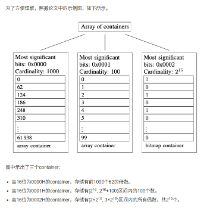

# 高效压缩位图RoaringBitmap的原理与应用
> - [高效压缩位图RoaringBitmap的原理与应用](https://www.jianshu.com/p/818ac4e90daf): 前言介绍的挺好的，对比布隆过滤器和HyperLogLog。和用单纯的位图的空间占用引出RBM、相关论文。但是后面的算法详解有点简陋

## 位图法简述

对于我们大数据工作者来说，**海量数据的判重和基数统计**是两个绕不开的基础问题。之前我已经讲了两种应用广泛的方法，即**布隆过滤器和HyperLogLog**。虽然它们**节省空间并且效率高**，但也付出了一定的代价，即：

- 只能插入元素，不能删除元素；
- 不保证100%准确，总是**存在误差**。

这两个缺点可以说是所有**概率性数据结构**（probabilistic data structure）做出的trade-off，毕竟鱼与熊掌不可兼得嘛。

显然，如果我们将这40亿个数原样存储下来，需要耗费高达14.9GB的内存，不可接受。所以我们可以用位图来存储，即第0个比特表示数字0，第1个比特表示数字1，以此类推。如果某个数位于原集合内，就将它对应的位图内的比特置为1，否则保持为0。这样就能很方便地查询得出结果了，**仅仅需要占用512MB的内存**，只有原来的不到3.4%。

由于位图的这个特性，它经常被作为索引用在数据库、查询引擎和搜索引擎中，并且位操作（如and求交集、or求并集）之间可以并行，效率更好。但是，位图也不是完美无缺的：**不管业务中实际的元素基数有多少，它占用的内存空间都恒定不变**。举个例子，如果上文题目中的集合只存储了0这一个元素，那么该位图只有最低位是1，其他位全为0，但仍然占用了512MB内存。**数据越稀疏，空间浪费越严重**。

为了解决位图不适应稀疏存储的问题，大佬们提出了**多种算法对稀疏位图进行压缩，减少内存占用并提高效率**。比较有代表性的有WAH、EWAH、Concise，以及RoaringBitmap。前三种算法都是基于行程长度编码（Run-length encoding, RLE）做压缩的，而RoaringBitmap算是它们的改进版，更加优秀，因此本文重点探讨它。

## RoaringBitmap的思路

为了不用打那么多字，下文将RoaringBitmap简称为RBM。

RBM的历史并不长，它于2016年由S. Chambi、D. Lemire、O. Kaser等人在论文[《Better bitmap performance with Roaring bitmaps》](https://arxiv.org/pdf/1402.6407.pdf) 与[《Consistently faster and smaller compressed bitmaps with Roaring》](https://arxiv.org/pdf/1603.06549.pdf) 中提出，官网在[这里](https://roaringbitmap.org/ )。

RBM的主要思路是：将32位无符号整数**按照高16位分桶**，即最多可能有216=65536个桶，论文内称为container。存储数据时，按照数据的高16位找到container（找不到就会新建一个），再将**低16位放入container中**。也就是说，一个RBM就是很多container的集合。

> 插入： roaring.go:569

图中示出了三个container：

- 高16位为0000H(16进制)的container，存储有前1000个62的倍数(图里面的数据规律)。
- 高16位为0001H的container，存储有[2^16, 2^16+100)区间内的100个数。
- 高16位为0002H的container，存储有[2×2^16, 3×2^16)区间内的所有偶数，共215个(位图表示)。

## Container原理
一共有3种。
> 容器接口： roaringarray.go:11

### ArrayContainer
当桶内数据的**基数不大于4096时**，会采用它来存储，其本质上是一个**unsigned short类型的有序数组**。数组初始长度为4，随着数据的增多会自动扩容（但最大长度就是4096）。另外还维护有一个计数器，用来实时记录基数。

上图中的前两个container基数都没超过4096，所以均为ArrayContainer。

### BitmapContainer
当桶内数据的基数大于4096时，会采用它来存储，其本质就是上一节讲过的普通位图，用**长度固定为1024的unsigned long型数组表示**，亦即位图的大小固定为216位（8KB）。它同样有一个计数器。

上图中的第三个container基数远远大于4096，所以要用BitmapContainer存储。

### RunContainer
RunContainer在图中并未示出，初始的RBM实现中也没有它，而是在本节开头的第二篇论文中新加入的。它使用**可变长度的unsigned short数组存储用行程长度编码（RLE）压缩后的数据**。举个例子，连续的整数序列11, 12, 13, 14, 15, 27, 28, 29会被RLE压缩为两个二元组11, 4, 27, 2，表示11后面紧跟着4个连续递增的值，27后面跟着2个连续递增的值。

由此可见，RunContainer的压缩效果**可好可坏**。考虑极端情况：如果所有数据**都是连续的**，那么最终只需要4字节；如果所有数据**都不连续**（比如全是奇数或全是偶数），那么不仅不会压缩，还会**膨胀成原来的两倍大**。所以，RBM引入RunContainer是作为其他两种container的折衷方案。

---
# RoaringBitmap数据结构及原理
> - [RoaringBitmap数据结构及原理](https://blog.csdn.net/yizishou/article/details/78342499): 有比较具体空间和过程的分析

## Container性能总结

> array升级过程 arraycontainer.go:256

### RoaringBitmap针对Container的优化策略

#### 创建时：

- 创建包含单个值的Container时，选用ArrayContainer
- 创建包含一串连续值的Container时，**比较**ArrayContainer和RunContainer，选取空间占用较少的

#### 转换：

针对ArrayContainer：
- 如果插入值后容量超过4096，则自动转换为BitmapContainer。因此正常使用的情况下不会出现容量超过4096的ArrayContainer。
- 调用runOptimize()方法时，会比较和RunContainer的空间占用大小，选择是否转换为RunContainer。

> toEfficientContainer arraycontainer.go:975 bitmapcontainer.go:1082 runcontainer.go:2452

> 主要是通过比较各自的大小，bitmap大小固定8kb, 数组则根据数组的长度计算， 而runcontainer则需要调用numberOfRuns方法(bitmapcontainer.go:1058) 来算出转换后的大小

针对BitmapContainer：
- 如果删除某值后容量低至4096，则会自动转换为ArrayContainer。因此正常使用的情况下不会出现容量小于4096的BitmapContainer。
- 调用runOptimize()方法时，会比较和RunContainer的空间占用大小，选择是否转换为RunContainer。

针对RunContainer：

只有在调用runOptimize()方法才会发生转换，会分别和ArrayContainer、BitmapContainer比较空间占用大小，然后选择是否转换。

---

> - [不深入而浅出 Roaring Bitmaps 的基本原理](https://cloud.tencent.com/developer/article/1136054)

操作又会出现下面三种场景：

- Bitmap vs Bitmap
- Bitmap vs Array
- Array vs Array

RBM 提供了相应的算法来高效地实现这些操作，看论文或者源码。

> 比较过程 roaring.go:712 大概应该是两个for循环高位和低位依次判断。

- [goland roaring](https://github.com/RoaringBitmap/roaring)
