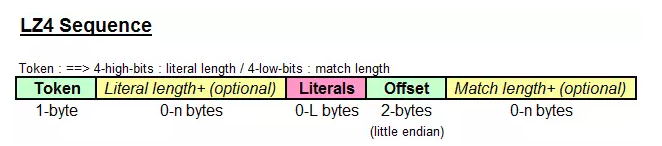

## 有损和无损

无损压缩：能够无失真地从压缩后的数据重构，准确地还原原始数据。可用于对数据的准确性要求严格的场合，如可执行文件和普通文件的压缩、磁盘的压缩，也可用于多媒体数据的压缩。该方法的压缩比较小。如差分编码、RLE、Huffman编码、LZW编码、算术编码。

有损压缩：有失真，不能完全准确地恢复原始数据，重构的数据只是原始数据的一个近似。可用于对数据的准确性要求不高的场合，如多媒体数据的压缩。该方法的压缩比较大。例如预测编码、音感编码、分形压缩、小波压缩、JPEG/MPEG。


## RLE

游程编码 Run Length Encoding

AAAAAABBCDDEEEEEF 的17个字符成功被压缩成了 A6B2C1D2E5F1 的12个字符，也就是 12 / 17 = 70%，压缩比为 70%，压缩成功了。

像这样，把文件内容用 数据 * 重复次数 的形式来表示的压缩方法成为 RLE(Run Length Encoding, 行程长度编码) 算法。RLE 算法是一种很好的压缩方法，经常用于压缩传真的图像等。因为图像文件的本质也是字节数据的集合体，所以可以用 RLE 算法进行压缩

简言之，其优点在于**将重复性高的数据量压缩成小单位**；然而，其缺点在于**─若该数据出现频率不高，可能导致压缩结果数据量比原始数据大**

> roaring-bitmap的位图对于稀疏位图的优化的压缩算法

## 哈夫曼算法和莫尔斯编码

莫尔斯编码一般把文本中出现最高频率的字符用短编码 来表示。

哈夫曼算法的关键就在于 **多次出现的数据用小于 8 位的字节数表示，不常用的数据则可以使用超过 8 位的字节数表示**。

哈夫曼算法是指，为各压缩对象文件分别构造最佳的编码体系，并以该编码体系为基础来进行压缩。因此，用什么样的编码（哈夫曼编码）对数据进行分割，就要由各个文件而定。用哈夫曼算法压缩过的文件中，存储着哈夫曼编码信息和压缩过的数据。

而在哈夫曼算法中，通过借助哈夫曼树的构造编码体系，即使在不使用字符区分符号的情况下，也可以构建能够明确进行区分的编码体系。不过哈夫曼树的算法要比较复杂，下面是一个哈夫曼树的构造过程。


自然界树的从根开始生叶的，而哈夫曼树则是叶生枝

使用哈夫曼树之后，**出现频率越高的数据所占用的位数越少**，这也是哈夫曼树的核心思想。

## Delta encoding
差分编码（英语：Delta encoding），又称增量编码，是指**在序列式数据之间以数据差异形式存储或发送数据的方式**（相对于存储发送完整文件的方式）。差分编码应用广泛，如需要查看文件的历史更改记录（版本控制、git等）、Windows中的远程差分压缩、在线备份等场景均用到了差分编码。

差异存储在称为“delta”或“diff”的不连续文件中。由于改变通常很小（平均占全部大小的2%），**差分编码能大幅减少数据的重复**。一连串独特的delta文件在空间上要比未编码的相等文件有效率多了。

差分编码的简单例子是存储序列式数据之间的差异（而不是存储数据本身）：不存“2, 4, 6, 9, 7”，而是存“2, 2, 2, 3, -2”。单独使用用处不大，但是在序列式数值常出现时可以帮助压缩数据。

> ES存储文档列表的压缩算法

---
## LZW

LZW算法中，首先建立一个字符串表，把每一个**第一次出现的字符串放入串表中，并用一个数字来表示**，这个数字与此字符串在串表中的位置有关，并将这个数字存入压缩文件中，如果这个字符串再次出现时，即**可用表示它的数字来代替**，并将这个数字存入文件中。压缩完成后将串表丢弃。如"print" 字符串，如果在压缩时用266表示，只要再次出现，均用266表示，并将"print"字符串存入串表中，在图象解码时遇到数字266，即可从串表中查出266所代表的字符串"print"，在解压缩时，串表可以根据压缩数据重新生成。

> 字典

特殊标记：

   随着新的串(string)不断被发现，标号也会不断地增长，如果原数据过大，生成的标号集（string table)会越来越大，这时候操作这个集合就会产生效率问题。如何避免这个问题呢?Gif在采用lzw算法的做法是**当标号集足够大的时候，就不能增大了，干脆从头开始再来**，在这个位置要插入一个标号，就是清除标志CLEAR，表示从这里我**重新开始构造字典**，以前的所有标记作废，开始使用新的标记。

---
## lz4

lz4是目前综合来看**效率最高的压缩算法**，更加侧重**压缩解压速度**，压缩比并不是第一。在当前的安卓和苹果操作系统中，内存压缩技术就使用的是lz4算法，及时压缩手机内存以带来更多的内存空间。本质上是时间换空间。

```
输入：fghabcde_bcdefgh_abcdefghxxxxxxx
输出：fghabcde_(5,4)(13,3)_(14,5)fghxxxxxxx
格式：[token]literals(offset,match length)[token](offset,match length)....
这里(13,3)长度3其实并不对，match length匹配的长度默认是4
```

其中两个括号内的便代表的是压缩时检测到的重复项，(5,4) 代表**向前5个byte，匹配到的内容长度有4**，即"bcde"是一个重复。当然也可以说"cde"是个重复项，但是根据算法实现的输入流扫描顺序，我们取到的是第一个匹配到的，并且长度最长的作为匹配。



- Literals指没有重复、首次出现的字节流，即不可压缩的部分
- Match指重复项，可以压缩的部分
- Token记录literal长度，match长度。作为解压时候memcpy的参数

### 压缩率

可以想到，如果重复项越多或者越长，压缩率就会越高。上述例子中"bcde"在压缩后，用(5,4)表示，即从4个bytes压缩成了3个bytes来表示，其中offset 2bytes, match length 1byte，能节省1个byte。

### 压缩算法实现

大致流程，压缩过程以**至少4个bytes为扫描窗口查找匹配**，每次移动1byte进行扫描，遇到重复的就进行压缩。

由于offset用2bytes表示，只能查找到到2^16(64kb)距离的匹配，对于压缩4Kb的内核页，只需要用到12位。

扫描的步长1byte是可以调整的，即对应LZ4_compress_fast机制，步长变长可以提高压缩解压速度，减少压缩率。


### 解压算法
根据解压前的数据流，取出token内的length，literals直接复制到输出，即memcpy(src,dst,length)。遇到match，在从前面已经拷贝的literals复制到后面即可

> 使用者： ES默认、clickhouse

---
参考链接：

- [深入解析数据压缩算法](https://blog.csdn.net/fanyun_01/java/article/details/80211799)
- [程序员需要了解的硬核知识之压缩算法](https://segmentfault.com/a/1190000020921942#item-2-6)
- [差分编码](https://zh.wikipedia.org/wiki/%E5%B7%AE%E5%88%86%E7%B7%A8%E7%A2%BC)
- [深入浅出lz4压缩算法](https://www.jianshu.com/p/824e1cf4f920)
- [lz4](https://github.com/lz4/lz4/)

---
## Deflate 算法

先说一下deflate算法吧.  deflate是zip压缩文件的默认算法.   其实deflate现在不光用在zip文件中, 在7z, xz等其他的压缩文件中都用.   实际上deflate只是一种压缩数据流的算法. 任何需要流式压缩的地方都可以用

DEFLATE是同时使用了**LZ77算法与哈夫曼编码**（Huffman Coding）的一个无损数据压缩算法

### LZ77

LZ77是基于字典的算法。思路是，把**数据中的重复（冗余）部分，用更短的metadata元信息代替**。

具体例子见参考链接:


> 使用者： ES的best_compression、zip

> Snappy 是谷歌基于 LZ77 算法思想编写出的压缩解压缩库，其目标并非最大压缩率或与其他压缩程序库的兼容性，而是非常高的速度和合理的压缩率。

## 参考链接
- [Compress Althgorim-压缩算法 ZIP Deflate 算法](https://houbb.github.io/2018/11/09/althgorim-compress-althgorim-12-zip-02): 详细说明, 包括哈夫曼编码的思考过程
- [无损压缩算法：deflate](https://www.qiujiawei.com/zlib-1/): LZ77的具体例子
-

---
## LZ4 vs LZ77（snappy）

Snappy（以前称Zippy）是Google基于LZ77的思路用C++语言编写的快速数据压缩与解压程序库

LZ4追求压缩速率的同时相对于snappy来说，不仅压缩更快了，压缩率也更佳可观了，同样是谷歌开发的。去看LZ4相关介绍的时候，提到了LZ77，博主是这么介绍LZ4的：**LZ4就是一个用16k大小哈希表储存字典并简化检索的LZ77**，而LZ77是一个应用了字典来进行压缩的算法。通俗来说，就是让程序观察（看字典）当前看到的数据是否和之前有重复， 如果有的话，我们就保存两个重复字段的距离（offset）和重复的长度，以替代重复的字段而以此来压缩数据。 其中**LZ77 最大的缺陷是在字典中寻找待匹配的最长的字符串占用了大量的时间**，如果字典和待搜索的缓存过短，能匹配到的概率就会非常小，针对这个问题LZ4做出了自己的改进，从而进一步的提升了压缩速率。

- [Kafka-之压缩算法&Hash算法](https://zhuanlan.zhihu.com/p/74212340)

## 算法对比

Zstandard（或Zstd）是由Facebook的Yann Collet开发的一个无损数据压缩算法。设计Zstandard的目的是提供一个类似于DEFLATE算法的压缩比，但更快，特别是解压缩快的算法。它的压缩级别从负5级（最快）到22级（压缩速度最慢，但是压缩比最高）可以调节。

LZ4算法有着最快的压缩时间

从表中我们可以发现 zstd 算法有着最高的压缩比，而在吞吐量上的表现只能说中规中矩。

反观 LZ4 算法，它在吞吐量方面则是毫无疑问的执牛耳者。

但对于 Kafka 而言，它们的性能测试结果却出奇得一致，即在吞吐量方面：LZ4 > Snappy > zstd 和 GZIP

而在压缩比方面，zstd > LZ4 > GZIP > Snappy。 如果网络不好且 CPU 资源够的话,建议使用 zstd 压缩

具体到物理资源，使用 Snappy 算法占用的网络带宽最多，zstd 最少，这是合理的，毕竟 zstd 就是要提供超高的压缩比；

在 CPU 使用率方面，各个算法表现得差不多，只是在压缩时 Snappy 算法使用的 CPU 较多一些，而在解压缩时 GZIP 算法则可能使用更多的 CPU。

- [由浅到深学习Kafka(六):生产者压缩算法](http://www.louisvv.com/archives/2436.html)

---
# Clickhouse压缩

- [编码压缩对比](./clickhouse/编码压缩对比.md)
