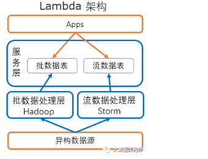
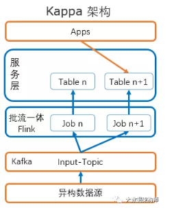
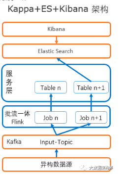
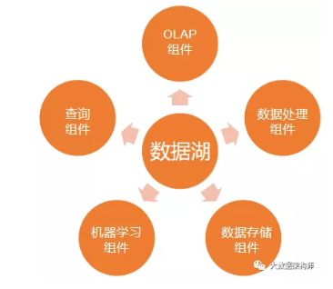
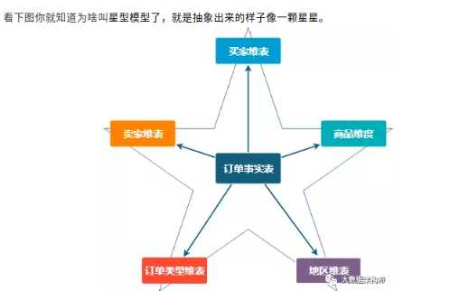
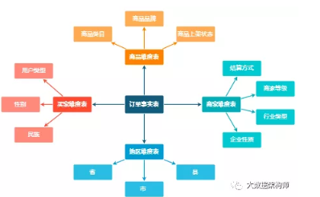
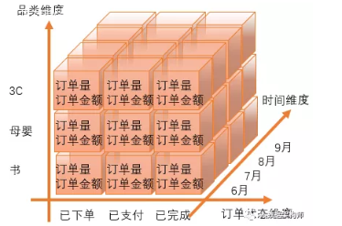

# 大数据的技术生态

> - [大数据的技术生态](https://www.zhihu.com/question/27974418)

传统的文件系统是单机的，不能横跨不同的机器。HDFS（Hadoop Distributed FileSystem）的设计本质上是**为了大量的数据能横跨成百上千台机器**，但是你看到的是一个文件系统而不是很多文件系统。

如果要用很多台机器处理，我就面临了如何**分配工作**，如果一台机器挂了如何重新启动相应的任务，机器之间如何互相通信交换数据以完成复杂的计算等等。这就是MapReduce / Tez / Spark的功能。MapReduce是第一代**计算引擎**，Tez和Spark是第二代。MapReduce的设计，采用了很简化的计算模型，只有Map和Reduce两个计算过程（中间用Shuffle串联），用这个模型，已经可以处理大数据领域很大一部分问题了。

Map＋Reduce的简单模型很黄很暴力，虽然好用，但是很笨重。第二代的Tez和Spark除了内存Cache之类的新feature，本质上来说，**是让Map/Reduce模型更通用，让Map和Reduce之间的界限更模糊，数据交换更灵活，更少的磁盘读写，以便更方便地描述复杂算法，取得更高的吞吐量**。

有了MapReduce，Tez和Spark之后，程序员发现，MapReduce的程序写起来真麻烦。他们希望简化这个过程。这就好比你有了汇编语言，虽然你几乎什么都能干了，但是你还是觉得繁琐。你希望有个**更高层更抽象的语言层来描述算法和数据处理流程**。于是就有了Pig和Hive。Pig是接近脚本方式去描述MapReduce，Hive则用的是SQL。它们把脚本和SQL语言翻译成MapReduce程序，丢给计算引擎去计算，而你就从繁琐的MapReduce程序中解脱出来，用更简单更直观的语言去写程序了。

于是Impala，Presto，Drill诞生了（当然还有无数非著名的交互SQL引擎，就不一一列举了）。三个系统的核心理念是，**MapReduce引擎太慢，因为它太通用，太强壮，太保守，我们SQL需要更轻量，更激进地获取资源，更专门地对SQL做优化，而且不需要那么多容错性保证**（因为系统出错了大不了重新启动任务，如果整个处理时间更短的话，比如几分钟之内）。这些系统**让用户更快速地处理SQL任务，牺牲了通用性稳定性等特性**。如果说MapReduce是大砍刀，砍啥都不怕，那上面三个就是剔骨刀，灵巧锋利，但是不能搞太大太硬的东西。

这些系统，说实话，一直没有达到人们期望的流行度。**因为这时候又两个异类**被造出来了。他们是Hive on Tez / Spark和SparkSQL。它们的设计理念是，MapReduce慢，但是如果我用**新一代通用计算引擎Tez或者Spark来跑SQL**，那我就能跑的更快。而且用户不需要维护两套系统。

上面的介绍，基本就是一个数据仓库的构架了。底层HDFS，上面跑MapReduce／Tez／Spark，在上面跑Hive，Pig。或者HDFS上**直接跑**Impala，Drill，Presto。这解决了中低速数据处理的要求。

---
# 大数据组件Presto，Spark SQL，Hive相互关系
> - [大数据组件Presto，Spark SQL，Hive相互关系](https://blog.csdn.net/yilulvxing/article/details/86220888)

## 1：Presto

### 1.1：Presto背景

Presto是Facebook开源的，完全基于内存的并⾏计算，分布式SQL交互式查询引擎是它被设计用来专门处理高速，实时的数据分析。Presto本身不存储数据，但是可以接入多种数据源，并且支持跨数据源的级联查询。

1.3：Presto优缺点

Presto是一个低延迟高并发的内存计算引擎，相比Hive，执行效率要高很多。

| 优点 | 缺点 |
| :---: | :---: |
| 轻量快速，支持近乎实时的查询 | 13年的new born，需要待验证 |
| Facebook内部广泛使用，扩展性和稳定性毋庸置疑 | 现在支持hive管理的表，尽管官方称支持hbase查询，但是仍然是开发状态 |
| 自从开源依赖有强劲的发展势头 | 不支持UDF操作 |
| 和impala同样使用分布式查询引擎，和传统的Mapreduce相比，消除了延迟和磁盘IO开销 |  |
| 文档完善 |  |

## 2：Hive

### 2.1：Hive背景

Apache Hive数据仓库软件可以使用SQL方便地阅读、编写和管理分布在分布式存储中的大型数据集。结构可以投射到已经存储的数据上。提供了一个命令行工具和JDBC驱动程序来将用户连接到Hive。产生背景有以下几个方面：

1. MapReduce编程的不便性

2. HDFS上的文件缺少Schema（字段名，字段类型等）

**关于Hive的定义（百度百科）：**

Hive是基于Hadoop的一个数据仓库工具，**可以将结构化的数据文件映射为一张数据库表，并提供简单的sql查询功能，可以将sql语句转换为MapReduce任务进行运行**。 其优点是学习成本低，可以通过类SQL语句快速实现简单的MapReduce统计，不必开发专门的MapReduce应用，十分适合数据仓库的统计分析。

Hive是建立在 Hadoop 上的数据仓库基础构架。它提供了一系列的工具，可以用来进行数据提取转化加载（ETL），这是一种可以存储、查询和分析存储在 Hadoop 中的大规模数据的机制。Hive 定义了简单的类 SQL 查询语言，称为 HQL，它允许熟悉 SQL 的用户查询数据。同时，这个语言也允许熟悉 MapReduce 开发者的开发自定义的 mapper 和 reducer 来处理内建的 mapper 和 reducer 无法完成的复杂的分析工作。

Hive 没有专门的数据格式。 Hive 可以很好的工作在 Thrift 之上，控制分隔符，也允许用户指定数据格式

### 2.3：Hive优缺点

| 优点 | 缺点 |
| :--- | :--- |
| 被广泛应用，经受时间的考验 | 既然是基于Mapreduce，也拥有MapReduce所有缺点，**包含昂贵的Shuffle操作和磁盘IO操作** |
| 运行在Mapreduce框架之上 | hive仍然不支持多个reduce操作group by和order by查询 |
| 非常好的支持用户自定义函数 | 和其他竞品相比，查询速度很慢 |
| 很友好的和hbase等系统结合 |  |

## 3：Presto与Hive对比

Hive是一个数据仓库，**是一个交互式比较弱一点的查询引擎**，交互式没有presto那么强，而且只能访问hdfs的数据；

Presto是一个**交互式查询引擎**，可以在很短的时间内返回查询结果，秒级，分钟级，能访问很多数据源；

Hive在查询100Gb级别的数据时，消耗时间已经是分钟级了；

但是Presto是**取代不了Hive的**，因为Presto全部的数据都是在内存中，限制了在内存中的数据集大小，比如多个大表的join，**这些大表是不能完全放进内存的**，实际应用中，对于在Presto的查询是有一定规定条件的，比如说一个查询在Presto查询超过30分钟（经常会遇到这种问题，此时适合在SparkSQL运行，后面会讲到），那就kill掉吧，说明不适合在Presto上使用，主要原因是，查询过大的话，会占用整个集群的资源，这会导致你后续的查询是没有资源进行查询的，这跟Presto的设计理念是冲突的，就像是你进行一个查询，但是要等个5分钟才有资源继续查询，这是很不合理的，交互式就变得弱了很多。

## 4：Spark SQL

### 4.1： Spark SQL背景

SparkSQL的前身是Shark，给熟悉RDBMS但又不理解MapReduce的技术人员提供快速上手的工具，我们上面提到，Hive是基于hadoop之上的一个开源的工具，提供的就是类似于SQL的一种HQL语言，它的好处就是可以直接把你的SQL语句转换成mapreduce作业，然后提交在集群上运行，好处就是我们不需要基于mapreduce的api进行编程，只需要写SQL语句就能完成大数据的统计和分析。

在上面我们提到，Hive是把SQL翻译成MapReduce作业，所以底层还是基于MapReduce，那么**MapReduce框架的缺点就是效率太低**，那么这样的话我们Hive的效率肯定不会高，对于批处理的作业Hive进行实现的话，如果很大的话，耗时十几个小时都是很可能的。

那么如何改进呢？

方法就是**换掉底层的执行引擎**，后来就产生的TEZ还有Spark这些**底层的执行引擎**，也就是说Hive可以跑在TEZ、SPARK上面。 后来慢慢发展就推出了Spark，**Spark是一个基于内存的分布式计算框架**，他的执行效率比MapReduce提高了很多！

### 4.2：Saprk SQL 的作用

Spark SQL的一大用处就是执行SQL查询语句，Spark SQL也可以用来从Hive中读取数据，当我们使用其它编程语言来运行一个SQL语句，结果返回的是一个Dataset或者DataFrame.可以使用命令行，JDBC或者ODBC的方式来与SQL进行交互。

## 5：总结

1：在数据源的级联查询时，用Presto写SQL语句进行查询；

2：在进行简单的数据查询时，可以用HQL进行建表，查询，关联等；

3：当数据量较大时，可用SparkSQL进行建表，查询，关联等；

---
# 流计算框架

> - [Spark Streaming，Flink，Kafka Streams：如何选择流处理框架](https://aijishu.com/a/1060000000119643)

## **流处理的两种类型：**

现在了解了我们刚刚讨论的术语，现在很容易理解，有两种方法可以实现Streaming框架：

### *原生流处理*
这意味着每条到达的记录都会在到达后立即处理，而无需等待其他记录。有一些连续运行的过程（根据框架，我们称之为操作员/任务/螺栓），这些过程将永远运行，每条记录都将通过这些过程进行处理。示例：Storm，Flink，Kafka Streams，Samza。

### *微批处理*
也称为快速批处理。这意味着每隔几秒钟就会将传入的记录分批处理，然后以单个小批处理的方式处理，延迟几秒钟。例如：Spark Streaming, Storm-Trident。

### 两种方法都有其优点和缺点
原生流传输感觉很自然，因为每条记录都会在到达记录后立即进行处理，从而使框架能够实现最小的延迟。但这也意味着在不影响吞吐量的情况下很难实现容错，因为对于每条记录，我们都需要在处理后跟踪和检查点。而且，状态管理很容易，因为有长时间运行的进程可以轻松维护所需的状态。

另一方面，微批处理则完全相反。容错是免费提供的，因为它本质上是一个批处理，吞吐量也很高，因为处理和检查点将在一组记录中一次性完成。但这会花费一定的等待时间，并且感觉不自然。高效的状态管理也将是维持的挑战。

## **流框架对比：**

### **Storm :**

Storm是流处理世界的强者。它是最古老的开源流框架，也是最成熟和可靠的框架之一。这是真正的流传输，适合基于简单事件的用例。

*优点*：

*   极低的延迟，真正的流，成熟和高吞吐量
*   非常适合简单的流媒体用例

*缺点*

*   没有状态管理
*   没有高级功能，例如事件时间处理，聚合，开窗，会话，水印等
*   一次保证

### **Spark Streaming :**

Spark已成为批处理中hadoop的真正继任者，并且是第一个完全支持Lambda架构的框架（在该框架中，实现了批处理和流传输；实现了正确性的批处理；实现了流传输的速度）。它非常受欢迎，成熟并被广泛采用。Spark Streaming是随Spark免费提供的，它使用微批处理进行流媒体处理。在2.0版本之前，Spark Streaming有一些严重的性能限制，但是在新版本2.0+中，它被称为结构化流，并具有许多良好的功能，例如自定义内存管理（类似flink），水印，事件时间处理支持等。另外，结构化流媒体更加抽象，在2.3.0版本以后，可以选择在微批量和连续流媒体模式之间进行切换。连续流模式有望带来像Storm和Flink这样的子延迟，但是它仍处于起步阶段，操作上有很多限制。

*优点*：

*   支持Lambda架构，Spark免费提供
*   高吞吐量，适用于不需要亚延迟的许多使用情况
*   由于微批量性质，默认情况下具有容错能力
*   简单易用的高级API
*   庞大的社区和积极的改进
*   恰好一次

*缺点*

*   不是真正的流，不适合低延迟要求
*   要调整的参数太多。很难做到正确。
*   天生无国籍
*   在许多高级功能方面落后于Flink

### **Flink** :

Flink也来自类似Spark这样的学术背景。Spark来自加州大学伯克利分校，而Flink来自柏林工业大学。像Spark一样，它也支持Lambda架构。但是实现与Spark完全相反。虽然Spark本质上是一个批处理，**其中Spark流是微批处理，并且是Spark Batch的特例，但Flink本质上是一个真正的流引擎，将批处理视为带边界数据流的特例**。尽管这两个框架中的API都是相似的，但是它们在实现上没有任何相似性。在Flink中，诸如map，filter，reduce等的每个函数都实现为长时间运行的运算符（类似于Storm中的Bolt）

Flink看起来像是Storm的真正继承者，就像Spark批量继承了hadoop一样。

*优点*：

*   开源流媒体领域创新的领导者
*   具有所有高级功能（例如事件时间处理，水印等）的第一个True流框架
*   低延迟，高吞吐量，可根据要求进行配置
*   自动调整，无需调整太多参数
*   恰好一次
*   被Uber，阿里巴巴等大型公司广泛接受。

*缺点*

*   起步较晚，最初缺乏采用
*   社区不如Spark大，但现在正在快速发展

### **Kafka Streams :**

与其他流框架不同，Kafka Streams是一个轻量级的库。对于从Kafka流式传输数据，进行转换然后发送回kafka很有用。我们可以将其理解为类似于Java Executor服务线程池的库，但具有对Kafka的内置支持。它可以与任何应用程序很好地集成，并且可以立即使用。

由于其重量轻的特性，可用于微服务类型的体系结构。Flink在性能方面没有匹配之处，而且不需要运行单独的集群，非常方便并且易于部署和开始工作。

Kafka Streams的一个主要优点是它的处理是**完全精确的端到端**。可能是因为来源和目的地均为Kafka以及从2017年6月左右发布的Kafka 0.11版本开始，仅支持一次。要启用此功能，我们只需要启用一个标志即可使用。

*优点*：

*   重量很轻的库，适合微服务，IOT应用
*   不需要专用集群
*   继承kafka的所有优良特性
*   支持流连接，内部使用rocksDb维护状态。
*   恰好一次（从Kafka 0.11开始）。

*缺点*

*   与kafka紧密结合，在没有kafka的情况下无法使用
*   婴儿期还很新，尚待大公司测试
*   不适用于繁重的工作，例如Spark Streaming，Flink。

## 参考链接
- [流计算框架 Flink 与 Storm 的性能对比](https://tech.meituan.com/2017/11/17/flink-benchmark.html)

# 大数据的那些事

> - [大数据的那些事](https://www.zhihu.com/people/fei-zong-55/posts?page=6)

作者的观点：

## 2
GFS的设计理念上做了两个非常重要的假设，其一是这个文件系统只处理大文件，一般来说要以TB或者PB作为级别去处理。其二是这个文件系统不支持update只支持append。在这两个假设的基础上，文件系统进一步假设可以把大文件切成若干个chunk，本文上面的图大致上给了GFS的一个基本体系框架的解释。

Chunk server是GFS的主体，它们存在的目的是为了保存各种各样的chunk。这些chunk代表了不同文件的不同部分。为了保证文件的完整性不受到机器下岗的影响，通常来说这些chunk都有冗余，这个冗余标准的来说是3份。有过各种分析证明这个三份是多门的安全。

除了保存实际数据的chunk server以外，我们还需要metadata manager，在GFS里面这个东西就是master了。

Master的重要性不言而喻。没有了metadata的文件系统就是一团乱麻。Google的实现实际上用了一个Paxos协议，倘若我的理解是正确的话。Paxos是Lamport提出来的用来解决在不稳定网络里面的consensus的一个协议。

对GFS的访问通过client，读的操作里，client会从master那边拿回相应的chunk server，数据的传输则通过chunk server和client之间进行。不会因此影响了master的性能。而写的操作则需要确保所有的primary以及secondary都写完以后才返回client。如果写失败，则会有一系列的retry，实在不行则这些chunk会被标注成garbage，然后被garbage collection。

## 3
我们先看看作为编程模型的MapReduce。所谓MapReduce的意思是任何的事情只要都严格遵循Map Shuffle Reduce三个阶段就好。**其中Shuffle是系统自己提供的而Map和Reduce则用户需要写代码。Map是一个per record的操作。任何两个record之间都相互独立。Reduce是个per key的操作，相同key的所有record都在一起被同时操作，不同的key在不同的group下面，可以独立运行。**

那么我们来看看为什么Google可以做到那么大规模的数据处理。首先这个系统的**第一条**，很简单，所有的中间结果可以写入到一个稳定的，**不因为单机的失败而不能工作的分布式海量文件系统**。GFS的伟大可见一斑。没有GFS，玩你妹的MapReduce。没有一个database厂商做出过伟大的GFS，当然也就没办法做出这么牛叉的MapReduce了。

这个系统的第二条也很简单，**能够对单个worker进行自动监视和retry**。这一点就使得单个节点的失败不是问题，系统可以**自动的进行管理**。加上Google一直保持着绝不泄密的资源管理系统Borg。使得Google对于worker能够进行有效的管理。

## ?
在BigTable的实现上，一个BigTable的cluster由一个client library，一个Master server和很多个的Tablet Server组成。按照论文的说法，一个大的BigTable会被分成**若干个**大小大致在100MB到200MB的tablets，而这些tablets 会被分配到一些Tablet Server上去给client 提供服务来。**Tablet Server对超过200MB的tablet灰进行切分，对小于100MB的则会进行合并**。

系统运行过程中的Tablet server的数量**不是固定的**，可以根据实际上的工作负载来增加或者减少，这方面的工作是Master server来控制的。**Tablet server并不存储实际的文件，而是作为一种service和proxy来访问存在Google File System里的实际的tablet们**。

> tablet: 大的BigTable会被分成**若干个**大小大致在100MB到200MB的tablets; Tablet Server对超过200MB的tablet灰进行切分，对小于100MB的则会进行合并。数量不是固定的，master控制。

和Tablet server不一样的是，Master Server始终都存在。Master server存在主要是把tablet分配给Tablet server，增加或者减少Tablet Server，并且负责去平衡不同的Tablet server的load。如果用户要创建一个新的Table，或者对已经有的Table做改动的话，譬如增加新的column family等，都是通过Master server来完成的。**Master server通过Tablet server来实现对tablet的间接操作，本身并不负责对任何Tablet 的管理**。

和大家直观上想象的不同，当一个client要访问BigTable的时候，client并不需要和Master server进行交流。这就保证了Master server的load并不是很重。那么，client是怎么样实现对BigTable的访问的呢? 这是BigTable比较精密的difference。这需要用到Chubby。

Chubby是一个highly distributed lock service。可以认为开源Zookeeper是一个Chubby的copycat。但是虽然说是CopyCat，实际上Chubby实现的是一个Paxos协议，而Zookeeper实现的是它的变种Zab。这方面我们不展开细讲。 具体的情况请阅读 The Chubby lock service for loosely-coupled distributed systems。

Chubby实现的是一个类似文件系统那样的目录结构。使用者可以访问这些文件来获得对被访问对象的锁。按照BigTable论文的说法，Chubby的用处有很多处，包括对Tablet的定位，对Tablet server的监控等等。

在BigTable里， SSTable(Sorted Strings Table)是一个基本的单元。**每个Tablet有若干个SSTable**。LSM-Tree

整个SSTable的实现分为memTable和磁盘上的SSTable。在内存里使用的是skip-list。所以写的操作只是写内存，非常的快。而内存写满之后就会把这个memTable变成一个immutable的memTable。同时开一个新的可以写的memTable另外一个线程则会把这个immutable的内存表变成一个磁盘上的SSTable。当这个转变完成以后immutable的内存表被释放。如此往复磁盘上会产生很多的SSTable。这就需要compact。SSTable是有level1， level2，。。。的。其中进到level1的compact叫做minor compact。后面还有major compact。从level2开始以后任意两棵树的key之间不会有overlap，但是在level1这并不guarantee。

所以我们的一个读操作要读memTable，immutable memTable，level1的tree，和level2以及以下的level的1棵树。这说明读的操作相对写的操作会更贵一些。大家需要注意的是，如果我们访问的是最新的版本，那么有可能会在内存里，所以这个设计对于读的操作主要是优化了新版本的读。对于cool data的读则要慢很多。顺便补充一句，Facebook的copycat RocksDB和LevelDB最主要的区别据说是引入了一个叫做universal compact的东西。当然我没有研究过这个codebase，不清楚universal compact到底有多牛。

当然，就像任何一个类似的系统一样，BigTable的recovery基于log，所有的写操作进内存之前写进log。LevelDB的log format并不是太难懂，是经典的**append only的操作**。基于**log的读写恢复是任何一个系统的基础了**。我就不再展开叙述。

---
# 实时查询

目前hive处理数据的特点：

- data shuffle时**网络瓶颈**，Reduce要等Map结束才能开始，不能**高效利用网络带宽**
- 一般一个SQL都会解析成多个MR job，Hadoop每次Job**输出都直接写HDFS**，性能差
- 每次执行Job都要启动Task，花费很多时间，**无法做到实时查询**

# 传统数仓和大数据数仓的区别是什么
> - [传统数仓和大数据数仓的区别是什么？](https://mp.weixin.qq.com/s/PN8-PXY1TbqYGGbsmHyB7g): Lambda、Kappa 架构+查询+分析展示

## 概念与容器

我们在实现数据仓库的时候，需要用到数据仓库设计（数据库设计工具）、数据存储技术（数据库工具）、数据处理技术（ETL工具、监控报警）、数据管理技术（元数据、数据地图、血缘关系）等等技术。

## 数据仓库发展历史

- 数据仓库概念诞生： inmon的建设理念是自上而下，这个上指的是数据的上游，不是数据分层的上层。因为自上而下太难见效，得把所有的业务理清楚，把所有系统的数据理清楚，然后分主题分层一点点的设计，然后按照这个设计一层层的建。而且一旦其中有任何变动，整个设计全废。
- 数据集市概念诞生： 先搞一个销售部门，摸清销售部门的需求，等于把下游的需求先锁死。然后再顺藤摸瓜，把数仓的每一层设计好，最后再摸到业务系统（CRM+ERP+人力系统），找业务系统的数据，这样就建立了一个销售部门级的数据集市。由于这种方法的需求少了，设计工作少，难度也就低了，对应的建设难度和工作量也少，建设速度就快，见效也就快啊，非常利于工作的开展。所以数据集市大行其道。
- DW\DM融合： Inmon提出了新的BI架构CIF(CorporationInformation Factory,企业信息工厂)。
- 实时数仓： 实时数仓又分为批数据+流数据、批流一体两种架构。从这里开始，也就正式进入了大数据环境下的数据仓库范畴。

## 大数据环境下的数据仓库

### 离线数仓

其实离线数仓就是咱以前做的传统数仓，数据**以T+1的形式计算好**放在那里，给前台的各种分析应用提供算好的数据。这也被称为“大数据的批处理”。只不过原本的单体环境工具（oracle、informatica等）**基本都被替换成了大数据体系**内（Hadoop、Hive、Sqoop、oozie等）的工具而已。

大数据环境中工具清单：

- 数据采集：flume/logstash+kafka，替代传统数仓的FTP；

- 批量数据同步：Sqoop、Kettle，跟传统数仓一样用Kettle，部分商用ETL工具也开始支持大数据集群;

- 大数据存储：Hadoop HDFS/Hive、TiDB、GP等**MPP**，替代传统数仓的Oracle、MySQL、MS SQL、DB2等；

- 大数据计算引擎：MapReduce、Spark、Tez，替代传统数仓的数据库执行引擎；

- OLAP引擎：Kylin/druid，（**Molap**，需预计算）、Presto/Impala，（**Rolap**，无需预计算），替代BO、Brio、MSTR等各种BI工具。

> MPP (Massively Parallel Processing)，即大规模并行处理。简单来说，MPP是将任务并行的分散到多个服务器和节点上，在每个节点上计算完成后，将各自部分的结果汇总在一起得到最终的结果(与Hadoop相似)。

### 实时计算

就是因为有实时数据处理，所以才会有离线数据处理。相对应的也就有实时数仓和离线数仓。实时数仓最开始是在日志数据分析业务中被广泛使用，后来在各种实时战报大屏的推动，实时数仓开始应用。

与离线计算相比，**实时计算这边减少了数据落地，替换了数据计算引擎**，目前纯流式数据处理基本上就只有Spark Streaming了。Storm会丢数据，Flink是批流一体的。实时数据计算好结果后，可以落地到各种数据库中，也可以直接对接到大屏进行展示。

## 大数据环境下的数据仓库架构

### Lambda 架构

Lambda架构核心就三个：批数据处理层、流数据处理层和服务层。批数据处理层应对历史长时间数据计算，流数据处理层应对短时间实时数据计算。如果一个需求要历史到当前所有数据的累加结果，那就在**服务层将两部分数据进行累加**就好了。

Lambda架构**需要维护两套计算引擎**，如果需要历史到现在实时数据的累加，则需要在两边同时做相同的计算，然后还得加总一下，非常麻烦。因此就有了最近非常火热的Kappa架构。

### Kappa 架构

Kappa架构的设计很有意思。Lambda架构反正还是分离线和实时两部分的，所以可以从离线库和实时消息队列取数，分别计算后，在服务层加总就可以了。

Kappa的设计理念是：干脆不要离线了，**全部都进行流式计算**。流式计算的数据来源是消息队列，那我把**所有需要计算的数据放在消息队列里**就好了，然后让流计算引擎计算所有数据不就好了？

因为所有数据都存在Kafka，上面接Flink批流一体数据处理引擎将kafka的数据计算好存在服务层的table n中。如果需求有变化了，就讲kafka的offset调整一下，Flink则重启一个任务重新计算，存在table N+1中，当N+1的数据进度赶上table n了，就停掉table n的任务。

### Kappa 架构+查询+分析展示

Kappa架构只到数据服务层，Flink本身只是一个计算引擎，因此还需要一个**提供快速查询的工具和一个展示的工具**。所以现在的架构就变成了这样：

## 总结
数仓设计的工具都是一样的，这个不会变；

- 由于大数据集群中，表关联的代价比较大，因此数仓建模会更多的使用宽表，所以这里会有一些变化；
- 数据处理和调度工具用kettle基本都OK，没啥太大变化，但是需要了解一下Flume、Kafka等工具；
- 数据存储这边需要深入了解一下，这是单体数据库和集群数据库的差别，会有分布式一致性的各种乱七八糟的问题；
- 数据计算引擎也有变化，也是单体数据库和集群数据库的差别。分布式计算会有数据倾斜、join代价高等问题，所以优化的方法和方向也不一样；
- 数据总体架构设计的时候也会有所变化，传统数仓整个BI套件就ok了，大数据环境下可能要面对更多的各种复杂需求，所需的大数据组件就变多了，需要系统学习。

---
# 数仓已死？数据湖当立！
> - [数仓已死？数据湖当立！](https://mp.weixin.qq.com/s/2BfASKS-UoZYX40SjZZd_A)

## 建模变了

**一个方向**，是规模大、技术强、业务趋于稳定的企业，如阿里、美团的固有业务，他们开始尝试一种全新的建模理念。

他们的主题域划分根本不遵循老一套的“中性、通用”，而是“个性、专用”。所以他们采用的是按业务流程划分主题域，因为这样才能更方便的支撑上面的业务指标体系。这样弄，上哪提炼一个通用的模型去啊？

在建模的时候，传统建模，DWD 层必须是范式建模，而且一般不对外提供服务。如果各部门需要明细数据，则各自建立 DM 解决。

而现在这些大厂的建模方式，则是尽可能**压缩范式建模的范围**，扩大维度建模的深度。以结构化指标体系开道，用维度模型向下不断穿透，直到 DWD 层。

是的，DWD 层也是维度建模。所有 ID 统一、代码转换、数据打平的事情放在哪里做？ETL 里做。

哦，不！应该改叫 ELT 了。先 Load ，再 Transformation 。因为超大量的数据输入，我们必须首先解决数据吞吐量的问题。

**另一个方向**，是那些创业公司或者大公司的新业务。这类场景的特点是业务一直在变，产品功能也在变，业务数据库也在变。

在这种场景中传统数据仓库建设的逻辑完全失效。因为根本不可能有人能在这么短的时间内，设计出一个能适应 2 周一次的迭代速度的数据仓库模型。

所以他们选择了简单粗暴的拉宽表！

## 数仓已死？

而对于那些业务日趋稳定的大厂，数据仓库同样也有巨大的困扰。就像新能源汽车车主总有里程焦虑一样，几乎所有的离线数仓工程师都害怕任务失败。

任务失败就意味着报表出不来，就意味着运营的白眼和扣绩效。

另外，我们的**增量入库方案，由于数据迟到、业务逻辑复杂等各种原因，慢慢的变得越来越复杂**。以至于**一些小公司干脆直接每天全量，这导致数据延迟更加严重**。

貌似一切正常的离线数仓 T+1 延迟，成为压死数仓的最后一根稻草。因为业务部门已经不能满足于看昨天的数据了。

“我们并没有做错什么,但不知为什么,我们输了”，诺基亚 CEO 的声音仿佛萦绕耳边。

什么？你说 Lambda 架构可以满足？是，这样是能出数，但是你拿实时和离线两个结果对比一下试试看？

你现在告诉我，拿什么拯救已然过了互联网淘汰年龄的数据仓库？

## 数据湖当立

而现在的数据湖，已经成长为一个巨无霸！凭借着**基于快照的设计方式、满足快照隔离、优秀的原子性、新元数据等巧妙设计**，数据湖拥有了**支持批流一体、完美增量入库、入库即可计算等特性**。

这些特性意味着什么？

对于 ETL 工程师来说，意味着数据湖没有 T+1 ！太令人兴奋了！

但是更兴奋的是大数据架构师，数据湖不仅意味着什么数据都往里扔，更意味着一种新架构的诞生！

一个万能的架构，能够满足算法工程师随意淘换原始数据的架构，能够满足大数据工程师随时拉一张准实时宽表出来的架构，能够**满足准实时数据增量接入和即时分析的架构**，能够让大数据工程师不用早起看任务是否失败的架构。

## 架构变了

Kappa 架构中，最无奈的其实是 Kafka ，生把一个 MQ 整成了数据库。这也直接**导致了 Kappa 架构无法存储海量数据的弊端**。

但是这个弊端，数据湖可以解决啊。把 Kafka 改成数据湖之后，问题解决了。 Kafka 也终于歇了口气，可以卸下莫名其妙得到的“数据库”头衔。

而传统数仓的“数据孤岛问题，在数据湖面前，瞬间荡然无存。因为数据湖本来就是大杂烩，什么都往里装呀！

而且现在已经有各种组件与数据湖产品进行对接了。数据湖真的变成了一个湖！

这个架构简直了！

你可以用数据处理组件，从湖里抽数出来，抽完直接做成宽表扔给运营。

也可以写一个 DAG ，数据规整、打通之后扔其他数据库里。

对数据非常了解的人，可以利用查询组件，直接到数据湖里查数据。

算法工程师同样可以直接对接数据湖，从湖里捞原始数据投喂给算法，训练模型。

最关键的一点，OLAP 引擎也能直接对接数据湖！

这个就厉害了！换句话说，咱可以依据这个构建一个超级无敌的 OLAP 体系，准实时、不用复杂的分层建设、不用担心任务跑不完、业务要啥可以快速给出去！

## 市场变了

当然，Kylin现在已经不局限于传统的Cube，基本上已经把Cube当成Index和存储了。之前分享过，Kylin现在已经支持明细查询和实时查询的功能。

云上数据湖 + Kylin 的这个产品叫 Kyligence Cloud，从上图可以看到它的位置，就在湖之上，可视化之下。因为是直接从湖里取数建 Cube，然后直接展示。这省了多少事儿啊！

有哥们问了，那构建 Cube 不得要时间么？咋说呢，第一次建 Cube，的确要一些时间。但是之后就不需要那么长时间了，因为数据可以增量加载。

因为数据湖的特性，它可以告诉 Kylin 在从上次消费后，有哪些 Partition 发生了修改。这样 Kylin 只要刷新特定的 Partition 就可以了。而且数据湖可以只拉取变化的数据，使得增量修改 Cube 变得可行。如果有查询不能被 Cube 满足，那么直接下压查询数据湖也是支持的，只是性能上会降级到普通水平。

这样，整个数据流，从产生到展示，基本上能控制在半个小时以内。啥？你还嫌慢？

嗯，的确，跟 ClickHouse 比起来，的确是慢一些，我也不是过来跟你掰扯那个工具好，谁的并发量高、速度快。

我们知道，OLAP 其实基本分为三个发展方向：MOLAP、ROLAP 和 HOLAP 。Kylin 是 MOLAP，ClikcHouse 是 ROLAP，这两个产品，犹如倚天屠龙。ClickHouse就是那倚天，追求极致的快，Kylin就是那屠龙，厚重而沉稳。

---
# 抽象真实世界的利器

> - [抽象真实世界的利器](https://mp.weixin.qq.com/s/kc_EMVYe1VrA_Jz_pGz4Ig)

名称 | 描述 | 模型
--- | --- | ---
DWS | Data Warehouse Service,服务数据层，按照业务目标，对已经处理好的数据进行横向汇聚、纵向汇总。按照宽表模型进行数据冗余和预计算，以空间换时间。 | 宽表模型
DWB | Data Warehouse Base,基础数据层，遵照维度模型的原理，将数据拆成维度和事实，进行维度、事实的统一。对数据进行轻度汇总，形成指标结果。 | 维度模型
DWD | Data Warehouse Detail,明细数据层，对数据进行清洗、代码统一、字段统一、格式统一等工作，目的是标准化，给后续处理提供干净、统一、标准的数据。 | 3NF模型
ODS | Operation Data Store,操作数据层，即原始数据层，与业务系统基本同构（可能会增加管理字段），目的是保留历史，解耦业务数据库。|

## 三范式
三范式是数据库建表（类同于excel的sheet页）设计原则，分为第一范式、第二范式、第三范式（这也太简单了吧？），其实还有第四范式、第五范式，不过那都没人用。

- 第一范式：保证列的原子性（每一列都是不重复的，不可再拆分的原子列）；人话翻译：每一列都只说一个事情。

- 第二范式：保证行的原子性（每一行都有唯一的主键，其他字段的值与主键一一对应）；人话翻译：每一行都只说一个事情。

- 第三范式：保证表的原子性（每张表中的数据不会冗余，一旦有冗余字段，就需要拆一张表出来，用外键与主表关联）人话翻译：每张表都只说一个事情。是不是很简单？

## 数据库设计

现在的很多开发人员，甚至是数据开发人员都不太遵守三范式了，有些三范式规则甚至被禁用，比如外键。

所有事物的发展都是有规律的，当时提出三范式，是因为我们在进行数据库设计的时候，必须要有一个规则，用来统一所有人的思想，保证数据库设计的通用性和可理解性。三范式就是用来约束所有设计者的。

数据库设计的过程，就是将现实世界抽象到信息系统的过程。使用的工具就是ER图。

我们把所有参与到业务流程中的对象，抽象为“实体”，每个实体有自己的“属性”，实体与实体之间产生的动作叫“关系”，用线连接起来。

业务员维护用户，一个业务员可以维护多个用户，他俩之间的关系就是一对多；用户采购商品，一个用户可以采购多个订单，关系是一对多；一个订单可以下多个商品，一个商品可以被多个订单采购，所以他俩的关系是多对多。

这四张表遵守第一、第二、第三范式，所有的数据做到了最少的冗余，最大的信息承载量，满足所有业务，不会对增、删、改等任何数据操作有歧义或者带来异常。

## 总结

不过现在已经进入大数据时代，上述的很多范式均已退化。以前的存储很贵，我们必须要寸土必争。现在存储很便宜，数据量又大，效率又要高，所以普遍采用空间换时间的方法，大量冗余数据，提升效率。尤其是在分布式环境中，要追求数据的一致性，三范式就无法满足。之前提到过禁用外键就是因为外键约束会导致连锁反应，那将会是一场灾难。

---
# 一口气讲完数据仓建模方法
- [一口气讲完数据仓建模方法](https://mp.weixin.qq.com/s/kueiaKs0ORgq3qvKT9AX6g)

维度模型中，一般分为两种：星型模型和雪花模型，再往上就是CUBE。

## 星型模型

如果你足够仔细，其实就能发现星型模型，乃至于维度模型的秘密。

在维度模型的设计理念中，数据工程师把所有的业务操作抽象成两类：

- 一类是业务操作时，需要的一些**基础信息**，也就是事实发生的前提。比如商品列表、商家信息等；

- 一类是**业务操作结果的记录**，也就是当时事实的记录结果，所以叫事实，对应的表就叫事实表。比如上图中的订单事实表，就是记录了当时这个订单发生的所有事实，比如你买了几个东西，多少钱等。

这两类信息必须关联起来，才能形成完整的交易链条。这两类信息画成图，就是中间是事实表，四周是维表，中间用代码连接。整个形状像是一个星星一样，所以叫星型模型。

## 雪花模型

逻辑跟星型模型是一样的，事实表、维度表。

在关系型数据库中，那时候存储还比较贵，磁盘很小，所以每一份数据都要尽量少存一些，所以当时会**严格按照三范式的要求，把每一个属性都单独抽成表**。以全国的三级行政区划表为例，如果是一张表，三个列，就是省代码、省名称、市代码、市名称、县代码、县名称，省代码和省名称会重复非常多次。拆成三张表，就是一张省表、一张市表、一张县表，省表里有三十几条数据，市表里几百条数据；县表里就几千条数据。

另外一个好处就是表间关系就非常清晰，看到雪花模型图，一眼就能看明白整个架构有哪些内容，各自的关系是怎样的。

## CUBE模型

这个形象倒是很形象，但是很多人依然看不明白。你这个CUBE跟上面的维度模型貌似没啥区别啊，就是把每个维度中的值给罗列出来了而已。这类图最坑的地方就是只告诉你cube的维度了，没告诉大家事实在哪里，所以大家都糊里糊涂的。

这么写一下你就明白了。我们可以通过类目、订单状态和月份三个维度，去看订单量、订单金额的统计结果。减少一个维度，就是上卷，增加一个维度就是下钻。就这么简单。

所以理解cube，你可以取个巧：CUBE模型其实就是多维模型的存储结构。在kylin这类预计算的MOLAP产品中，资料稍微详细、易懂一些。kylin会把每个组合方式计算一遍，然后存储下来。在查询的时候，kylin直接读取预计算的结果就好了，所以速度非常快，但是非常占存储。为了减少存储，kylin提供了剪枝的功能，就是把不常要的某个分支给删掉。

以上图为例，一个类目+订单状态+月份的cube，其实会生成0维1张表，1维3*1=3张表，2维C32=(3*2)/(2*1)=3张表（3张表，两两组合），3维1张表，总共8张表。这才3个维啊！我们现在动辄几十个维度，这个存储你可想而知了。

## 宽表模型

前面讲过三范式。严格按照三范式的规则设计出来的表就是窄表，每张表只说一件事情，如果顺带说了其他事情，就要拆表。相对于窄表来说，一张表中说了好几个事情，好几个概念，就是宽表了。宽表其实就是三范式的退化。宽表在关系型数据库中是异类，但是在NoSQL数据库中大行其道。

上图就是用三个窄表解决了订单业务数据存储。优点是关系非常清晰，一眼能看明白实体以及之间的关系

上表就是一张大宽表，冗余了卖家和买家的信息。对开发、数据分析师非常友好，不用join，直接拖数据就好了。

## 建模方法总结

从星型到雪花到星系到CUBE，最后到宽表，面对的业务越来越多，关系越来越复杂，数据量也越来越多。在关系型数据库为数仓载体的时候，我们尽可能的保证实体与关系之间的清晰逻辑。

但是在NoSQL环境中，**分布式数据库JOIN的代价比较大**，另外呢，现在的**存储也非常便宜**。所以星系模型是废了，雪花模型已经基本不用了；星型模型和CUBE在一些情况还在用；加上现在对效率的要求越来越高，所以数据仓库靠上的两层，**基本都是直接建大宽表**，导致现在很多人就知道宽表，而不知道其他模型了。

但是，这个世界始终还是底层规则决定上层逻辑。对于底层规则吃的越透，上层逻辑就越容易理解。

---
# 一口气说穿数据中台

> - [一口气说穿数据中台](https://mp.weixin.qq.com/s/RrA0hNZVKnivJYUmIcTDRw)

## 蛮荒时代

现在很多系统仍然是这样的，比如你采购一个erp、电商平台等，自带的绝大部分报表都与业务系统在一个数据库中的。其实这个时候正式对应系统架构中的“单体架构”。

## 数据仓库时代

随着信息系统的不断建设，管理者开始不太满足于固定的寥寥几张报表，他们期望看到更多细节，找到异常，发现问题。这时候，就必须要有一个信息系统去满足他们的需求，DSS/BI系统就顺应而生，几乎同时，数据仓库的概念也一并被提出。

这时候，业务数据和分析数据开始分道扬镳，走上了不一样的道路。业务数据处理(OLTP)向准确、及时、一致的方向不断迈进；分析数据操作(OLAP)向历史静态、聚合、关联、多维的方向发展。

一个典型的问题就是在业务数据库中，你无法回答类似于一个订单的选购、下单、支付、发货、完成的全流程各用了多少时间的问题。当然，你可以通过冗余N个时间戳来解决，但是你无法将所有状态变化的数据统统记录下来。因为**OLTP是反应当前的情况**。

**而OLAP就可以通过全量表、拉链表等方式保存历史状态数据，从而对每个对象进行历史分析。**

tips：除了拉链表之外，通常还有全量快照表、增量表和流水表，一共四种形式收集历史数据，这四种情况下次开单篇聊。

数据仓库建设的目的就是为了进行数据分析用的。**原则上来说数据仓库中的数据是不允许修改的**。所以你看HIVE根本就没有update和delete的功能，很多人非常不理解其中的原因，其实这就是因为HIVE就是为了数据仓库而生的。

数据仓库解决的核心问题其实就是上面说到的，解决历史情况追踪，解决数据分析能力、解决业务频繁变化等一系列问题。

拿inmon老爷子的话来总结一下：

> 数据仓库（Data Warehouse）是一个面向主题的（Subject Oriented）、集成的（Integrated）、相对稳定的（Non-Volatile）、反映历史变化（Time Variant）的数据集合，用于支持管理决策(Decision Making Support)。

## 数据湖时代

数据仓库很好用，多维分析简直能满足老板的一切需要。它能让决策者从公司总体情况，一直下钻到每个业务员的贡献，极大的满足了决策者的掌控欲，同时也给企业的决策带来了坚实的数据基础。

但是，数据仓库也有其非常致命的弊端：**所有数据必须经过定义之后才能被使用，所有数据都经过了ETL处理，所有数据都被聚合。**

作为数据工作者的你，肯定能理解其中的含义。一旦数据被动过，那就会造成信息丢失。

而在算法时代，这是不可接受的。

因此，在数据仓库发展了20年之后的2010年，Pentaho的创始人James Dixon提出了一个“数据湖”的概念。简单来说，**数据湖其实可以理解为一个巨大的ODS层**。

任何使用数据的同学都可以直接到数据湖中自由提取数据：

- 在多维分析报表中钻取到最细颗粒度之后仍然不能解决问题的，就到数据湖中查看最原始的数据，查找根因。

- 在进行算法设计的时候，数仓中处理的数据已经损失了一部分信息，那就去数据湖中找更详尽、更丰富的底层数据，没准可以找到最佳特征。

## 数据中台时代

数据湖貌似非常完美，能解决一切问题，但是肯定哄不住专业的你。是的，数据湖说的好听，是一个原生态的，任由你汲取的巨型数据源，说的不好听，就是一个数据垃圾堆。不管你管理的多么好都无法改变这个事实。

你现在已经找到了一个异常客户，想找到这个客户在公司业务流中的表现。我们应该会通过CRM与其进行沟通和跟进；通过交易平台与其发生交易；货物是通过ERP进行采购的，通过WMS记录货物存储信息的，通过TMS记录货物运输过程信息的。最后你是在微博中收到了他的抱怨信息，在客服中心的CallCenter接到投诉电话的。

这个时候，你想怎么办？**各个系统都是独立建设的，所有数据都在数据湖中，你就是没办法把他们串起来**！而且，这还是一条业务线。公司通常都会有N条业务线，每个业务线的系统都统统单独建立一遍，一个客户与公司发生关系的系统越来越多。

所以你可以看到，数据中台解决的是什么问题：

- 实体的打通和画像-OneID;
- 数据资产的统一构建与管理-OneModel；
- 数据服务的统一服务-OneService

这三点，共同组成了数据中台的OneData的方法论体系。

- OneID是最底层的数据打通，把各条业务线、各个业务系统的**相同实体（如客户）进行统一识别**。用户端的感觉就是你用一个id，可以通行阿里系所有app。企业端的感觉就是无论用户用什么客户端，通过那个系统与企业发生关系，都能识别成为一个用户；
- OneModel是中间层数据的**统一建模**，这里其实就是数据仓库。只不过不是一个业务线的数据仓库，是整个企业，整个集团的，统一的数据仓库。
- OneService是业务层的**统一服务提供**，其实还是那一套，主数据、即席查询、固定报表、多维分析等等。当然会多一些算法层面的试探，也仅仅是试探而已。

我在之前的工作中，就曾建立数据中台，主要工作内容就是做商品id和用户id的打通，进行全局统一建模，提供统一的商品主数据的编码工作和统一的数据输出。

---
# 到底什么是数据湖？全面解读数据湖的缘起、特征、技术、案例和趋势

- [到底什么是数据湖？全面解读数据湖的缘起、特征、技术、案例和趋势](https://mp.weixin.qq.com/s/kvCgH1t3aQXqbNlVQn1YBg)

## 数据湖的缘起

“数据仓库”，由比尔·恩门（Bill Inmon）于1990年提出，其被广泛接受的定义是，**一个面向主题的、集成的、相对稳定的、反映历史变化的数据集合，用于支持管理决策，通常也被认为是决策支持型应用的必要条件**。

因此，比起事务型的数据系统，数据仓库能更有效地对业务数据进行统计分析，无论是在提高效率、稳定性还是降低资源成本上都有其优势，所以被广为接受而大行其道。

后来，数据仓库领域的大师Ralph Kimball又**演化出“维度建模”的概念**，认为数据仓库是一系列数据集市的集合。如果说**数据仓库中包含着许多不同的主题域，那么数据集市可以理解为主要面向业务应用的单一主题域**。

### 3、数据湖的由来

Pentaho是个BI分析组件。当时的BI分析主要是基于数据集市（Data Mart）的。数据集市的建立需要事先识别出感兴趣的字段、属性，并对数据进行聚合处理。这样BI分析面临两个问题：

（1）只使用一部分属性，这些数据只能回答预先定义好（pre-determined）的问题。

（2）数据被聚合了，最低层级的细节丢失了，能回答的问题被限制了。

而基于Hadoop的BI分析，可以解决这个问题——把所有数据都原样存在Hadoop中，后面需要的时候再来取用。**如果说数据集市、数据仓库里面是瓶装的水——它是清洁的、打包好的、摆放整齐方便取用的；那么数据湖里面就是原生态的水——它是未经处理的，原汁原味的。数据湖中的水从源头流入湖中，各种用户都可以来湖里获取、蒸馏提纯这些水（数据）**。

2011年，福布斯在文章《Big Data Requires a Big, New Architecture》中报道了“data lake”这个词，并给出了数据仓库与数据湖的对比： **数据仓库的数据在被集成时就会被预先分类，并以最优的方式进行存储，以支撑特定的分析；但在大数据时代，我们从源系统抽取数据时可能无法明确知道这些数据的价值，因此无法给出一个最优的存储方式**。

彼时的数据湖概念更多地是关于当企业在处理海量异构的数据时，如何在数据产生实际的应用价值之前，为海量数据构建一个易访问且成本低的存储方式，和数据资产化、资产服务化等当下热点名词并没有太大关系。

目前大家普遍认为，解决数据孤岛是数据湖的一大特点，毕竟这是一个看上去很美好的事。

目前Hadoop是最常用的部署数据湖的技术，以前这个概念国内谈的少，但绝大部分互联网公司都已经有了，国内一般把整个HDFS叫做数据仓库（广义），即存放所有数据的地方，而国外一般叫数据湖（data lake）。

真正将数据湖推而广之的是亚马逊AWS。AWS 构筑了一套以 S3 为中心化存储、Glue 为元数据服务，E-MapReduce、Athena 为引擎的开放协作式的产品解决方案，AWS 之后，各个云厂商也纷纷跟进数据湖的概念，并在自己的云服务上提供类似的产品解决方案。

## 数据湖的定义

Wikipedia：

数据湖是一类存储数据自然/原始格式的系统或存储，通常是对象块或者文件。数据湖通常是企业中全量数据的单一存储。全量数据包括原始系统所产生的原始数据拷贝以及为了各类任务而产生的转换数据，各类任务包括报表、可视化、高级分析和机器学习。

数据湖中包括来自于关系型数据库中的结构化数据（行和列）、半结构化数据（如CSV、日志、XML、JSON）、非结构化数据（如email、文档、PDF等）和二进制数据（如图像、音频、视频）。

数据沼泽是一种退化的、缺乏管理的数据湖，数据沼泽对于用户来说要么是不可访问的要么就是无法提供足够的价值。

## 数据湖的技术

数据湖要解决的核心问题是高效的存储各类数据并支撑上层应用，传统的数据湖一般采用HDFS为存储引擎，但在实际应用中面临着难以克服的问题，这直接催生了delta、iceberg和hudi[11]三大开源数据湖方案，虽然它们开始的时候是为了解决特定的应用问题的，但最终促成了数据湖特征的统一。

### Delta

在没有delta数据湖之前，Databricks的客户一般会采用经典的lambda架构来构建他们的流批处理场景。以用户点击行为分析为例，点击事件经Kafka被下游的Spark Streaming作业消费，分析处理（业务层面聚合等）后得到一个实时的分析结果，这个实时结果只是当前时间所看到的一个状态，无法反应时间轴上的所有点击事件。所以为了保存全量点击行为，Kafka还会被另外一个Spark Batch作业分析处理，导入到文件系统上（一般就是parquet格式写HDFS或者S3，可以认为这个文件系统是一个简配版的数据湖），供下游的Batch作业做全量的数据分析以及AI处理等。

这套方案其实存在很多问题 :

第一、批量导入到文件系统的数据一般都缺乏全局的严格schema规范，下游的Spark作业做分析时碰到格式混乱的数据会很麻烦，每一个分析作业都要过滤处理错乱缺失的数据，成本较大；

第二、数据写入文件系统这个过程没有ACID保证，用户可能读到导入中间状态的数据。所以上层的批处理作业为了躲开这个坑，只能调度避开数据导入时间段，可以想象这对业务方是多么不友好；同时也无法保证多次导入的快照版本，例如业务方想读最近5次导入的数据版本，其实是做不到的。

第三、用户无法高效upsert/delete更新历史数据，parquet文件一旦写入HDFS文件，要想改数据，就只能全量重新写一份的数据，成本很高。事实上，这种需求是广泛存在的，例如由于程序问题，导致错误地写入一些数据到文件系统，现在业务方想要把这些数据纠正过来；线上的MySQL binlog不断地导入update/delete增量更新到下游数据湖中；某些数据审查规范要求做强制数据删除。

第四、频繁地数据导入会在文件系统上产生大量的小文件，导致文件系统不堪重负，尤其是HDFS这种对文件数有限制的文件系统。

在Databricks看来，以下四个点是数据湖必备的：

事实上, Databricks在设计delta时，希望做到流批作业在数据层面做到进一步的统一(如下图)。业务数据经过Kafka导入到统一的数据湖中（无论批处理，还是流处理），上层业务可以借助各种分析引擎做进一步的商业报表分析、流式计算以及AI分析等等。

### Hudi

Uber的业务场景主要为：将线上产生的行程订单数据，同步到一个统一的数据中心，然后供上层各个城市运营同事用来做分析和处理。在2014年的时候，Uber的数据湖架构相对比较简单，业务日志经由Kafka同步到S3上，上层用EMR做数据分析；线上的关系型数据库以及NoSQL则会通过ETL（ETL任务也会拉去一些Kakfa同步到S3的数据）任务同步到闭源的Vertica分析型数据库，城市运营同学主要通过Vertica SQL实现数据聚合。当时也碰到数据格式混乱、系统扩展成本高（依赖收Vertica商业收费软件）、数据回填麻烦等问题。后续迁移到开源的Hadoop生态，解决了扩展性问题等问题，但依然碰到Databricks上述的一些问题，其中最核心的问题是无法快速upsert存量数据。

如上图所示，ETL任务**每隔30分钟定期地把增量更新数据同步到分析表中，全部改写已存在的全量旧数据文件，导致数据延迟和资源消耗都很高**。此外，在数据湖的下游，还存在流式作业会增量地消费新写入的数据，数据湖的流式消费对他们来说也是必备的功能。所以，他们就希望设计一种合适的数据湖方案，在解决通用数据湖需求的前提下，还能实现快速的upsert以及流式增量消费。

Uber团队在Hudi上同时实现了Copy On Write和Merge On Read 的两种数据格式，其中Merge On Read就是为了解决他们的fast upsert而设计的。简单来说，就是每次把增量更新的数据都写入到一批独立的delta文件集，定期地通过compaction合并delta文件和存量的data文件。同时给上层分析引擎提供三种不同的读取视角：仅读取delta增量文件、仅读取data文件、合并读取delta和data文件。满足各种业务方对数据湖的流批数据分析需求。

最终，我们可以提炼出Uber的数据湖需求为如下图，这也正好是Hudi所侧重的核心特性。

### Iceberg
Netflix的数据湖原先是借助Hive来构建，但发现Hive在设计上的诸多缺陷之后，开始转为自研Iceberg，并最终演化成Apache下一个高度抽象通用的开源数据湖方案。Netflix用内部的一个时序数据业务的案例来说明Hive的这些问题，采用Hive时按照时间字段做partition，他们发现仅一个月会产生2688个partition和270万个数据文件。他们执行一个简单的select查询，发现仅在分区裁剪阶段就耗费数十分钟。

他们发现Hive的元数据依赖一个外部的MySQL和HDFS文件系统，通过MySQL找到相关的parition之后，需要为每个partition去HDFS文件系统上按照分区做目录的list操作。在文件量大的情况下，这是一个非常耗时的操作。同时，由于元数据分属MySQL和HDFS管理，写入操作本身的原子性难以保证。即使在开启Hive ACID情况下，仍有很多细小场景无法保证原子性。另外，Hive Memstore没有文件级别的统计信息，这使得filter只能下推到partition级别，而无法下推到文件级别，对上层分析性能损耗无可避免。最后，Hive对底层文件系统的复杂语义依赖，使得数据湖难以构建在成本更低的S3上。

于是，Netflix为了解决这些痛点，设计了自己的轻量级数据湖Iceberg。在设计之初，作者们将其定位为一个通用的数据湖项目，所以在实现上做了高度的抽象。虽然目前从功能上看不如前面两者丰富，但由于它牢固坚实的底层设计，一旦功能补齐，将成为一个非常有潜力的开源数据湖方案。

总体来说，Netflix设计Iceberg的核心诉求可以归纳为如下：

**因此，数据湖并不是炒作的新概念，而是来源于应用的驱动，delta、iceberg和hudi这类新技术实际是介于上层计算引擎和底层存储格式之间的一个中间层，我们可以把它定义成一种“数据组织格式”**，Iceberg 将其称之为“表格式”也是表达类似的含义。它与底层的存储格式（比如 ORC、Parquet 之类的列式存储格式）最大的区别是，它并不定义数据存储方式，而是定义了数据、元数据的组织方式，向上提供统一的“表”的语义。它构建在数据存储格式之上，其底层的数据存储仍然使用 Parquet、ORC 等进行存储。

delta、iceberg和hudi诞生于不同公司，需要解决的问题存在差异，Iceberg 在其格式定义和核心能力上最为完善，但是上游引擎的适配上稍显不足；Hudi 基于 Spark 打造了完整的流式数据落地方案，但是其核心抽象较弱，与 Spark 耦合较紧；Delta Lake 同样高度依赖于 Spark 生态圈，与其他引擎的适配尚需时日，**虽然这三个方案在设计初衷上稍有不同，但实现的思路和提供的能力却非常相似，我们可以总结出数据湖技术需要具备的能力**：

（1）同时支持流批处理

（2）支持数据更新

（3）支持事务（ACID）

（4）可扩展的元数据

（5）支持多种存储引擎

（6）支持多种计算引擎

不同公司根据不同需求选择了不同的数据湖产品，比如阿里云的 DLA 团队选择 hudi 作为其底层数据湖存储引擎；腾讯选择了 iceberg 作为他们的数据湖存储引擎,比如文章《基于 Flink+Iceberg 构建企业级实时数据湖》\[12\]就介绍了腾讯的企业实时数据湖方案。

## 数据湖的趋势

#### 1、服务模式演进趋势

**第三阶段：云上数据湖架构（无服务器）**，即云上纯托管的存储系统逐步取代HDFS，成为数据湖的存储基础设施，并且引擎丰富度也不断扩展。除了Hadoop和Spark的生态引擎之外，各云厂商还发展出面向数据湖的引擎产品。如分析类的数据湖引擎有AWS Athena和华为DLI，AI类的有AWS Sagemaker。

这个架构仍然保持了一个存储和多个引擎的特性，所以统一元数据服务至关重要，如AWS推出了Glue，阿里云EMR近期也即将发布数据湖统一元数据服务。该架构相对于原生HDFS的数据湖架构的优势在于：

（1）帮助用户摆脱原生HDFS系统运维困难的问题。HDFS系统运维有两个困难：1）存储系统相比计算引擎更高的稳定性要求和更高的运维风险 2）与计算混布在一起，带来的扩展弹性问题。存储计算分离架构帮助用户解耦存储，并交由云厂商统一运维管理，解决了稳定性和运维问题。

（2）分离后的存储系统可以独立扩展，不再需要与计算耦合，可降低整体成本

（3）当用户采用数据湖架构之后，客观上也帮助客户完成了存储统一化（解决多个HDFS数据孤岛的问题）

#### 2、技术架构演进趋势

**第一阶段：以Hadoop为代表的离线数据处理基础设施**。如下图所示，Hadoop是以HDFS为核心存储，以MapReduce（简称MR）为基本计算模型的批量数据处理基础设施。

第二阶段：lambda架构。随着数据处理能力和处理需求的不断变化，越来越多的用户发现，批处理模式无论如何提升性能，也无法满足一些实时性要求高的处理场景，流式计算引擎应运而生，例如Storm、Spark Streaming、Flink等，如下图所示，整个数据流向自左向右流入平台。进入平台后一分为二，一部分走批处理模式，一部分走流式计算模式。无论哪种计算模式，最终的处理结果都通过服务层对应用提供，确保访问的一致性。

第三阶段：Kappa架构。Lambda架构解决了应用读取数据的一致性问题，但是“流批分离”的处理链路增大了研发的复杂性。因此，有人就提出能不能用一套系统来解决所有问题。目前比较流行的做法就是基于流计算来做。流计算天然的分布式特征，注定了他的扩展性更好。通过加大流计算的并发性，加大流式数据的“时间窗口”，来统一批处理与流式处理两种计算模式。

#### 3、湖仓一体的演进趋势

数据仓库的设计强调计划，而数据湖强调市场，更具灵活性，因此对于处于不同阶段的企业的效用是不一样的：

1、当企业处于初创阶段，数据从产生到消费还需要一个创新探索的阶段才能逐渐沉淀下来，那么用于支撑这类业务的大数据系统，灵活性就更加重要，数据湖的架构更适用。

2、当企业逐渐成熟起来，已经沉淀为一系列数据处理流程，问题开始转化为数据规模不断增长，处理数据的成本不断增加，参与数据流程的人员、部门不断增多，那么用于支撑这类业务的大数据系统，成长性的好坏就决定了业务能够发展多远。数据仓库的架构更适用。

对企业来说，数据湖和数据仓库是否必须是一个二选一的选择题？是否能有一种方案同时兼顾数据湖的灵活性和云数据仓库的成长性，将二者有效结合起来为用户实现更低的总体拥有成本？阿里云提出了大数据架构新概念：湖仓一体。

何谓湖仓一体？

（1）湖和仓的数据/元数据无缝打通，互相补充，数据仓库的模型反哺到数据湖（成为原始数据一部分），湖的结构化应用知识沉淀到数据仓库

（2）湖和仓有统一的开发体验，存储在不同系统的数据，可以通过一个统一的开发/管理平台操作

（3）数据湖与数据仓库的数据，系统可以根据自动的规则决定哪些数据放在数仓，哪些保留在数据湖，进而形成一体化

## 数据湖的案例

### 3、阿里云数据湖

阿里云DLA数据湖解决方案\[4\]如上图所示，DLA 核心在于打造云原生的服务与引擎，端到端解决基于 OSS 的管理、分析、计算问题，核心关键点如下。

（1）**数据存储**：采用OSS作为数据湖的集中存储，可以支撑EB规模的数据湖，客户无需考虑存储量扩容，各类型数据可以统一存储

（2）**数据湖管理**：面对 OSS 数据开放性带来的管理及入湖困难，DLA的Formation组件具备元数据发现和一键建湖的能力，DLA提供Meta data catalog组件对于数据湖中的数据资产进行统一的管理，无论数据是在“湖中”还是在“湖外”，比如利用元数据爬取功能，可以一键创建 OSS 上的元数据信息，轻松自动识别 CSV/JSON/Parquet 等格式，建立好库表信息，方便后续计算引擎使用

（3）**数据分析和计算**：DLA提供了SQL计算引擎和Spark计算引擎两种。无论是SQL还是Spark引擎，都和Meta data catalog深度集成，能方便的获取元数据信息。基于Spark的能力，DLA解决方案支持批处理、流计算和机器学习等计算模式

（4）**在数据集成和开发上：**阿里云的数据湖解决方案提供两种选择：一种是采用dataworks完成；另一种是采用DMS来完成。无论是选择哪种，都能对外提供可视化的流程编排、任务调度、任务管理能力。在数据生命周期管理上，dataworks的数据地图能力相对更加成熟。

阿里云DLA解决方案的另一个特色在于“**基于云原生的湖仓一体化**”。传统的企业级数据仓库在大数据时代的今天，在各类报表应用上依然是无法替代的；但是数仓无法满足大数据时代的数据分析处理的灵活性需求。

因此，阿里云推荐数据仓库应该作为数据湖的上层应用存在：即数据湖是原始业务数据在一个企业/组织中唯一官方数据存储地；数据湖根据各类业务应用需求，将原始数据进行加工处理，形成可再次利用的中间结果；当中间结果的数据模式（Schema）相对固定后，DLA可以将中间结果推送至数据仓库，供企业/组织开展基于数仓的业务应用。阿里云在提供DLA的同时，还提供了云原生数仓（原ADB），DLA和云原生数仓在以下两点上深度融合。

（1） 使用同源的SQL解析引擎。DLA的SQL与ADB的SQL语法上完全兼容，这意味着开发者使用一套技术栈即能同时开发数据湖应用和数仓应用。

（2） 都内置了对于OSS的访问支持。OSS直接作为DLA的原生存储存在；对于ADB而言，可以通过外部表的能力，很方便的访问OSS上的结构化数据。借助外部表，数据可以自由的在DLA和ADB之间流转，做到真正的湖仓一体。

---
# 参考链接

- [到底什么是数据湖？全面解读数据湖的缘起、特征、技术、案例和趋势](https://mp.weixin.qq.com/s/kvCgH1t3aQXqbNlVQn1YBg): 比较详细介绍起源和相关各个方面的缘由。
- [数据仓库主题系统文章](https://mp.weixin.qq.com/mp/appmsgalbum?__biz=Mzk0NDI0NDg1OA==&action=getalbum&album_id=1874116838897319938&scene=173&from_msgid=2247487543&from_itemidx=1&count=3&nolastread=1&uin=&key=&devicetype=Windows+7&version=63030054&lang=zh_CN&ascene=1&fontgear=2): 比较倾向个人思考和总结，虽然不会很详细。
    - [阿里的《大数据之路》吹牛了？](https://mp.weixin.qq.com/s/_chwuyzOwyMDUoSTtjNTRw):
        - 大数据工程师的工作日常: 接需求、拉数据、做宽表、对数、跑批、找bug、重跑。
        - 传统数仓的弱点，周期长。互联网数仓，快速迭代。
        - 偏向能立刻出活儿，解决任务、调度、优化等问题的大数据工程师。
        - 所以我完全相信阿里《大数据之路》中写的那些内容，一来，当时的阿里，有高度统一的数据认知；二来，阿里有很好的数据团队基础；三来，数据团队有非常高的权限（权力）。
        - 大数据数仓领域也出现了一些新的小工具，比如宽表模型、BitMap、布隆过滤器等等。
        - 消失的玩意: 代理键、拉链表、什劳子缓慢变化维、快速维
    - [传统数仓和大数据数仓的区别是什么？](https://mp.weixin.qq.com/s/PN8-PXY1TbqYGGbsmHyB7g): Lambda、Kappa 架构+查询+分析展示
    - [数仓已死？数据湖当立！](https://mp.weixin.qq.com/s/2BfASKS-UoZYX40SjZZd_A)
    - [抽象真实世界的利器](https://mp.weixin.qq.com/s/kc_EMVYe1VrA_Jz_pGz4Ig)
    - [一口气说穿数据中台](https://mp.weixin.qq.com/s/RrA0hNZVKnivJYUmIcTDRw)
