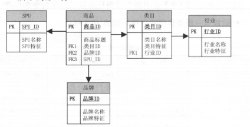
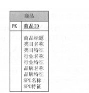

3.3.3 增量与全量同步的合并

在传统的数据整合方案中，合并技术大多采用 merge 方式( update+insert ）：当前流行的大数据平台基本都不支持 update 操作 ，现在我们比较推荐的方式是全外连接（ full outer join) ＋数据全量覆盖重新加载（ insert overwrite ），即如日调度，则将当天的增量数据和前一天的全量数据做全外连接，重新加载最新的全量数据。

在大数据量规模下，全量更新的性能比 update 要高得多。此外，如果担心数据更新错误问题，可以采用分区方式，每天保持一个最新的全量版本，保留较短的时间周期(如 3-7天)

时效性和吞吐量是数据处理中的两个矛盾体 ，很多时候需要从业务的角度来权衡使用什么样的系统来做数据中转

5.2.2 数据处理

实时计算任务部署在流式计算系统上，通过数据中间件获取到实时源数据后进行实时加工处理。在各大互联网公司中，有各种开源的和非开源的流计算引擎系统在使用。在业界使用比较广泛的是 Twitter 开源的Storm 系统、雅虎开源的 S4 系统、 Apache park Streaming ，以及最近几年兴起的 Flink 。

由于实时计算是分布式处理的，系统的不稳定性必然会导致数据的处理有可能出现失败的情况。

比如网络的抖动导致数据发送不成功、机器重启导致数据丢失等。在这些情况下，怎么做到数据的**精确处理**呢？

上面提到的几个流计算系统几乎都提供了数据自动 ACK 、失败重发以及事务信息等机制。
- 超时时间: 由于数据处理是按照批次来进行的，当一批数据处理超时时，会从拓扑的一端重发数据。另外，批次处理的数据量不宜过大，应该增加一个限流的功能（限定一批数据的记录数或者容量等），避免数据处理超时。
- 事务信息 每批数据都会附带一个事务 ID 的信息，在重发的情况下，让开发者自己根据事务信息去判断数据第一次到达和重发时不同的处理逻辑。
- 备份机制 开发人员需要保证内存数据可以通过外部存储恢复，因此在计算中用到的中间结果数据需要备份到外部存储中。上面的这些机制都是为了保证数据的幕等性。

实时任务在运行过程中，会计算很多维度和指标，这些数据需要放在一个存储系统中作为恢复或者关联使用。其中会涉及三种类型的数据：
- 中间计算结果一一在实时应用处理过程中，会有一些状态的保存（比如去重指标的明细数据），用于在发生故障时，使用数据库中的数据恢复内存现场。
- 最终结果数据一一指的是通过 ETL 处理后的实时结果数据，这些数据是实时更新的，写的频率非常高，可以被下游直接使用。
- 维表数据一一在离线计算系统中，通过同步工具导人到在线存储系统中，供实时任务来关联实时流数据。后面章节中会讲到维表的使用方式。

数据库分为很多种类型，比如关系型数据库、列式数据库、文档数据库等 那么在选择实时任务所使用的数据库时应该注意哪些特征呢？

前面提到实时任务是多线程处理的，这就意味着数据存储系统必须能够比较好地支持多并发读写，并且延时需要在毫秒级才能满足实时的性能要求。

在实践中，一般使用 HBase Tair MongoDB 等列式存储系统。由于这些系统在写数据时是先写内存再落磁盘，因此写延时在毫秒级：读请求也有缓存机制，重要的是多并发读时也可以达到毫秒级延时。

但是这些系统的缺点也是比较明显的，以 HBase 为例， 一张表须要有 row key ，而 rowkey 是按照 ASCII 码来排序的，这就像关系型数据库的索引一样， row key 的规则限制了读取数据的方式。

如果业务方需要使用另一种读取数据的方式，就必须重新输出 row key 。从这个角度来看， HBase 没有关系型数据库方便。但是 HBase 张表能够存储TB 甚至几十 TB 的数据，而关系型数据库必须要分库分表才能实现这个量级的数据存储。

因此，对于海量数据的实时计算，一般会采用非关系型数据库，以应对大量的多并发读写。

5.3.2 多流关联

在流式计算中常常需要把两个实时流进行主键关联，以得到对应的实时明细表。

在离线系统中两个表关联是非常简单的，因为离线计算在任务启动时已经可以获得两张表的全量数据，只要根据关联键进行分桶关联就可以了。

但流式计算不一样，数据的到达是一个增量的过程，并且**数据到达的时间是不确定的和无序的**，因此在数据处理过程中会**涉及中间状态的保存和恢复机制等细节问题**。

比如A表和B表使用 ID 进行实时关联，由于无法知道两个表的到达顺序，因此在两个数据流的每条新数据到来时，都需要到另外一张表中进行查找。如A表的某条数据到达，到B表的全量数据中查找，如果能查找到，说明可以关联上，拼接成一条记录直接输出到下游 但是如果关联不上，则需要放在内存或外部存储中等待，直到B表的记录也到达。**多流关联的一个关键点就是需要相互等待，只有双方都到达了，才能关联成功**。

在上面的例子中，实时采集两张表的数据，每到来一条新数据时都在内存中的对方表截至当前的全量数据中查找，如果能查找到，则说明关联成功，直接输出 ：如果没查找到 ，则把数据放在内存中的自己表数据集合中等待。

另外，不管是否关联成功，内存中的数据都需要备份到外部存储系统中，在任务重启时，可以从外部存储系统中恢复内存数据这样才能保证数据不丢失。因为在重启时，任务是续跑的，不会重新跑之前的数据。

另外，订单记录的变更有可能发生多次（比如订单的多个字段多次更新），在这种情况下 需要根据订单 ID 去重，避免A表和B表多次关联成功；否则输出到下游就会有多条记录，这样得到的数据是有重复的。

以上是整体的双流关联流程，在实际处理时，考虑到查找数据的性能，实时关联这个步骤一般会把数据按照关联主键进行分桶处理，并且在故障恢复时也根据分桶来进行，以降低查找数据量和提高吞吐量。

5.3.3 维表使用
在离线系统中，一般是根据业务分区来关联事实表和维表的，因为在关联之前维表的数据就已经就绪了。

而在实时计算中，关联维表一般会使用当前的实时数据（T）去关联 T-2 的维表数据，相当于在T的数据到达之前需要把维表数据准备好，并且一般是一份静态的数据。为什么在实时计算中这么做呢？

主要基于以下几点的考虑。

- 1. 数据无法及时准备好

    当到达零点时，实时流数据必须去关联维表（因为不能等待，如果等就失去了实时的特性），而这个时候 T-1 的维表数据一般不能在零点马上准备就绪（因为 T-1 的数据需要在这一天加工生成），因此去联T-2维表，相当于在T-1 一天时间里加工好 T-2 的维表数据。

- 2. 无法准确获取全量的最新数据

    维表一般是全量的数据，如果需要实时获取到当天的最新维表数据，则需要 T-1 的数据＋当天变更才能获取到完整的维表数据。也就是说，维表也作为一个实时流输入，这就需要使用多流实时关联来实现。但是由于实时数据是无序的并且到达时间不确定，因此在维表关联上有歧义。

- 3. 数据的无序性

    如果维表作为实时流输入的话，获取维表数据将存在困难。比如10:00 点的业务数据成功关联维表，得到了相关的维表字段信息，这个时候是否就已经拿到最新的维表数据了呢？其实这只代表拿到截至10:00 点的最新状态数据（实时应用永远也不知道什么时候才是最新状态，因为不知道维表后面是否会发生变更）。

因此在实时计算中维表关联一般都统一使用 T-2 的数据，这样对于业务来说，起码关联到的维表数据是确定的（虽然维表数据有一定的延时，但是许多业务的维表在两天之间变化是很少的）。

在有些业务场景下，可以关联 T-1 的数据，但 T-1 的数据是不全的。比如在T-1的晚上 22:00 点开始对维表进行加工处理，在零点到达之前，有两个小时可以把数据准备好，这样就可以在T的时候关联 T-1 的数据了，但是会缺失两个小时的维表变更过程。

另外，由于实时任务是**常驻进程的**，因此维表的使用分为两种形式。

- ( I ）全量加载

    在维表数据较少的情况下，可以一次性加载到内存中，在内存中直接和实时流数据进行关联，效率非常高。但缺点是内存一直占用着，并且需要定时更新。例如：类目维表，每天只有几万条记录，在每天零点时全量加载到内存中。

- (2 ）增量加载

    维表数据很多，没办法全部加载到内存中，可以使用增量查找和LRU 过期的形式，**让最热门的数据留在内存中**。其优点是可以**控制内存的使用量**；**缺点是需要查找外部存储系统，运行效率会降低**。例如会员维表，有上亿条记录，每次实时数据到达时，去外部数据库中查询，并且把查询结果放在内存中，然后每隔一段时间清理一次最近最少使用的数据，以避免内存溢出。在实际应用中，这两种形式根据维表数据量和实时性能要求综合考虑来选择使用。

9.3 模型设计

CDM 层又细分为 DWD 层和 DWS 层，分别是明细数据层和汇总数据层，采用维度模型方法作为理论基础。

更多地**采用一些维度退化手法，将维度退化至事实表中，减少事实表和维表的关联，提高明细数据易用性**：

同时**在汇总数据层， 加强指标的维度退化， 采取更多的宽表手段构建公共指标数据层，提升公共指标的复用性，减少重复加工**。

其主要功能如下。

- 组合相关和相似数据：采用明细宽表，复用关联计算，减少数据扫描。
- 公共指标统加工：基于 OneData 体系构建命名规范、口径和算法统一的统计指标，为上层数据产品、应用和服务提供公共指标; 建立逻辑汇总宽表。
- 建立一致性维度：建立一致的数据分析维表，降低数据计算口径、算法不统一的风险。

维度所包含的表示维度的列，称为维度属性。维度属性是**查询约束条件、分组和报表标签生成的基本来源，是数据易用性的关键**。

所以维度的作用一般是查询约束、分类汇总以及排序等。

10.1.2 维度的基本设计方法

**维度的设计过程就是确定维度属性的过程，如何生成维度属性，以及所生成的维度属性的优劣，决定了维度使用的方便性，成为数据仓库易用性的关键**。正如 Kimball 所说的，数据仓库的能力直接与维度属性的质量和深度成正比。

下面以淘宝的商品维度为例对维度设计方法进行详细说明。

- 第一步：选择维度或新建维度。作为维度建模的核心，在企业级数据仓库中必须保证维度的唯一性。以淘宝商品维度为例，有且只允许有一个维度定义。
- 第二步：确定主维表。此处的主维表一般是 ODS 表，直接与业务系统同步。以淘宝商品维度为例， s_auction_auctions 是与前台商品中心系统同步的商品表，此表即是主维表。
- 第三步：确定相关维表。数据仓库是业务源系统的数据整合，不同业务系统或者同一业务系统中的表之间**存在关联性**。根据对业务的梳理，确定哪些表和主维表存在关联关系，并选择其中的某些表用于生成维度属性。以淘宝商品维度为例，根据对业务逻辑的梳理，可以得到商品与类目、 SPU 卖家、店铺等维度存在关联关系。
- 第四步 ：确定维度属性。本步骤主要包括两个阶段，其中第一个阶段是从主维表 中选择维度属性或生成新的维度属性；第二个阶段是**从相关维表中选择维度属性或生成新的维度属性**。以淘宝商品维度为例，从主维表 s_auction_auctions ）和类目、 SPU 、卖家、店铺等相关维表中选择维度属性或生成新的维度属性。

(3）区分数值型属性和事实

数值型宇段是作为事实还是维度属性，可以参考字段的一般用途。

如果**通常用于查询约束条件或分组统计，则是作为维度属性；如果通常用于参与度量的计算， 则是作为事实**。

比如商品价格，可以用于查询约束条件或统计价格区间 的商品数量，此时是作为维度属性使用的；

也可以用于统计某类目 下商品的平均价格，此时是作为事实使用的。

另外，如果数值型字段是离散值，则作为维度属性存在的可能性较大；如果数值型宇段是连续值 ，则作为度量存在的可能性较大，但并不绝对，需要同时参考宇段的具体用途。

> 通常用于查询约束条件或分组统计，则是作为维度属性；如果通常用于参与度量的计算， 则是作为事实

当属性层次被实例化为一系列维度，而不是单一的维度时，被称为雪花模式。

大多数联机事务处理系统（ OLTP ）的底层数据结构在设计时采用此种规范化技术，**通过规范化处理将重复属性移至其自身所属的表中，删除冗余数据**。

这种方法用在 OLTP 系统中**可以有效避免数据冗余导致的不一致性**。

比如在 OLTP 系统中，存在商品 和类目表，且商品表中有冗余的类目表的属性字段，假设对某类目进行更新，则必须更新商品表和类目表，且由于商品和类目是一对多的关系，商品表可能每次需要更新几十万甚至上百万条记录，这是不合理的。

而对于联机分析处理系统（ OLAP) 来说，**数据是稳定的**，不存在 OLTP 系统中所存在的问题。

采用雪花模型，除了可以节约 部分存储外，对于 OLAP 系统来说没有其他效用 而现阶段存储的成本非常低。出于易用性和性能的考虑，维表一般是很不规范化的 在实际应用中，几乎总是使用维表的空间来取简明性和查询性能。

11.1.1 事实表特性

事实表作为数据仓库维度建模的核心，紧紧围绕着业务过程来设计，通过**获取描述业务过程的度量来表达业务过程**，包含了引用的维度和与业务过程有关的度量。

作为度量业务过程的事实，一般为整型或浮点型的十进制数值，**有可加性、半可加性和不可加性三种类型**。

- 可加性事实是指可以按照与事实表关联的任意维度进行汇总。
- 半可加性事实只能按照特定维度汇总，不能对所有维度汇总，比如库存可以按照地点和商品进行汇总，而按时间维度把一年中每个月的库存累 加起来则毫无意义。
- 还有一种度量完全不具备可加性，比如比率型事实。对于不可加性事实可分解为可加的组件来实现聚集。

相对维表来说，通常事实表要细长得多，行的增加速度也比维表快很多。

维度属性也可以存储到事实表中，这种存储到事实表中的维度列被称为“退化维度”。与其他存储在维表中的维度一样 ，退化维度也可以用来进行事实表的过滤查询、实现聚合操作等。

事实表有三种类型： 事务事实表、周期快照事实表和累积快照事实表，具体内容后面章节会详细介绍。事务事实表用来描述业务过程，跟踪空间或时间上某点的度量事件，保存的是最原子的数据，也称为“原子事实表”。周期快照事实表以具有规律性的、可预见的时间间隔记录事实 ，时间间隔如每天、每月、每年等。累积快照事实表用来表述过程开始和结束之间的关键步骤事件 ，覆盖过程的整个生命周期，通常具有多个日期字段来记录关键时间点， 当过程随着生命周期不断变化时，记录也会随着过程的变化而被修改。

事实可以通过回答“过程的度量是什么”来确定。应该选择与业务过程有关的所有事实，且事实的粒度要与所声明的事实表的粒度一致。事实有可加性、半可加性、非可加性三种类型 需要将不可加性事实分解为可加的组件。

