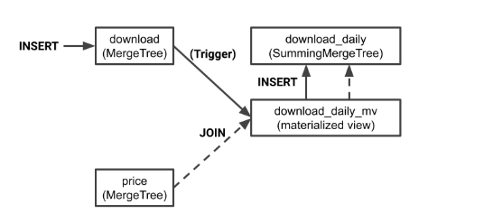

# 数据同步向CR: AGGS/宽表数据相关演化历史思路/现状/问题/优化

aggs的表结构

```sql
create table ad_aggs_outer (
  -- 主键
  ad_id int unsigned not null comment '[广告ID](#advertisement)',
  platform smallint unsigned not null comment '应用平台 1=>Android, 2=>iOS',
  ad_year_month smallint unsigned not null comment '**年月**, 格式: YYMM, 例子: 1907=2019年7月',
  ad_format int unsigned not null comment '广告形式',
  application int unsigned not null comment '[应用id](PAGES_ROOT/alishh/ag-db-10/agconstants#application)',
  primary key (ad_id,platform,ad_year_month,application,ad_format),
  -- 冗余根据application映射得到媒体字段
  media_id int unsigned not null default 0 comment '[媒体id](PAGES_ROOT/alishh/ag-db-10/agconstants#mediaCollection)',

  -- ad_id关联到advertisement表属性
  channel_id int unsigned not null default 0 comment '[广告平台id](#advertisement.channel_id)',
  purpose int unsigned not null default 0 comment '[推广目的](#advertisement.purpose)',
  material_type smallint unsigned not null default 0 comment '[广告素材类型](#advertisement.materialType)',
  campaign_type smallint unsigned not null default '0' comment '[推广目标类型](#advertisement.campaign_type)',
  campaign_id int unsigned not null default '0' comment '[推广目标id](#advertisement.campaign_id)',

  -- 应用品牌相关属性
  app_brand_id int unsigned not null default '0' comment '[应用品牌id](PAGES_ROOT/alishh/ag-db-10/asoData#app_brand.id)',
  developer_id int unsigned not null default '0' comment '[公司](#advertiser)',
  genres int unsigned not null default '0' comment '[品牌分类](PAGES_ROOT/alishh/ag-db-10/asoData#app_brand.genres)',
  style_app int unsigned not null default '0' comment '位图标记 [应用类品牌风格](PAGES_ROOT/alishh/ag-db-10/asoData#app_brand_style.style_id)',
  style_game int unsigned not null default '0' comment '位图标记 [游戏类品牌风格](PAGES_ROOT/alishh/ag-db-10/asoData#app_brand_style.style_id)',

  -- 品牌相关属性
  brand_id bigint unsigned not null default '0' comment '[品牌id](PAGES_ROOT/alishh/pub-db-00/msp_org#brands)',
  via tinyint unsigned not null default '0' comment '[相关来源](#ad_campaign.via), 如果是品牌： 1来源于ad_brand_collection算法识别结果, 2来源于广告应用品牌的品牌, 3来源于广告店铺的品牌',

  -- 店铺相关属性
  shop_id int unsigned not null default '0' comment '[店铺id](PAGES_ROOT/alishh/ag-db-10/ecData_v3#shop)',
  shop_type int unsigned not null default '0' comment '[店铺类型](PAGES_ROOT/alishh/ag-db-10/agconstants#shop_type)',
  shop_site int unsigned not null default '0' comment '[站点id](PAGES_ROOT/alishh/ag-db-10/agconstants#ec_channel)',
  -- 商品相关属性
  product_id int unsigned not null default '0' comment '[商品id](PAGES_ROOT/alishh/ag-db-10/ecData_v3#product)',

  -- 统计指标
  budget int unsigned not null default '0' comment '预算(元): NOTE: ad_id/application维度统计, 广告形式随机分配，所以涉及到金额的都不能进行广告形式的筛选',
  ad_month int unsigned not null default '0' comment '位图标记本月出现对应的天数，从右往左的第32位标识是否为新投放广告标识。 筛选N日有投放的广告: `ad_month & (1<<(N-1)) > 0`, 统计本月出现天数: `bit_count(ad_month, 2^31-1)`',
  first_date date not null default '2001-01-01' comment '本月首次投放日期',
  last_date date not null default '2001-01-01' comment '本月最后投放日期',

  -- 索引
  modify_time timestamp not null default current_timestamp on update current_timestamp comment '最后更新时间',
  key idx_modify_time (modify_time),
  key idx_campaign_type_campaign_id (campaign_type,campaign_id),
  key idx_app_brand_id (app_brand_id),
  key idx_brand_id (brand_id)
)
comment='对外媒体广告聚合月表'
partition by range (ad_year_month)
(partition pYYMM values less than maxvalue)
;
```

目的： 按月汇总广告的投放记录，并且附带各种关联属性

分析相应的表结构之前，我们先了解一下一些基本概念

## 基本概念
### 事实表


通过**获取描述业务过程的度量来表达业务过程**

例如我们广告的每日投放记录，商品的某个时刻的抓取信息等

作为度量业务过程的事实，一般为整型或浮点型的十进制数值，**有可加性、半可加性和不可加性三种类型**。

- 可加性事实是指可以按照与事实表关联的任意维度进行汇总。例如ad_log的广告发现次数。
- 半可加性事实只能按照特定维度汇总，不能对所有维度汇总。比如库存可以按照商品进行汇总，而按时间维度把一年中每个月的库存累加起来则毫无意义。
- 还有一种度量完全不具备可加性，比如比率型事实。商品的优惠券，需要跟价格字段一起使用才行。

相对维表来说，通常事实表要细长得多，**行的增加速度也比维表快很多**。

事实表有三种类型： 事务事实表、周期快照事实表和累积快照事实表。
- 事务事实表用来描述业务过程，跟踪空间或时间上某点的度量事件，保存的是最原子的数据，也称为“原子事实表”。
- 周期快照事实表以具有规律性的、可预见的时间间隔记录事实 ，时间间隔如每天、每月、每年等。
- 累积快照事实表用来表述过程开始和结束之间的关键步骤事件 ，覆盖过程的整个生命周期，通常具有多个日期字段来记录关键时间点， 当过程随着生命周期不断变化时，记录也会随着过程的变化而被修改。

> 分别对应着: ad_log、ad_aggs、campaign_record

### 维度表

**维度的设计过程就是确定维度属性的过程，如何生成维度属性，以及所生成的维度属性的优劣，决定了维度使用的方便性，成为数据仓库易用性的关键**。

维度所包含的表示维度的列，称为维度属性。维度属性是查询约束条件、分组和报表标签生成的基本来源，是数据易用性的关键。所以维度的作用一般是**查询约束、分类汇总以及排序等**。

下面以AG的广告维度为例对维度设计方法进行详细说明。

- 第一步： 选择维度或新建维度。作为维度建模的核心，在企业级数据仓库中必须保证维度的唯一性。以淘宝商品维度为例，有且只允许有一个维度定义。
- 第二步： 确定主维表。此处的主维表一般是 ODS 表，直接与业务系统同步。以advertisement就是主维表。
- 第三步： 确定相关维表。数据仓库是业务源系统的数据整合，不同业务系统或者同一业务系统中的表之间**存在关联性**。根据对业务的梳理，确定哪些表和主维表存在关联关系，并选择其中的某些表用于生成维度属性。以广告为例，根据对业务逻辑的梳理，可以得到商品、 品牌、店铺等维度存在关联关系。
- 第四步： 确定维度属性。本步骤主要包括两个阶段：
    - 其中第一个阶段是从主维表中选择维度属性或生成新的维度属性。广告的投放地区、广告形式等。
    - 第二个阶段是**从相关维表中选择维度属性或生成新的维度属性**。广告的应用品牌的风格、广告的品牌的行业等，生成新的维度属性。

同时**在汇总数据层，加强指标的维度退化，采取更多的宽表手段构建公共指标数据层，提升公共指标的复用性，减少重复加工**。

其主要功能如下。

- 组合相关和相似数据：采用明细宽表，复用关联计算，减少数据扫描。
- 公共指标统加工：构建命名规范、口径和算法统一的统计指标，为上层数据产品、应用和服务提供公共指标; 建立逻辑汇总宽表。
- 建立一致性维度：建立一致的数据分析维表，降低数据计算口径、算法不统一的风险。

> 实例： ad_campaign、ad_industry_tag等属性表


### 模型设计

#### 规范化和反规范化

当属性层次被实例化为一系列维度，而不是单一的维度时，被称为雪花模式。

大多数联机事务处理系统（ OLTP ）的底层数据结构在设计时采用此种规范化技术，**通过规范化处理将重复属性移至其自身所属的表中，删除冗余数据**。这种方法用在 OLTP 系统中**可以有效避免数据冗余导致的不一致性**。

比如在 OLTP 系统中，存在商品和分类，且商品表中有冗余的分类的属性字段，假设对某分类进行更新，则必须更新商品表和分类，且由于商品和分类是一对多的关系，商品表可能每次需要更新几十万甚至上百万条记录，这是不合理的。


而对于联机分析处理系统（ OLAP) 来说，**数据是稳定的**，不存在 OLTP 系统中所存在的问题。

采用雪花模型，除了可以**节约 部分存储外**，对于 OLAP 系统来说没有其他效用 而现阶段存储的成本非常低。出于**易用性和性能的考虑，维表一般是很不规范化的** 在实际应用中，**几乎总是使用维表的空间来取简明性和查询性能**。


### 数据处理

#### 离线同步

我们大部分数据同步（定时脚本）都是离线同步任务，也就是非实时的。

可以使用的工具:
- yugong
- datax

#### 实时同步

数据价值是具有时效性的，在一条数据产生的时候，如果不能及时处理并在业务系统中使用，就不能让数据保持最高的“新鲜度”和价值最大化。

- kafka->mysql->binlog->kafka->es/clickhouse/mysql等
- b2k/BinlogSyncCommand/river

汇总数据层更多地采用一些**维度退化**手法，**将维度退化至事实表中，减少事实表和维表的关联，提高明细数据易用性**：


## 历史与现状

看回我们的ad_aggs表。其实一开始是有ad_log事实表、ad_property维度表等，查询需要**进行各种join查询进行统计**，也就是上面所提到的规范化和雪花模型。

这里的好处是？简单、灵活，不需要维护各种数据同步脚本和冗余数据，没有数据一致性相关问题。

但是随着时间推移，量级的提升使得mysql的join表已经出现性能问题了，这时候一般的思路是提前做好相关的冗余表，也就是“维度退化”。**将维度退化至事实表中**，减少事实表和维表的关联，提高明细数据易用性。

其中因为按天进行冗余，扫描的量级也是太大了，所以那时候为了满足相关的查询性能。按月做了一个汇总表，并将相关的维度属性冗余进去。

### 问题

#### 写放大

这里涉及到一个比较大的问题就是**维度属性的变更操作的同步**。例如当应用品牌的行业发生了变更，需要获取到所有属于应用品牌的广告进行更新操作。

我们现在处理方式是**通过binlog进行监听各个维度表，如果维度的各种属性值发生变更，需要同步到相应的下游，通过mysql的各种索引进行更新操作**。

但这里会有写放大的问题, 例如因为某个头部的应用品牌关联的广告上百万，而且部分广告的投放周期很长、事实行也很多。导致我们消费跟不上写入，延迟严重。

#### 维护逻辑复杂

看下相关的表字段，已经多达20个字段。各种关联属性，关联属性的属性，各个维度表和维度的维度表都需要相应的监听逻辑，**代码量和维护成本都很大**。

而且当需要进行**字段调整**或者加字段的时候，mysql这些行存储也是非常不友好。

#### 同步任务慢

还有就是ad_aggs利用了mysql的更新特性，导致汇总表放到mysql上，而mysql对于OLAP查询性能差，导致我们还需要将mysql同步到clickhouse上。这个同步的过程现在是，**找出有变化的月分区，然后进行整个分区的覆盖同步操作**。月表的数据量也是比较大，同步clickhouse也是有性能问题。

虽然可以通过datax等工具通过拆分多批次的同步处理任务来进行优化，但也是消耗比较多的资源和成本。

### 优化

业务复杂性过高和性能问题的根源，还是维度表发现变更后各种同步维护逻辑，利用了mysql的更新特性，导致必须放到mysql上，但因为mysql的查询性能问题，又得做相应的月汇总表和同步clickhouse处理。


#### 离线任务

当前流行的大数据平台基本**都不支持 update 操作** ，现在比较推荐的方式是全外连接（ full outer join) ＋数据全量覆盖重新加载（ insert overwrite ）。

方案： 为了降低业务复杂性，通过DLA这些大数据技术，让相关的业务维护逻辑通过sql进行更新操作。

在T时刻，将T - 1及之前的事实表和T - 1时刻的维度表通过DLA进行各种关联查询，得到一个更新后的事实快照表。而且可以直接落地到clickhouse上，因为clickhouse的性能比较好，也不需要像mysql一样做月的汇总表，直接天维度的汇总，更灵活。

缺点： 无法做到比较实时的同步，如果是小时级别的延迟要求，还是可以通过该方式进行处理的。

##### 难点
难点1： 业务复杂性偏移到sql上，一不小心会写出几百行的代码。

思路： 所以对于维度表，我们需要**加强指标的维度退化**，采取更多的宽表手段构建公共指标数据层，提升公共指标的复用性，减少重复加工。提前把维度表的各种sql逻辑提前做好，大宽表。

难点2： 相应的维度更新操作需要影响到全量数据，对资源的要求还是比较高的。

思路：
    - 减少影响的数据范围，可变数据的时间窗口需要有一个合理的值，不能每次都更改全量的数据。有数据封存的概念，要让产品理解数据的不变性。
    - 减少维度变更的频次，每周或者每月进行全量的数据更新。

#### 实时任务

离线数据任务总会有延迟性，但对实时性有更高要求的，需要进行实时任务。

实时计算任务部署在流式计算系统上，**通过数据中间件获取到实时源数据后进行实时加工处理**。在各大互联网公司中，有各种开源的和非开源的流计算引擎系统在使用。在业界使用比较广泛的是 Twitter 开源的Storm 系统、雅虎开源的 S4 系统、 Apache park Streaming ，以及最近几年兴起的 Flink 。

由于实时计算是分布式处理的，**系统的不稳定性必然会导致数据的处理有可能出现失败的情况**。

比如网络的抖动导致数据发送不成功、机器重启导致数据丢失等。在这些情况下，怎么做到数据的**精确处理**呢？

上面提到的几个流计算系统几乎都提供了**数据自动 ACK 、失败重发以及事务信息**等机制。
- 超时时间： 由于数据处理是按照批次来进行的，当一批数据处理超时时，会从拓扑的一端重发数据。另外，批次处理的数据量不宜过大，应该增加一个限流的功能（限定一批数据的记录数或者容量等），避免数据处理超时。
- 事务信息： 每批数据都会附带一个事务 ID 的信息，在重发的情况下，让开发者自己根据事务信息去判断数据第一次到达和重发时不同的处理逻辑。
- 备份机制： 开发人员需要保证内存数据可以通过外部存储恢复，因此在计算中用到的中间结果数据需要备份到外部存储中。上面的这些机制都是为了保证数据的幕等性。

实时任务在运行过程中，会计算很多维度和指标，这些数据需要放在一个存储系统中作为恢复或者关联使用。其中会涉及三种类型的数据：
- 中间计算结果一一在实时应用处理过程中，会有一些状态的保存（比如去重指标的明细数据），用于在发生故障时，使用数据库中的数据恢复内存现场。
- 最终结果数据一一指的是通过 ETL 处理后的实时结果数据，这些数据是实时更新的，写的频率非常高，可以被下游直接使用。
- 维表数据一一在离线计算系统中，通过同步工具导人到在线存储系统中，供实时任务来关联实时流数据。


##### 多流关联

在流式计算中常常需要把两个实时流进行主键关联，以得到对应的实时明细表。

在离线系统中两个表关联是非常简单的，因为离线计算在任务启动时已经可以获得两张表的全量数据，只要根据关联键进行分桶关联就可以了。

但流式计算不一样，数据的到达是一个增量的过程，并且**数据到达的时间是不确定的和无序的**，因此在数据处理过程中会**涉及中间状态的保存和恢复机制等细节问题**。

比如A表和B表使用 ID 进行实时关联，由于无法知道两个表的到达顺序，因此在两个数据流的每条新数据到来时，都需要到另外一张表中进行查找。如A表的某条数据到达，到B表的全量数据中查找，如果能查找到，说明可以关联上，拼接成一条记录直接输出到下游 但是如果关联不上，则需要放在内存或外部存储中等待，直到B表的记录也到达。**多流关联的一个关键点就是需要相互等待，只有双方都到达了，才能关联成功**。

在上面的例子中，实时采集两张表的数据，每到来一条新数据时都在内存中的对方表截至当前的全量数据中查找，如果能查找到，则说明关联成功，直接输出： 如果没查找到 ，则把数据放在内存中的自己表数据集合中等待。

另外，不管是否关联成功，内存中的数据都需要**备份到外部存储系统中**，在任务重启时，可以从外部存储系统中恢复内存数据这样才能保证数据不丢失。因为在重启时，任务是续跑的，不会重新跑之前的数据。

另外，订单记录的变更有可能发生多次（比如订单的多个字段多次更新），在这种情况下 需要**根据订单 ID 去重**，避免A表和B表多次关联成功；否则输出到下游就会有多条记录，这样得到的数据是有重复的。

以上是整体的双流关联流程，在实际处理时，考虑到查找数据的性能，实时关联这个步骤一般会把数据按照关联主键进行分桶处理，并且在故障恢复时也根据分桶来进行，以降低查找数据量和提高吞吐量。

**时效性和吞吐量是数据处理中的两个矛盾体 ，很多时候需要从业务的角度来权衡使用什么样的系统来做数据中转。**


##### clickhouse物化视图

物化视图存储由相应的 SELECT 查询转换的数据。

一个物化视图的实现是这样的：当向SELECT指定的表插入数据时，插入的部分数据被这个SELECT查询转换，结果插入到视图中。也就是说物化视图创建好之后，如果源表被写入新数据，那么物化视图也会同步更新。

要注意的是： ClickHouse中的物化视图的实现更像是插入触发器。如果视图查询中存在某种聚合，则它仅应用于新插入的一批数据。对源表现有数据的任何更改（如更新、删除、删除分区等）都不会更改物化视图。

SELECT查询可以包含DISTINCT、GROUP BY、ORDER BY、LIMIT…请注意，对插入的**每个数据块分别执行相应的转换**。例如，如果设置了GROUP BY，则数据在插入期间聚合，但仅在插入数据的单个数据包中聚合。数据将不会进一步汇总。例外情况是使用独立执行数据聚合的引擎时，例如SummingMergeTree。

物化视图是ClickHouse用户可用的最通用的功能之一。物化视图由SELECT语句填充，SELECT可以连接多个表。需要理解的关键是，ClickHouse只触发连接中最左边的表。其他表可以为转换提供数据，但视图不会对这些表上的插入做出反应。

所以这里提供一个比较简单的多流关联的方案给我们尝试。

我们可以将相关的维度表（一般保存在mysql）通过binlog to clickhouse， 让相应的更新准实时同步到clickhouse上，然后当事实表进行插入的时候，通过物化视图和join操作进行维度的补充。




但也要注意的问题是：
- 对于旧的数据是无法做更新或者删除操作的。
- 对于右表的insert是无法影响物化视图的，所以如果相关右边的维度表有延迟（异步更新相关维度表），会让事实表的数据缺失。

更好的思路可能还是： 利用物化视图做T的实时数据流，但对于数据准确性需要有一定的容忍。而T-1的数据则通过离线任务，进行数据校准。

参考链接：
- [MATERIALIZED VIEW](https://clickhouse.tech/docs/en/sql-reference/statements/create/view/)
- [joins-in-clickhouse-materialized-views](https://altinity.com/blog/2020-07-14-joins-in-clickhouse-materialized-views)


